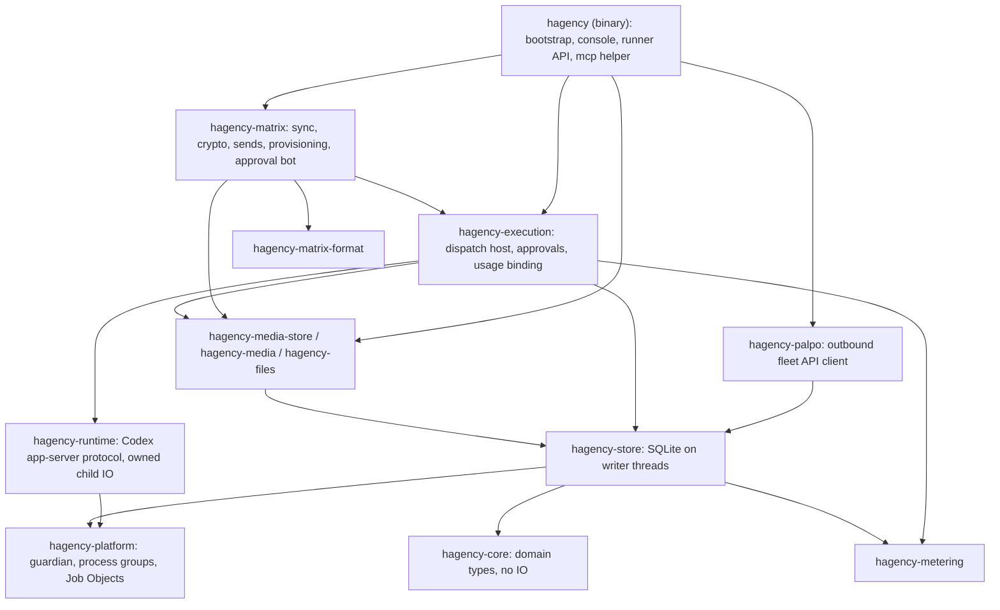
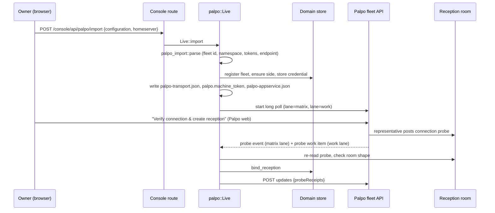
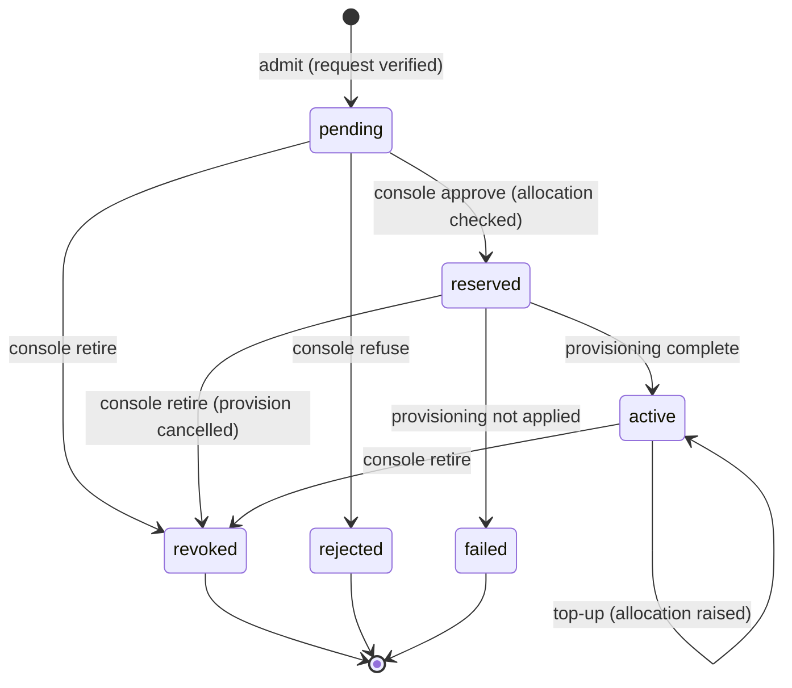
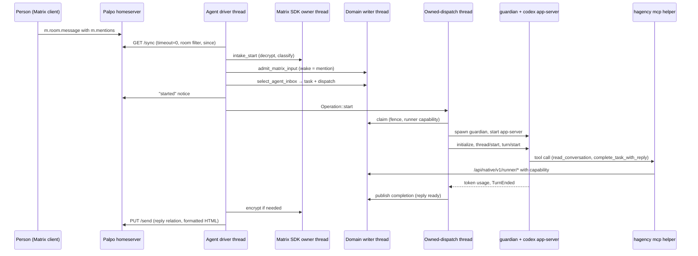
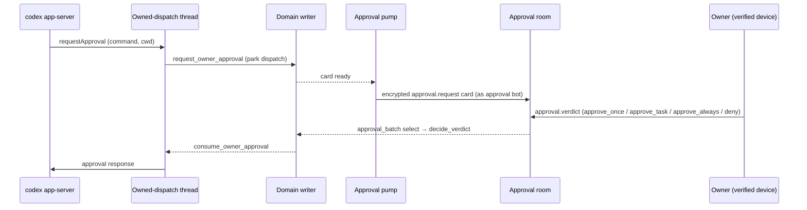
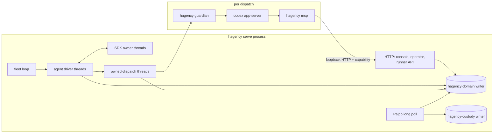

# Code walkthrough: from a Palpo request to an agent's reply

English | [简体中文](architecture-walkthrough.zh-CN.md)

This walkthrough is for developers who will change the native Rust service in `native/`. It follows the code paths behind the [user guide](user-guide/README.md):
1. A Palpo server is connected.
2. A project asks for an agent.
3. Hagency approves the agent and provisions it.
4. A person @-mentions the agent and gets a reply.

Each step names the file and function to open; search for the function name. ADRs live in [knowledge/decisions](../knowledge/decisions/). Section 13 lists what is implemented and what is not built yet. Section 14 says where to make a change.

## 1. Vocabulary

| Name | Meaning |
| --- | --- |
| Hagency | The service that runs coding agents and lends them to projects. One installation is one **fleet**. |
| Palpo | The project's Matrix homeserver. Its web app installs Hagency's App Service and shows projects their agent requests. |
| Fleet id | `hf_` plus 32 hex characters. It prefixes every Matrix account Hagency owns, such as `@hf_…_representative`. |
| Representative | The fleet's own Matrix account. It owns the reception room and invites agents into project rooms. |
| Approval bot | A separate Matrix account (`@<fleet>_approval`) with its own device. It posts permission cards to the owner and reads the owner's verdicts. |
| Coordinator | The fleet's root intake session. Its intake runs provisioning, and the invite poller uses its Matrix identity. It serves the fleet rather than a project. |
| Project side | Hagency's record of one connected homeserver: its credential, API base URL and token budget. |
| Resource | A runnable configuration offered to projects: framework, model, reasoning effort and a monthly token ceiling. |
| Seat | A model account that resources draw on. Several resources can share one seat's quota. |
| Engagement | One approved agent for one project. It is the unit that is allocated tokens, provisioned, paused, topped up and retired. |
| Owner | The project-side human recorded in `projects.owner_mxid` when the engagement is admitted. Only the owner answers approval cards and DMs the agent. |
| Reception room | An unencrypted, invite-only room shared by Palpo and the representative. Requests and connection probes arrive there as custom events. |
| Project room | The room where people and agents work. It is unencrypted, so the fleet's intake can read it. |
| Approval room | An encrypted room whose members are exactly the owner and the approval bot. |
| Agent DM | An encrypted room whose members are exactly the owner and one agent. |
| Session, dispatch, attempt | A session is one conversation route (room plus optional thread). A dispatch is one unit of agent work selected from it. An attempt is one launch of the runner for that dispatch. |
| Custody | A durable record, written before an external side effect, that says what was attempted. After a crash it decides between "inspect" and "do again". |
| Fence | A counter or row that stops stale work. A dispatch carries a fence number. Anything holding an older number is refused. |

## 2. Repository layout

| Path | Contents |
| --- | --- |
| [native/](../native/) | The Rust workspace: the `hagency` binary and its crates (section 4), test fixtures and CI gate scripts |
| [mockup/](../mockup/) | The console's Next.js source. Node is a build-time tool; `hagency serve` serves the static export (section 11) |
| [deploy/](../deploy/), [install/install-native.sh](../install/install-native.sh) | The systemd unit and launchd plist for `hagency serve`, and the installer that renders them |
| [specs/](../specs/), [knowledge/](../knowledge/) | Task contracts bound to tests, and the ADRs and requirements behind them |
| [docs/](.) | This walkthrough, the [user guide](user-guide/README.md), the agent workspace templates that `hagency-store` compiles in, and design history |

The service runs as `hagency serve --agent-driver --palpo-transport --console-assets …` under [deploy/hagency-native.service](../deploy/hagency-native.service) (Linux) or [deploy/io.hagency.native.plist](../deploy/io.hagency.native.plist) (macOS), on one loopback port (`127.0.0.1:13300` by default). It reaches Palpo and Matrix only through outbound connections.

Comments in the code cite `backend-v2.js`, `bridge-matrix.js` and `lib/*.js` with line numbers. Those cite the earlier JavaScript implementation that this service replaced; the files are in git history.

## 3. Start at the executable

Open [native/hagency/src/main.rs](../native/hagency/src/main.rs). The `Command` enum is the whole surface:

| Subcommand | Who runs it | What it does |
| --- | --- | --- |
| `serve` | systemd/launchd | The daemon. Everything in sections 5–12 runs inside it. |
| `guardian` (hidden, Unix) | `serve`, as a child process | Owns one runner's process tree (section 9). |
| `mcp` | Codex, as an MCP server | The task helper that gives the agent its tools (section 10). |
| `task …` | The agent, from a shell | The same task operations as a CLI. |
| `intake-refuse-stale-session` | The operator | Rejects a known stale pre-session SDK batch by its digest ([bootstrap/intake_refusal.rs](../native/hagency/src/bootstrap/intake_refusal.rs)). |
| `init`, `account`, `registration`, `side-registration`, `provision` | The operator | Create the state directory and credentials offline, or drive a running service with `--listen`. |
| `console-access`, `engagements`, `resources`, `alerts` | The operator | Loopback clients of the running service. |
| `backup`, `restore`, `rotate` | The operator | Online SQLite backup, restore and credential rotation ([ops/](../native/hagency/src/ops/)). |

`guardian` and `mcp` branch off in `main` before any Tokio runtime is built. They are short-lived helper processes started by the same binary. Everything else runs on one multi-threaded runtime built in `main`.

`serve` hands off to `Bootstrap::open_with_options` and `Bootstrap::serve` in [bootstrap.rs](../native/hagency/src/bootstrap.rs). Read `open_with_options` first: it opens the two databases, the approval-bot pump, the file and receive services, the fleet service and the Palpo transport, in that order. `serve` binds the single listener and starts the ceiling, retention (60 s) and reminder (1 s) sweeps, the invite poller, the HTTP server and Palpo. It then retries approval-bot enrollment with a 1–60 s backoff until it succeeds, and only after that starts the approval forwarder, the coordinator's driver and the fleet loop. `Bootstrap::close` shuts them down in reverse order (section 12).

All HTTP traffic shares the one loopback port. `App::new` in [lib.rs](../native/hagency/src/lib.rs) refuses any listen address that is not loopback.

| Path | Caller | Auth |
| --- | --- | --- |
| `/health`, `/ready` | Supervisors | None. `/ready` answers 503 while any configured component is not ready. |
| `/console/**` | The operator's browser | Session cookie (section 11) |
| `/console/api/**` | The console's JavaScript | Session cookie plus same-origin checks |
| `/api/native/v1/**` | Operator CLI | Bearer `operator.token`, checked by `local_authority` |
| `/api/native/v1/runner/**` | The `mcp` helper inside a runner | Per-dispatch runner capability ([runner.rs](../native/hagency/src/runner.rs)) |

`serve` reads no `.env`. Its configuration is the files in `--state-dir`:

| File | Purpose | Read by |
| --- | --- | --- |
| `operator.token` | Operator bearer secret | `Bootstrap::open_with_options` |
| `agent-driver.json` | Runner executable, workspaces, Matrix and approval settings, factory service | [bootstrap/config.rs](../native/hagency/src/bootstrap/config.rs) |
| `matrix.*`, `approval.*` | Access tokens, SDK store keys and CA bundles for the agent and approval identities | `bootstrap/config.rs` |
| `palpo-transport.json`, `palpo.machine_token`, `palpo-appservice.json` | Written by the Palpo import (section 5) | [bootstrap/palpo.rs](../native/hagency/src/bootstrap/palpo.rs) |
| `domain.sqlite3`, `custody.sqlite3` | Domain state; Palpo transport custody (section 12) | [native/hagency-store](../native/hagency-store/src/) |
| `sdk/`, `approval-sdk/` | Encrypted Matrix crypto and state stores | [hagency-matrix/src/sdk.rs](../native/hagency-matrix/src/sdk.rs) |

## 4. The crates and their layers

Most library crates state their role in a `//!` comment at the top of `lib.rs`. Dependencies point downward; transitive edges are omitted:

Start with three crates:
- [hagency-core](../native/hagency-core/src/) holds the vocabulary as types. `authority.rs` has `ProjectRequest` and `verify_request`. `project.rs` has `Resource` and `AgentName`. `replies.rs` has `ReplyRoute`.
- [hagency-store](../native/hagency-store/src/) holds every durable rule.
- [hagency-matrix](../native/hagency-matrix/src/) holds every Matrix side effect.

The workspace also contains `hagency-permissions`, `hagency-progress`, `hagency-progress-runtime` and `hagency-crypto-proof`. Only their own tests use them. Live approvals run through `hagency-execution/src/approval/`. Live progress notices come from `hagency-store/src/domain/activity.rs`.

## 5. Connect a Palpo server

The admin's "Add Hagency" and the owner's "Download Hagency configuration" happen in Palpo web. Hagency's part starts when the owner uploads that JSON in the console.

1. `console/palpo_import.rs` accepts the upload and calls `Live::import` in [bootstrap/palpo.rs](../native/hagency/src/bootstrap/palpo.rs).
2. `parse` in [bootstrap/palpo_import.rs](../native/hagency/src/bootstrap/palpo_import.rs) accepts exactly one shape:
   - The fleet id is `hf_` plus 32 hex characters, and the sender is `<fleet>_representative`.
   - There is one exclusive user namespace `@<fleet>_…:<server>` and no room or alias namespaces.
   - `as_token`, `hs_token` and the machine token are all different.
   - The transport mode is `outbound`, to an `https://…/api/fleet/v2/<fleet>` endpoint (plain `http` only on loopback).
   - A file for a second fleet is refused with `palpo_fleet_conflict`: one service runs one fleet.
3. The import stores what it validated:
   - **Domain store:** a `registrations` row (fleet, server, representative, approval bot, and a reception room left empty for now), a project-side row and its App Service credential.
   - **State directory:** three private files.
   - With `--palpo-transport` set, the transport starts at once.
4. Credentials are write-only. `SideRecord` in `hagency-store/src/domain/side_lifecycle.rs` exposes `credential_kind` and `has_credential`, never the token. Registration views show SHA-256 fingerprints.
5. The transport is [hagency-palpo](../native/hagency-palpo/src/).
   - `adapter.rs` long-polls `GET {endpoint}/poll` on two lanes, then calls `POST ack` and `POST updates`.
   - The **matrix lane** relays App Service transactions. The **work lane** carries jobs such as probes and agent requests.
   - The poll waits 25 s and the catalog republishes every 15 s (`config.rs`).
   - Nothing listens for inbound connections. A homeserver behind NAT works without exposing Hagency.
6. "Verify connection & create reception" in Palpo makes the representative post a `com.hagency.connection.probe.v1` event. `work_once` in [bootstrap/probe.rs](../native/hagency/src/bootstrap/probe.rs) re-reads that event as the representative. It binds the room only if the room is invite-only and unencrypted, the representative has joined, and no other reception room is bound. The receipt returns to Palpo in the next `updates`. A failed probe is retried until it succeeds.

Test examples: `native_palpo_import_route_saves_the_owner_download` and `native_palpo_import_route_refuses_a_foreign_file` in [hagency/tests/console/palpo_import.rs](../native/hagency/tests/console/palpo_import.rs).

## 6. Resources and the catalog

A provider sets up resources in the console:
- `console/resources.rs` creates them.
- `console/resource_configuration.rs` changes model, reasoning effort and monthly ceiling, using `expectedRevision` for optimistic concurrency.

`Resource::qualifies` in `hagency-core/src/project.rs` offers a resource for a role only when all four hold:
- it is published;
- its framework is `codex` or `claude`;
- it has a ceiling;
- its model qualifies for the requested role (`hagency-core/src/qualification.rs`).

New resources are published in the same transaction that creates them (`prepare_resource_write` in `hagency-store/src/domain.rs`). Withdrawal is durable. While a resource has reserved or active engagements, its profile cannot be edited.

`publish_resources_once` in `hagency-palpo/src/catalog.rs` sends the frozen catalog to Palpo every 15 s. For each resource, Palpo receives an opaque id `resource_<24hex>`, a display name, the framework, the model and the reasoning effort. Ceilings, seats and preset ids stay inside Hagency (ADR-024, ADR-108, ADR-111). The same `updates` call carries engagement statuses and probe receipts.

The console can publish a `claude` resource, but `Host::prepare_bound` in `hagency-execution/src/host.rs` refuses to launch one with `UnsupportedRunner`. Only Codex runs natively today.

## 7. From agent request to provisioned agent

A project member defines an agent in Palpo web: a name, one published resource, a role, requested tokens and a daily rate. Palpo posts `com.hagency.engagement.request.v1` in the reception room and queues a work item.

**Admission.** `admit_request` in [bootstrap/palpo_work.rs](../native/hagency/src/bootstrap/palpo_work.rs) re-reads the source event, observes the rooms, and calls `verify_request` in `hagency-core/src/authority.rs`. These must hold:
- The reception and project rooms are invite-only and unencrypted.
- The requester, the owner and the representative have joined the project room.
- The owner has power level 100 there.
- The room's `com.hagency.admin.binding.v1` state names this fleet, project and owner.
- The owner's approval room is encrypted and contains exactly the owner and the approval bot.
- The observation is less than 30 s old.

`DomainRepository::admit` in `hagency-store/src/domain.rs` then writes the engagement:
- **Id:** `en_` plus a 32-hex hash of fleet and request id. A replay returns the stored row; a different body under the same id is a conflict.
- **Name:** must be unique among the project's pending, reserved and active engagements. `AgentName` accepts Unicode letters, normalises to NFC and allows at most 64 UTF-16 units.
- **Writes:** the `projects` row (owner, approval room) and the `engagements` row in `pending`.

**Approval.** The Engagements console page uses three routes:
- `GET …/candidates` returns `remainingTokens`. This is what "All remaining" fills in.
- `POST …/approve {allocatedTokens?}` approves. The agents route `…/refuse` rejects a pending request.
- `approve_allocating` calls `check_grant`. `check_grant` compares the amount with `headroom`, the smallest of ceiling, seat and pool headroom. The ceiling side counts each draw as `max(reserved, spent)`; seats and pools count commitments. A refusal is `OverCommit` (with a message naming the binding limit), `InsufficientCapacity` or `NoCeiling`.
- On success the engagement becomes `reserved`, and a `provision_<id>` effect is queued.

`refresh_statuses` in `palpo_work.rs` reports each state back to Palpo: `pending`, `active` while provisioning, `active` plus `complete`, `rejected` or `ended`. It also sends the allocated tokens, the agent's MXID and `ready` once the agent has joined its room.

**Provisioning.** The coordinator's intake turn calls `resume_pending_provisions` in [hagency-matrix/src/provisioning.rs](../native/hagency-matrix/src/provisioning.rs). Each claim is fenced by its effect id. The order comes from ADR-184:

1. Create `@<fleet>_<32hex>:<server>` through App Service `/register`, then log in to get device `DEVICE_<engagement>` (`token_provision/application_service.rs`).
2. Set the display name to the project's agent name.
3. The agent creates its DM: `private_chat`, Megolm, `m.federate: false`, history `invited`, **no invitees**.
4. The representative invites the agent to the project room; the agent joins.
5. `enroll_created_rooms` uploads the agent's device keys and cross-signing identity.
6. Only now `invite_owner` invites the owner to the DM. The step waits, with no deadline, until the owner joins. A restart during this wait leaves the step to the operator.

Step 5 comes before step 6 so that the owner's client always has the agent's keys before the owner can type. ADR-184 records the incident that forced this order.

Every Matrix write records a custody stage before and after it: `dm-possible`/`dm-response`, `invite-possible`/`invite-response`, and so on (`token_provision/rooms/custody.rs`). After a lost response, the next attempt inspects the room instead of repeating the write.

**Retirement.**
- `POST …/retire` revokes a pending, reserved or active engagement. A reserved engagement's provision effect is cancelled. If provisioning had started, the call queues a `retire_<id>` effect. That effect leaves every room and logs the device out ([hagency-matrix/src/retire.rs](../native/hagency-matrix/src/retire.rs)).
- A failed retirement is re-run only by `POST …/cleanup-retry`.

## 8. Rooms, and who can talk to an agent

| Room | Encrypted | Members | What wakes the agent | Where the rule lives |
| --- | --- | --- | --- | --- |
| Reception | No | Palpo's accounts and the representative | Nothing. It carries requests and probes. | `verify_request`, `probe.rs` |
| Project room | No | The project's people, representative, agents | A human message that mentions the agent | `admit_matrix_input` in `hagency-store/src/domain/verified_ingress.rs` |
| Agent DM | Yes | Owner and one agent | Any message from the owner | `admit_matrix_input`; room shape in `domain/matrix_routes.rs` |
| Approval room | Yes | Owner and approval bot | Nothing. It carries cards and verdicts. | `observe_approval_room` in `domain/approvals.rs` |

All members must be on the fleet's own server: `matrix_user` and `matrix_room` in `hagency-core/src/replies.rs` refuse other server names.

In a project room, every joined human can give the agent work by mentioning it. The owner keeps control in three ways:
- Risky operations need the owner's approval (section 10).
- All work spends the engagement's allocation (section 11).
- The owner decides who joins the room.

Only human messages wake an agent; `!` commands and `/thread` directives are handled separately. After a task is done, a reply in its thread wakes the agent only if it comes from the original requester.

**Invites.**
- `bootstrap/invites.rs` polls the agent's invites. An invite from the project's recorded owner is joined automatically.
- Any other invite, including one whose inviter cannot be read, becomes a row in `pending_invites`. The operator accepts or declines it in the console under Invitations (`console/invites.rs`). The next poll then joins or leaves.
- Declines are remembered, so the same invite cannot come back.
- The poller is started only for the coordinator's collector (`Bootstrap::serve`), so provisioned agents do not act on invites yet. The user guide lists this as a known limitation.

Test examples: `untrusted_invite_becomes_a_pending_decision`, `owner_invite_takes_the_trusted_inviter_arm_and_joins` and `console_accept_queues_the_join_and_the_next_poll_performs_it` in [hagency/tests/invites.rs](../native/hagency/tests/invites.rs).

## 9. Follow one message to its reply

A person writes `@coding-fast-01 add a sum() helper` as a top-level message in the project room.

**Intake.** Each active agent has a driver: an OS thread named `hagency-agent-driver` with its own current-thread runtime (`Driver::start_agent` in [bootstrap/driver.rs](../native/hagency/src/bootstrap/driver.rs)). The fleet loop starts one driver per provisioned agent.

`run_continuous` repeats `run`:
1. `collector.collect`, then resume any unfinished outgoing custody.
2. Build a `HostIntakePlan` from the agent's sessions.
3. `collector.intake(plan)`. Idle passes sleep 1 s, and errors back off up to 60 s.

`Inner::intake` in [hagency-matrix/src/intake.rs](../native/hagency-matrix/src/intake.rs) handles one pass:
1. Check the agent's identity with `whoami`.
2. Issue one `GET /sync` with `timeout=0`, a room filter and the stored `since`.
3. Pass the response to the SDK owner thread (`Owner::intake_start` in `sdk.rs`). It journals the batch, applies it to the encrypted state store, and retries envelopes that earlier lacked keys.

`Batch::derive_with_history` in `event_batch.rs` classifies each event:
- **Candidate:** an accepted plaintext event, or a verified Megolm event whose sender and device match.
- **NotTarget:** an event that does not concern this agent.
- **Rejected:** a decryption failure, plaintext in an encrypted room, and so on.
- **Deferred:** the room key has not arrived yet.

It also reads `m.thread`, ignores edits, and takes mentions from `m.mentions.user_ids`, falling back to pills and `@name` text.

**Admission.** `admit_matrix_input` in `hagency-store/src/domain/verified_ingress.rs` checks route, membership, encryption match and the `ingress_since` boundary. It deduplicates by content digest, then writes one `session_inputs` row whether the message wakes the agent or not (ADR-023). Rows that do not wake become discussion context for the agent's next turn.

**Dispatch.** `select_agent` in `domain/messages.rs` takes the oldest waking input:
- It creates a task and a dispatch with deterministic ids.
- `freeze_window` fixes the discussion range the agent will see.
- `enqueue_inbox` puts the inputs addressed to the agent in the payload. Everything else is reachable through `read_conversation`.

The driver posts a "started" notice. That event becomes the anchor that later progress edits replace.

**Claim.** `claim_clock` in `domain/execution.rs` leases a dispatch only when all of these hold:
- It is queued, or it is parked and its time has come.
- No other dispatch of the same session is leased, started or parked. This gives one turn per conversation.
- The engagement is `active`, with no open `quota_holds` row, no agent fence and no quarantine.
- The workspace lease is free.
- The account's readiness is known (`dispatch_account_ready`).
- Fewer than `max_live` dispatches are live (8 for factory agents).

The lease bumps the fence and mints a `RunnerCapability`: dispatch id, runner id, fence number and a secret stored only as a hash.

**Execution.** `execute` in [hagency-execution/src/operation.rs](../native/hagency-execution/src/operation.rs) runs on a `hagency-owned-dispatch` thread:
1. `Host::prepare_bound` (`host.rs`) resolves the workspace. When the agent's workspace mode is `worktree` and the session has a thread root, the dispatch gets its own `git worktree` under `worktrees_dir`, and is refused if that directory is not configured (ADR-011). Every other dispatch uses the agent's shared workspace. It also sets the environment, including `HAGENCY_RUNNER_API_ADDR` and the capability, and fixes argv to `["app-server"]`.
2. `OwnedSession::spawn` (`hagency-runtime/src/owned/session.rs`) starts `hagency guardian`.
   - **Unix:** a socket pair carries a Prepare/Start handshake ([hagency-platform/src/supervisor/unix.rs](../native/hagency-platform/src/supervisor/unix.rs)). The guardian puts Codex in its own process group, becomes subreaper on Linux, and kills the whole group on stop.
   - **Windows:** no guardian. The child is created directly inside a kill-on-close Job Object (`hagency-platform/src/windows.rs`).
3. The Codex app-server protocol (`hagency-runtime/src/codex/session/driver.rs`) runs `initialize`, `thread/start` and `turn/start`, then reads updates until `TurnEnded`.
   - `thread/start` sets `sandbox: workspace-write` (or `read-only`), `approvalPolicy: on-request`, no network and no extra writable roots (`codex/session.rs`). `state.rs` checks that Codex echoed these settings back.
   - The turn ceiling is 20 minutes. Overrunning the operation budget raises a notice and does not kill the turn (ADR-183).

**Tools.** Codex's MCP config, built in `codex/session/task_mcp.rs`, runs `hagency mcp` as `hagency_task_writer`. The helper forwards each call to `/api/native/v1/runner/*` with the dispatch, runner and fence headers, and `runner.rs` authenticates them. Section 10 lists the route behind each tool.

**Completion.** `complete_task_with_reply` (`domain/owned_completion.rs`):
1. Moves the task to Done and bumps its execution epoch.
2. Stores the reply as `held` and fences the dispatch, so the old capability stops working.

After the guardian proves the process tree is gone, `publish_owned_completion` marks the reply `ready`. If cleanup cannot be proven, the reply is not published and the driver fences the agent instead.

**Reply.** `finish_attempt` in `driver.rs` claims the final reply and calls `collector.send_final`. `Inner::outgoing` in [hagency-matrix/src/outgoing.rs](../native/hagency-matrix/src/outgoing.rs) then:
- Looks up any earlier receipt for this reply and returns it if one exists.
- Builds the content with a body and a Markdown-rendered `formatted_body` (`hagency-matrix-format`, raw HTML disabled).
- Adds the reply relation from `reply_relation` (`outgoing/state.rs`): `m.thread` when the source message was in a thread, `m.in_reply_to` for this example's top-level group message, nothing in a DM.
- Encrypts through the SDK owner for encrypted rooms and sends with `PUT /send/{txn}`.

A resumed send reuses the same transaction id.

Test example: `native_two_agent_task_handoff_observes_usage_on_the_right_engagement` in [hagency/tests/two_agent_handoff.rs](../native/hagency/tests/two_agent_handoff.rs).

## 10. Tools and approvals

Codex starts `hagency mcp` as the MCP server `hagency_task_writer`. The always-on tools are `TASK_MCP_TOOLS`. Three optional groups are switched on in `agent-driver.json` by `coordination_tools`, `send_file` and `receive_file` ([hagency-runtime/src/task_mcp.rs](../native/hagency-runtime/src/task_mcp.rs)). Routes are under `/api/native/v1/runner/`, and the task and coordination handlers pass a `RunnerCommand` (`hagency-core/src/tasks.rs`) to `DomainStore::runner_command`. The file routes hand off to their service threads:

| Tool | Route | Handler in `runner.rs` or `runner/` | Pre-approved |
| --- | --- | --- | --- |
| `get_task`, `list_tasks` | `tasks/{id}`, `tasks` | `get_task`, `list_tasks` | Yes |
| `update_task_execution`, `transition_task` | `tasks/{id}/operations` | `mutate` | Yes |
| `complete_task_with_reply` | `complete-task-with-reply` | `completion.rs` `finish` | Yes |
| `read_conversation` | `conversation` | `conversation_page` | Yes |
| `schedule_reminder` | `reminders` | `schedule_reminder` | Yes |
| `comment_task` (coordination) | `tasks/{id}/operations` | `mutate` | Yes (ADR-021) |
| `delegate_task`, `open_conversation`, `send_peer_message` and the other coordination tools | `delegations`, `conversations…`, `peer-messages`, `peer-inbox` | `delegate`, `open_conversation`, `conversation`, `change_conversation`, `send_peer`, `peer_inbox` | No: each call needs the owner (ADR-180) |
| `send_file`, `get_file_delivery` | `file-deliveries`, `file-deliveries/{id}` | `files.rs` (`submit`, `inspect`), then the file-service thread | No |
| `list_received_files`, `receive_file` | `received-files` | `received.rs`, then the receive-service thread | No |

The runner API also serves routes that Codex never calls as tools: `approval` and `approval/consume` (used by the helper's `get_approval` and `consume_approval` tools outside the owned Codex profile), `inbox`, `tasks/{id}/comments`, `graphs/*` ([runner/workflows.rs](../native/hagency/src/runner/workflows.rs)), `final-replies` ([runner/replies.rs](../native/hagency/src/runner/replies.rs)), `late-output` (ADR-146) and a fixed refusal on `PATCH agent`. The helper's catalog hides `get_approval`, `consume_approval` and `accept_task` from the owned Codex profile (`mcp.rs`).

The pre-approved set is written into Codex's MCP config by `codex/session/task_mcp.rs`. Every other tool call, and every command or file change that Codex wants outside its sandbox, reaches Hagency as an approval request on the app-server connection.

- **Admission.** The Codex adapter (`hagency-runtime/src/codex/approval.rs`) ends the session on a malformed, oversized or unknown-method request (ADR-046).
- **Parking.** `request_owner_approval_clock` in `hagency-store/src/domain/approvals.rs` stores the request and parks the dispatch in one transaction.
  - A request may expire at most 600 s ahead.
  - Caps count open requests (pending, decided, applying, uncertain): 16 per dispatch fence, 64 per engagement, 1024 overall.
- **Standing grants.** `derive` in `hagency-core/src/execution.rs` turns each request into a scope: an exact command plus cwd and extra permissions, a network host plus protocol, and so on (ADR-039). A grant matches on that scope key, the agent's context key and the approval binding's generation. A `task` grant also needs the same task and epoch; an `always` grant does not. These grants are the only standing rules. When no scope can be derived, the owner can approve once or deny.
- **Delivery.** `Pump::drain` in [bootstrap/approval.rs](../native/hagency/src/bootstrap/approval.rs) re-reads each card from the store and sends it as the approval bot.
  - `observe_approval_room` marks the room unavailable as soon as it gains a third member or loses encryption.
  - If a send fails after it has started, `deny_for_failed_delivery` records a deny (ADR-137). After a delivered card, a redacted status notice goes to the task's thread in the project room, sent as the agent. The delivery budget is 45 s (ADR-149).
- **Verdict.** `approval_batch.rs` accepts the owner's verdict only if all of these hold:
  - It is a Megolm event from a verified device of the owner, with no forwarder.
  - Its strict content names this request's digest, agent, project and room.
  - `decide_verdict` re-checks all of it against the binding and the request's expiry.

  Plain text, `!` commands and console clicks cannot approve.
- **Expiry.** When the owner does not answer within `approval_owner_wait_ms`, `deny_for_owner_wait_expiry` records the same deny an owner's Deny would, and the turn continues without the permission (ADR-046, owner-wait expiry amendment). The code default (`default_approval_wait` in `bootstrap/config.rs`) is 1000 ms, which denies almost at once; set `approval_owner_wait_ms` in `agent-driver.json`.
- **Applying.** `consume_owner_approval` moves the request to `applying` before the response is written to Codex. After a restart, an `applying` request becomes `uncertain`, and recovery inspects it instead of resending.

The execution policy stores a `yolo` flag (`domain/exec_policy.rs`), but every native approval context is built with `yolo: false`, and the store refuses a yolo context.

The console lists approvals and revokes grants (`console/approvals.rs`), and lists and unbinds approval rooms (`console/approval_bindings.rs`). Approving happens only in the approval room.

Test examples: [hagency-matrix/tests/approval_delivery/](../native/hagency-matrix/tests/approval_delivery/), for example `native_private_approval_fresh_enrollment_and_delivery` and `native_private_approval_send_cancellation_and_loss`.

## 11. Tokens, usage and the console

**Usage.** Codex reports `thread/tokenUsage/updated`.
- `UsageRun::record_pending` in `hagency-execution/src/usage.rs` passes each report to `record_usage_clock` in `hagency-store/src/domain/usage.rs`.
- Attribution comes from the `usage_sources` row bound to the dispatch at launch, never from transcripts.
- Reports are deduplicated by source and call, credited to daily and monthly buckets, and receipted.

**Pause and top-up (ADR-186).**
- After each usage record, `quota_holds::evaluate` in `domain/quota_holds.rs` sums input + output + cache writes since approval. When the sum reaches the allocation, it opens a `quota_paused` hold and posts "Paused: used N of M tokens" in the task's thread.
- The running turn finishes. New dispatches stay queued, because the claim skips held engagements.
- If no report carries a known count, usage counts as unknown, and unknown usage never pauses an agent.
- `POST /console/api/engagements/{id}/allocation {addTokens}` calls `raise_allocation`. It checks the same headroom as approval, lifts the hold, and posts "Resumed".

**Alerts.** `sweep_ceiling_overruns` (`domain/ceiling_alerts.rs`) runs hourly and raises `agent_ceiling_overrun` when a resource's draws exceed its ceiling. Alerts only inform the operator; the pause is what stops new work.

Test examples: `native_quota_pause_when_spend_reaches_the_allocation` and `native_quota_no_pause_on_unknown_usage` in [hagency-store/tests/engagement_allocation.rs](../native/hagency-store/tests/engagement_allocation.rs), and `native_allocation_route_top_up_lifts_the_pause_and_is_idempotent` in `hagency/tests/console/engagements_allocation.rs`.

**The console.** The console is the Next.js app in [mockup/](../mockup/).
- `mockup/scripts/build-native-console.mjs` exports the native pages statically, and `serve --console-assets <dir>` serves them under `/console/` ([console/assets.rs](../native/hagency/src/console/assets.rs)). The client is `mockup/lib/native-api.js`.
- Login:
  1. `hagency console-access` presents `operator.token` and receives a link valid for 120 s.
  2. The page exchanges it at `POST /console/session` for an `HttpOnly; SameSite=Strict` cookie.
- Every console request must carry the exact listen address as `Host`, a same-origin `Origin` for writes, and no `Authorization` or forwarding headers (`console.rs`).

## 12. How the service executes

| Component | Execution | Where |
| --- | --- | --- |
| HTTP server, fleet loop, sweeps, Palpo poll, approval pump | Tasks on the main multi-thread runtime | `main`, `Bootstrap::serve` |
| Domain database | Dedicated thread `hagency-domain`; a bounded `mpsc` of boxed closures over `&mut DomainRepository`, replies on `oneshot` | `hagency-store/src/domain_worker.rs` |
| Custody database (Palpo polls, attempts and publication receipts) | Dedicated thread `hagency-custody`, same pattern | `hagency-store/src/worker.rs`, `custody-migrations/002-outbound.sql` |
| Each agent (and the coordinator) | Thread `hagency-agent-driver` with its own current-thread runtime | `bootstrap/driver.rs` |
| Matrix crypto and state | Thread `hagency-matrix-sdk` per identity; owns the SQLite crypto store lock | `hagency-matrix/src/sdk.rs` |
| One running dispatch | Thread `hagency-owned-dispatch` (warm agents: `hagency-warm-owned-runtime`) | `hagency-execution/src/operation.rs`, `warm.rs` |
| Runner process tree | `hagency guardian` child process, then Codex | `hagency-platform` |
| File delivery, received files | Threads `hagency-file-service`, `hagency-receive-service` with `LocalSet`s | `file_service.rs`, `receive_service.rs` |
| Agent tools | `hagency mcp` child process of Codex, talking HTTP to the runner API | `native/hagency/src/mcp.rs` |

**One writer per database.** Every read and write of `domain.sqlite3` is a job sent to the `hagency-domain` thread. Rules that must hold together, such as "insert the approval and park the dispatch", run as one job inside one transaction. Each job carries a deadline and a byte budget. `/health` reports whether both writers' channels are open. The databases use WAL with `synchronous=FULL`. An exclusive lock on `domain.lock` and `owner.lock` stops a second process from opening the same state directory.

**Ids and fences instead of locks.** Work crosses threads and processes by id. The fence on a dispatch, the epoch on a task and the generation on a registration or room let the owner of the current number act and refuse everyone else. Once a dispatch is fenced, its runner's calls are refused, except three routes that sit outside the authentication hoop on purpose: an identical replay of `complete-task-with-reply`, `late-output` (ADR-146) and historical `file-deliveries/{id}` reads.

**Unknown outcomes stay unknown.** A Matrix write, process cleanup or approval response whose result was lost is recorded as `Unknown` or `uncertain`. Recovery inspects the outcome or waits for the operator (ADR-182, ADR-183).

**Shutdown.** SIGTERM cancels a `CancellationToken`. `Bootstrap::close` then:
1. Quiesces the fleet, the console, the shared workspace, and the receive and file services; stops the agent driver and the sweeps; cancels Palpo.
2. Closes the file and receive services, the driver and Palpo, then drains and closes the fleet's agents.
3. Closes the coordinator's collector and the approval pump.
4. Shuts down the domain writer, then the custody writer.

The HTTP server stops last, with a 5 s grace period.

## 13. Implemented and not built yet

The user guide's "Known limitations" is the user-facing list; keep the two in step when a gap closes.

| Area | Status |
| --- | --- |
| Codex runner, Palpo outbound transport, provisioning, owner approvals, quota pause and top-up, file delivery | Implemented in native |
| Claude runner | Runtime protocol code exists; launch is refused (`UnsupportedRunner`) |
| Agents acting on their own invites | Not built; only the coordinator's invites are polled |
| Retiring an agent's account on Palpo (`retire-agent`) | Not built; retirement leaves rooms and logs the device out |
| Approval notice in the request room ("已批准 / Approved") | Builder exists (`bootstrap/engagement_notice.rs`) with no caller |
| Project-side budget check at approval | Not built; the side budget is stored and shown only |
| Inbound App Service listener, Agent Ops client (ADR-012) | Not built; Matrix is reached outbound only |
| `!` commands | Native handles `!help`, `!offer`, `!request`, `!status`, `!agents`, `!sessions`; the ACL in `bot_commands.rs` accepts the rest, which produce no reply |
| Federation | Refused by design; the fleet assumes a non-federating homeserver |
| Effective runner sandbox | Requested and echo-checked; qualification on each OS is still open (`hagency-execution/src/lib.rs`) |

## 14. Making a change

**A durable rule.** Add a method on `DomainRepository` in the matching `hagency-store/src/domain/*.rs` file, and expose it as an async `DomainStore` method in `domain_worker.rs`, so it runs as one job on the writer thread. Keep every check that must hold together inside that one transaction.

**A schema change.**
1. Add `hagency-store/src/migrations/NNN-name.sql`.
2. Append it to the versioned migration list in `hagency-store/src/domain.rs` with the next sequential version (the file number can differ), raise `DOMAIN_SCHEMA_VERSION`, and add a probe query for the new columns or tables to the `verify` list.
3. Extend the schema-rewind fixtures in `hagency-store/tests/` (for example `schema_fixtures.rs`) so that an older database still upgrades.

**An agent tool.**
1. Add the name to `TASK_MCP_TOOLS` or an optional group in `hagency-runtime/src/task_mcp.rs`.
2. Describe it in the helper's catalog under `native/hagency/src/mcp/`, dispatch it in `mcp.rs`, and add the HTTP call in `native/hagency/src/task_client/`.
3. Add the runner route in `runner.rs` and a `RunnerCommand` variant in `hagency-core/src/tasks.rs`.
4. Decide whether `codex/session/task_mcp.rs` pre-approves it, and update that file's tests. A tool that reaches another session or sends data out of the workspace needs the owner.

**A console route.** Add it under `native/hagency/src/console/` and mount it in `console.rs`. If it backs a new page, add the page to `ROUTES` in `mockup/scripts/build-native-console.mjs`.

**Tests and contracts.**
- Run `cargo test --locked -p <crate>` for the crates you touched, then `cargo clippy --workspace --all-targets --locked -- -D warnings`.
- Behaviour is bound to tests through task contracts in `specs/`. Add or update the scenario and bind it to your test. CI runs `native/scripts/check-rust-spec-bindings.mjs`, and `native/scripts/check-production-callers.mjs` checks that every `Production caller:` line in a spec resolves in the production call graph (ADR-146).

## 15. Where to go next

- [user-guide/README.md](user-guide/README.md): the same flow from the user's side.
- ADR-002 (owner), ADR-016 (project sides), ADR-023 (room context and DMs), ADR-025 (project-defined agents), ADR-184 (key enrollment order) and ADR-186 (allocation pause) in [knowledge/decisions](../knowledge/decisions/).
- [specs/](../specs/): the task contracts that bind each behaviour to tests.
