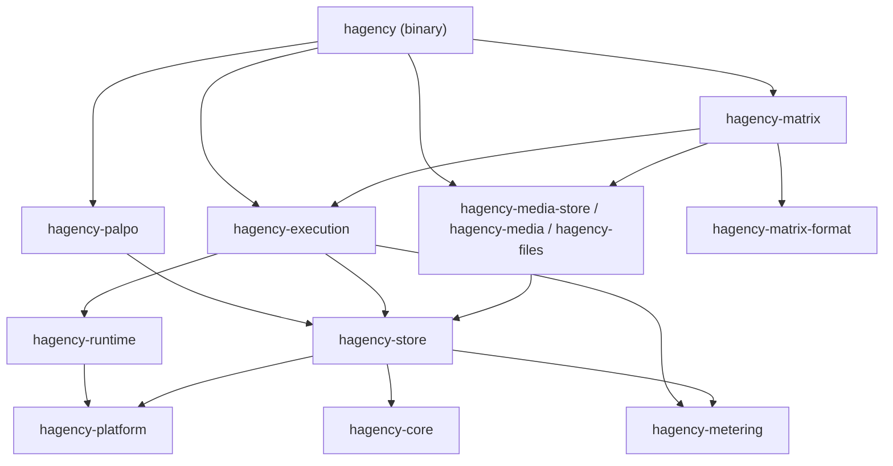
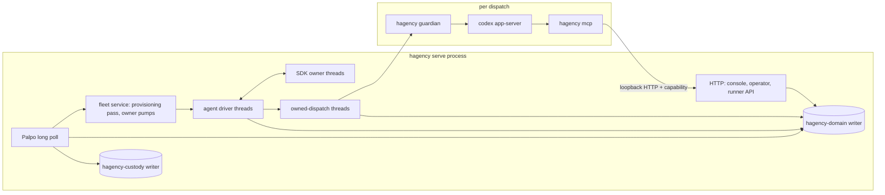
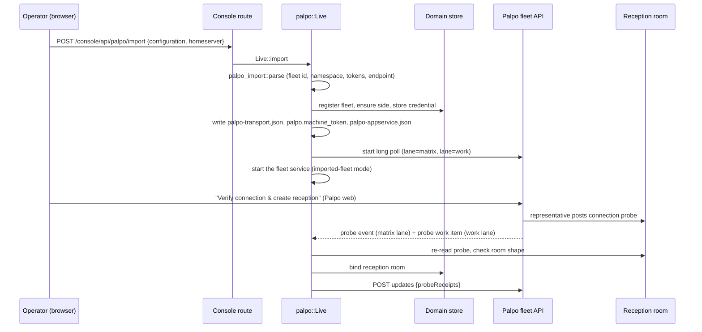
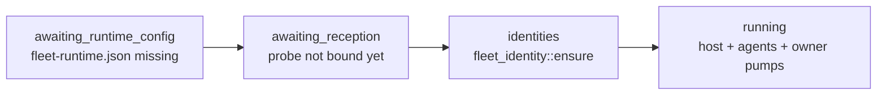
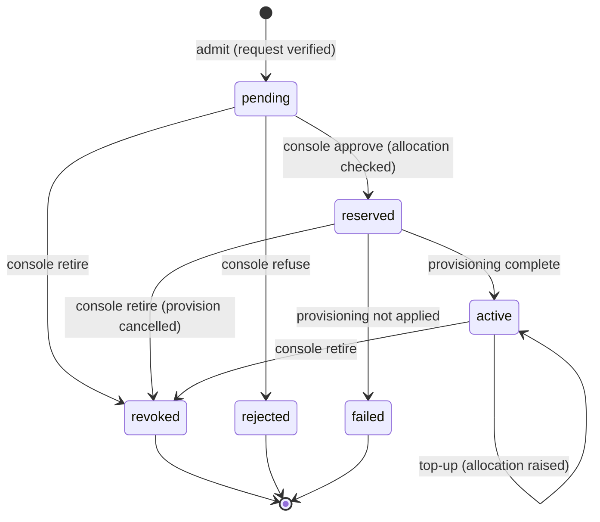
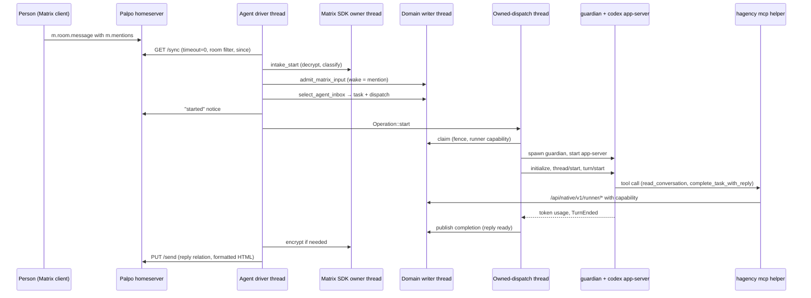
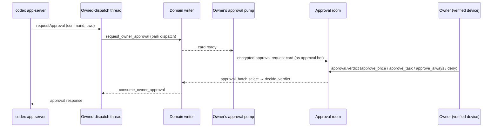

[English](architecture-walkthrough.md) | [中文](architecture-walkthrough.zh-CN.md)

# Code walkthrough: from a Palpo request to an agent's reply

This walkthrough is for developers who will change the native Rust service in `native/`. It follows the code paths behind the [user guide](user-guide/README.md):
1. A Palpo server is connected.
2. A project asks for an agent.
3. Hagency approves the agent and provisions it.
4. A person @-mentions the agent and gets a reply.

Each step names the file and function to open; search for the function name. ADRs live in [knowledge/decisions](../knowledge/decisions/). Section 15 lists what is implemented, what is not built yet, and the known gaps. Section 16 says where to make a change.

## 1. Vocabulary

| Name | Meaning |
| --- | --- |
| Hagency | The service that runs coding agents and lends them to projects. One installation is one **fleet**. |
| Palpo | The project's Matrix homeserver. Its web app installs Hagency's App Service and shows projects their agent requests. |
| Fleet id | `hf_` plus 32 hex characters. It prefixes every Matrix account Hagency owns, such as `@hf_…_representative`. |
| Representative | The fleet's own Matrix account (the App Service sender). It owns the reception room, invites agents into project rooms, and reads owners' keys. |
| Approval bot | The Matrix account `@<fleet>_approval`. It posts permission cards to an owner and reads the owner's verdicts. On an imported fleet it has one device per owner. |
| Fleet service | The part of `hagency serve` that creates an imported fleet's agents and runs its approvals, with no coordinator agent (ADR-187). |
| Coordinator | The older setup: a full agent engagement, configured in `agent-driver.json`, whose intake hosts provisioning and approvals. It still works for installs that use it (ADR-187 §D). |
| Project side | Hagency's record of one connected homeserver: its credential, API base URL and token budget. |
| Resource | A runnable configuration offered to projects: framework, model, reasoning effort and a monthly token ceiling. |
| Seat | A model account that resources draw on. Several resources can share one seat's quota. |
| Engagement | One approved agent for one project. It is the unit that is allocated tokens, provisioned, paused, topped up and retired. |
| Owner | The project-side human recorded in `projects.owner_mxid` when the engagement is admitted. Only the owner answers approval cards and DMs the agent. |
| Owner anchor | The owner's cross-signing master key, which the agent and the approval bot trust. On an imported fleet it is pinned on first use (section 7). |
| Reception room | An unencrypted, invite-only room shared by Palpo and the representative. Requests and connection probes arrive there as custom events. |
| Project room | The room where people and agents work. It is unencrypted, so the fleet's intake can read it. |
| Approval room | An encrypted room whose members are exactly the owner and the approval bot. |
| Agent DM | An encrypted room whose members are exactly the owner and one agent. |
| Identity rooms | The rooms an agent was created with: its DM and its project room. They are fixed for the agent's life. |
| Joined room | A room the agent joined later by invitation. It is stored per engagement and never becomes an identity room (ADR-188, section 10). |
| Session, dispatch, attempt | A session is one conversation route (room plus optional thread). A dispatch is one unit of agent work selected from it. An attempt is one launch of the runner for that dispatch. |
| Custody | A durable record, written before an external side effect, that says what was attempted. After a crash it decides between "inspect" and "do again". |
| Fence | A counter or row that stops stale work. A dispatch carries a fence number. Anything holding an older number is refused. |

## 2. Repository layout

| Path | Contents |
| --- | --- |
| [native/](../native/) | The Rust crates (section 4), test fixtures and the spec-binding check scripts. The workspace manifest is [Cargo.toml](../Cargo.toml) at the repository root. |
| [mockup/](../mockup/) | The console's Next.js source. Node is a build-time tool; a release build embeds the static export in the binary (section 13). |
| [deploy/](../deploy/), [install/install-native.sh](../install/install-native.sh) | The system unit and launchd plist for `hagency serve`, and the installer that renders them. `hagency service install` writes its own per-user units ([service.rs](../native/hagency/src/service.rs)) and needs neither. |
| [specs/](../specs/), [knowledge/](../knowledge/) | Task contracts bound to tests, and the ADRs and requirements behind them |
| [docs/](.) | Product documentation: this walkthrough, the [user guide](user-guide/README.md), operator [guides/](guides/) and [history/](history/README.md) (historical TypeScript-era architecture and guides). Everything under `docs/` other than `user-guide/`, `guides/`, `history/` and this walkthrough is internal working notes, not product documentation. There are two exceptions: [LICENSING.md](LICENSING.md), the licensing statement, and the agent workspace templates (`workspace-*-template.md`) that `hagency-store` compiles in. |

Code comments often cite `backend-v2.js`, `bridge-matrix.js` and `lib/*.js` with line numbers. They point to the TypeScript product that this service replaced. That code has been removed from the repository; read it in git history when a comment cites it.

## 3. Start at the executable

Open [native/hagency/src/main.rs](../native/hagency/src/main.rs). The `Command` enum is the whole surface:

| Subcommand | Who runs it | What it does |
| --- | --- | --- |
| `start` | The operator, or the per-user service | The fleet entry point (ADR-189). It resolves the state directory (`default_state_dir` in [service.rs](../native/hagency/src/service.rs) when `--state-dir` is absent), runs `init_state` from [setup.rs](../native/hagency/src/setup.rs) when there is no `operator.token`, and runs the same `serve` body as `serve --palpo-transport`, with the embedded console. It refuses to start when the binary has no embedded console and no `--console-assets` is given. |
| `service install`, `service uninstall` | The operator | Write and load a per-user service that runs `start --no-open` ([service.rs](../native/hagency/src/service.rs)): the LaunchAgent `io.hagency` (`launchctl bootstrap gui/<uid>`) on macOS, or the `systemd --user` unit `hagency.service` (`enable --now`) on Linux. The unit carries the binary's canonical path and the installer's `PATH`. `uninstall` keeps the state directory. |
| `serve` | `start`, install-native.sh's units, or the operator | The daemon. Everything in sections 5–14 runs inside it. Coordinator installs run it with explicit flags. |
| `guardian` (hidden, Unix) | `serve`, as a child process | Owns one runner's process tree (section 11). |
| `mcp` | Codex, as an MCP server | The task helper that gives the agent its tools (section 12). |
| `task …` | The agent, from a shell | The same task operations as a CLI. |
| `intake-refuse-stale-session` | The operator | Rejects one quarantined SDK batch, named by its digest, whose events are pre-session: each one's `origin_ts` is earlier than its session route's `ingress_since`, the moment that session began admitting Matrix input. It records a stale-session receipt per event and retries no model, SDK apply or domain admission ([bootstrap/intake_refusal.rs](../native/hagency/src/bootstrap/intake_refusal.rs); `refuse_stale_session_batch` in `hagency-matrix/src/intake.rs`, `stale_matrix_session_receipt` in `hagency-store/src/domain/verified_ingress.rs`). |
| `setup` | The operator, or the installer in fleet mode | The CLI form of the Setup page's first step (section 13). Prepares an imported fleet's state directory: initializes it if new, finds Codex and its sign-in folder, writes `fleet-runtime.json` and validates it with `serve`'s loader (`check_fleet_runtime` in [bootstrap.rs](../native/hagency/src/bootstrap.rs); [setup.rs](../native/hagency/src/setup.rs)). |
| `init`, `account`, `registration`, `side-registration`, `provision` | The operator | Create the state directory and credentials offline. Only `account` and `registration register` can drive a running service instead, with `--listen`. |
| `console-access`, `engagements`, `resources`, `alerts` | The operator | Loopback clients of the running service. |
| `backup`, `restore`, `rotate` | The operator | Online SQLite backup, restore and credential rotation ([ops/](../native/hagency/src/ops/)). |

`guardian` and `mcp` branch off in `main` before any Tokio runtime is built. Everything else runs on one multi-threaded runtime built in `main`.

### Two ways to run `serve`

`Bootstrap::open_with_options` in [bootstrap.rs](../native/hagency/src/bootstrap.rs) picks the mode from the flags:

| Flags | Mode | Agents come from |
| --- | --- | --- |
| `--palpo-transport` without `--agent-driver` | **Imported fleet** (ADR-187) | The fleet service, started by `palpo::Live::with_fleet_service` once a fleet is imported (section 7) |
| `--agent-driver` (with or without `--palpo-transport`) | **Coordinator install** | `agent-driver.json`: the coordinator's driver, its approval pump and its factory (`fleet::Service::new`) |

The units in [deploy/](../deploy/) carry an `__AGENT_DRIVER__` placeholder (`<!--__AGENT_DRIVER_ARG__-->` in the plist). [install-native.sh](../install/install-native.sh) fills it by `--mode`: empty for `fleet`, the default, so the unit runs `serve --palpo-transport`; `--agent-driver` for `coordinator`, which the installer accepts only with an `agent-driver.json` in `--config-dir`. In fleet mode the installer runs `hagency setup` unless `--config-dir` supplied a `fleet-runtime.json`.

`hagency start` is the imported-fleet mode with no flags to choose. It calls the same `serve` function as `serve --palpo-transport`, with one addition: `announce` in [service.rs](../native/hagency/src/service.rs) waits up to 60 s for the service to answer, then asks it for a console link through `console::client::access`. On an interactive terminal it prints the link and opens it (`open` on macOS, `xdg-open` on Linux) unless `--no-open`. When stdout is not a terminal, as under the per-user service, it logs only the `hagency console-access` command, so the link never reaches a log file.

`open_with_options` opens the custody store, then the domain store. In a coordinator install it also builds the approval-bot pump, the file and receive services and the factory service. Last, it builds the Palpo transport (`palpo::Live`). A fresh install with no imported fleet does not refuse to start; the transport waits for the console import.

`Bootstrap::serve` binds the single listener and starts the ceiling (hourly), retention (60 s) and reminder (1 s) sweeps, then the HTTP server, then Palpo. Starting Palpo also starts the fleet service of an imported fleet. In a coordinator install, `serve` also:
- starts the invite poller for the coordinator;
- retries approval-bot enrollment with a 1–60 s backoff until it succeeds;
- only then starts the approval forwarder, the coordinator's driver and the factory loop.

All HTTP traffic shares one loopback port (`127.0.0.1:13300` by default). `App::new` in [lib.rs](../native/hagency/src/lib.rs) refuses any listen address that is not loopback. The service reaches Palpo and Matrix only through outbound connections.

| Path | Caller | Auth |
| --- | --- | --- |
| `/health`, `/ready` | Supervisors | None. `/ready` answers 503 while any configured component is not ready. |
| `/console/**` | The operator's browser | Session cookie (section 13) |
| `/console/api/**` | The console's JavaScript | Session cookie plus same-origin checks |
| `/api/native/v1/**` | Operator CLI | Bearer `operator.token`, checked by `authorize` in [lib.rs](../native/hagency/src/lib.rs), which runs `local_authority` and then compares the bearer token's SHA-256 in constant time |
| `/api/native/v1/runner/**` | The `mcp` helper inside a runner | Per-dispatch runner capability ([runner.rs](../native/hagency/src/runner.rs)) |

`serve` reads no `.env`. Its configuration is the files in `--state-dir`:

| File | Purpose | Written by |
| --- | --- | --- |
| `operator.token` | Operator bearer secret | `hagency init` |
| `palpo-transport.json`, `palpo.machine_token`, `palpo-appservice.json` | The imported fleet's transport and App Service registration | The Palpo import, `write` in [bootstrap/palpo_import.rs](../native/hagency/src/bootstrap/palpo_import.rs) |
| `fleet-runtime.json` | Imported fleet: the local Codex executable and its hash, file tools, limits and agent homes (profile `palpo_fleet_runtime_v1`) | `configure` in [setup.rs](../native/hagency/src/setup.rs), called by the Setup page (`POST /console/api/setup/check`) or by `hagency setup`; it also creates `agent-homes/` for `home.root`. Or the operator, through the installer's `--config-dir`. Loaded by `load_fleet_runtime` in [bootstrap/config.rs](../native/hagency/src/bootstrap/config.rs) |
| `representative.identity.json`, `matrix.representative_token`, `matrix.appservice_token`, `matrix.provisioning_key`, `approval-<owner>.*`, `approval-sdk-<owner>/` | Imported fleet: the representative's device, the App Service token, the agents' provisioning key, and one approval device per owner | The fleet service ([bootstrap/fleet_identity.rs](../native/hagency/src/bootstrap/fleet_identity.rs)) |
| `runtime-home/` | Imported fleet without a `local_codex` block: the agents' `HOME` and `CODEX_HOME` (section 7) | `serve`, created owner-private when it loads `fleet-runtime.json` (`load_fleet_runtime` in [bootstrap/config.rs](../native/hagency/src/bootstrap/config.rs)) |
| `fleet-workspace/` | Imported fleet: a private placeholder workspace for the fleet host; no dispatch is routed to it | `serve`, in the same load |
| `factory-task-contexts/` | Imported fleet: the task contexts the warm task bridge hands to each dispatch | `serve`, in the same load |
| `console-logins.json` | SHA-256 hashes of the console access link and of each login, so a restart does not sign the operator out | The console ([console/authority.rs](../native/hagency/src/console/authority.rs)) |
| `agent-driver.json`, `matrix.*`, `approval.*` | Coordinator install: runner, workspaces, Matrix and approval settings, factory service | The operator ([bootstrap/config.rs](../native/hagency/src/bootstrap/config.rs)) |
| `agent-matrix-provision_<engagement>/` | Each provisioned agent's credential and SDK store | Provisioning ([hagency-matrix/src/token_provision.rs](../native/hagency-matrix/src/token_provision.rs); the directory is named in `TokenAccountProvision::configured` as `agent-matrix-` plus the effect id `provision_<engagement>`) |
| `domain.sqlite3`, `custody.sqlite3` | Domain state; Palpo transport custody (section 5) | [native/hagency-store](../native/hagency-store/src/) |

## 4. The crates

The workspace members are listed in the root [Cargo.toml](../Cargo.toml). Most library crates state their role in a `//!` comment at the top of `lib.rs`.

| Crate | Owns |
| --- | --- |
| `hagency` | The binary: bootstrap, fleet service, console routes, runner API, `mcp` helper, operator CLI |
| `hagency-core` | Domain types and rules with no IO: requests and their verification, resources, replies, tasks, approvals scopes |
| `hagency-store` | Every durable rule: the domain and custody SQLite databases, each on its own writer thread |
| `hagency-matrix` | Every Matrix side effect: sync and intake, the SDK crypto owner, sends, provisioning, joined rooms, the approval bot |
| `hagency-palpo` | The outbound Palpo transport: long poll, acknowledgements, updates, catalog publication |
| `hagency-execution` | One dispatch from claim to settlement: workspace, runner launch, approvals, usage binding, warm runtimes |
| `hagency-runtime` | The Codex app-server protocol (and Claude protocol code that is not launched), owned child IO |
| `hagency-platform` | Process scope: the Unix guardian and process groups, Windows Job Objects |
| `hagency-metering` | Normalizes untrusted token-usage reports |
| `hagency-matrix-format` | Markdown to Matrix HTML formatting |
| `hagency-files`, `hagency-media`, `hagency-media-store` | File snapshots, attachment crypto and private media storage for file delivery |
| `hagency-permissions`, `hagency-progress`, `hagency-progress-runtime`, `hagency-crypto-proof` | Not used by the binary; only their own tests use them. Live approvals run through `hagency-execution/src/approval/`; live progress notices come from `hagency-store/src/domain/activity.rs`. |

Dependencies point downward; transitive edges are omitted:

Start with three crates: `hagency-core` for the vocabulary as types, `hagency-store` for the rules, and `hagency-matrix` for the side effects.

## 5. Process model

`hagency serve` is one process. Its work runs on these threads and child processes:

| Component | Execution | Where |
| --- | --- | --- |
| HTTP server, sweeps, Palpo poll, fleet service, approval pumps | Tasks on the main multi-thread runtime | `main`, `Bootstrap::serve`, `bootstrap/fleet_service.rs` |
| Domain database | Thread `hagency-domain`: a bounded `mpsc` of boxed closures over `&mut DomainRepository`, replies on `oneshot` | `hagency-store/src/domain_worker.rs` |
| Custody database (Palpo polls, attempts and publication receipts) | Thread `hagency-custody`, same pattern | `hagency-store/src/worker.rs`, `custody-migrations/002-outbound.sql` |
| Each agent (and the coordinator, if any) | Thread `hagency-agent-driver` with its own current-thread runtime | `bootstrap/driver.rs` |
| Matrix crypto and state | Thread `hagency-matrix-sdk` per identity; owns the SQLite crypto store lock | `hagency-matrix/src/sdk.rs` |
| One running dispatch | Thread `hagency-owned-dispatch` (warm agents: `hagency-warm-owned-runtime`) | `hagency-execution/src/operation.rs`, `warm.rs` |
| Runner process tree | `hagency guardian` child process, then Codex | `hagency-platform` |
| File delivery, received files | Threads `hagency-file-service`, `hagency-receive-service` | `file_service.rs`, `receive_service.rs` |
| Agent tools | `hagency mcp` child process of Codex, talking HTTP to the runner API | `native/hagency/src/mcp.rs` |

**One writer per database.** Every read and write of `domain.sqlite3` is a job sent to the `hagency-domain` thread. Rules that must hold together, such as "insert the approval and park the dispatch", run as one job inside one transaction. Each job carries a deadline and a byte budget. The databases use WAL with `synchronous=FULL`. Exclusive locks on `domain.lock` and `owner.lock` stop a second process from opening the same state directory. The domain schema is at version 60 (`DOMAIN_SCHEMA_VERSION` in `hagency-store/src/domain.rs`).

**Ids and fences instead of locks.** Work crosses threads and processes by id. The fence on a dispatch, the epoch on a task and the generation on a registration, room or transport let the holder of the current number act and refuse everyone else. Once a dispatch is fenced, its runner's calls are refused, except three routes that stay open on purpose: an identical replay of `complete-task-with-reply`, `late-output`, which records the output as fenced and settles nothing ([REQ-TSS-FENCE](../knowledge/requirements/req-thread-scoped-agent-sessions.md)) and historical `file-deliveries/{id}` reads.

**Unknown outcomes stay unknown.** A Matrix write, process cleanup or approval response whose result was lost is recorded as `Unknown` or `uncertain`. Recovery inspects the outcome or waits for the operator (ADR-182, ADR-183). A component that fails is retried with backoff; it does not stop the process.

**Shutdown.** SIGTERM cancels a `CancellationToken`. `Bootstrap::close` then:
1. Quiesces the factory service, the console, and the file and receive services; cancels the driver; aborts the sweeps; cancels Palpo.
2. Closes the file and receive services and the driver. Closing Palpo first closes the fleet service (its agents and pumps), then the transport. Then it drains and closes the factory's agents.
3. Closes the coordinator's collector and approval pump, if any.
4. Shuts down the domain writer, then the custody writer.

The HTTP server stops last, with a 5 s grace period.

## 6. Connect a Palpo server

The admin's "Add Hagency" and the owner's "Download Hagency configuration" happen in Palpo web. Hagency's part starts when the operator uploads that JSON in the console.

1. [console/palpo_import.rs](../native/hagency/src/console/palpo_import.rs) accepts the upload and calls `Live::import` in [bootstrap/palpo.rs](../native/hagency/src/bootstrap/palpo.rs).
2. `parse` in [bootstrap/palpo_import.rs](../native/hagency/src/bootstrap/palpo_import.rs) accepts exactly one shape:
   - The fleet id is `hf_` plus 32 hex characters, and the sender is `<fleet>_representative`.
   - There is one exclusive user namespace `@<fleet>_…:<server>` and no room or alias namespaces.
   - `as_token`, `hs_token` and the machine token are all different.
   - The transport mode is `outbound`, to an `https://…/api/fleet/v2/<fleet>` endpoint (plain `http` only on loopback).
   - A file for a second fleet is refused with `palpo_fleet_conflict`: one service runs one fleet.
3. The import stores what it validated:
   - **Domain store:** a `registrations` row (fleet, server, representative, approval bot, and a reception room that stays empty until the probe binds it), a project-side row and its App Service credential.
   - **State directory:** three private files.
   - With `--palpo-transport` set, the transport starts at once, without a restart. A re-import of the same fleet keeps the bound reception room and the running fleet service.
4. Credentials are write-only. `SideRecord` in `hagency-store/src/domain/side_lifecycle.rs` exposes `credential_kind` and `has_credential`, never the token. The import route answers with public facts only.
5. The transport is [hagency-palpo](../native/hagency-palpo/src/).
   - `adapter.rs` long-polls `GET {endpoint}/poll` on two lanes, then calls `POST ack` and `POST updates`.
   - The **matrix lane** relays App Service transactions. The **work lane** carries jobs such as probes and agent requests.
   - The poll waits 25 s and the catalog republishes every 15 s (`config.rs`).
   - Nothing listens for inbound connections. A homeserver behind NAT works without exposing Hagency.
6. "Verify connection & create reception" in Palpo makes the representative post a `com.hagency.connection.probe.v1` event. `work_once` in [bootstrap/palpo_work.rs](../native/hagency/src/bootstrap/palpo_work.rs) re-reads that event as the representative, and `decide` in [bootstrap/probe.rs](../native/hagency/src/bootstrap/probe.rs) checks the room. The room is bound only if it is invite-only and unencrypted, the representative has joined, and no other reception room is bound. The receipt returns to Palpo in the next `updates`. A failed probe is retried until it succeeds.
7. The same loop (`run` in `palpo_work.rs`) lets the approval bot accept invites to private approval rooms every 15 s (`approval_invites_once`).

Test examples: `native_palpo_import_route_saves_the_owner_download` and `native_palpo_import_route_refuses_a_foreign_file` in [hagency/tests/console/palpo_import.rs](../native/hagency/tests/console/palpo_import.rs).

## 7. The fleet service (ADR-187)

An imported fleet runs with no coordinator agent. [ADR-187](../knowledge/decisions/adr-187-palpo-fleet-without-coordinator.md) and its amendment set the rules. `FleetService::start` in [bootstrap/fleet_service.rs](../native/hagency/src/bootstrap/fleet_service.rs) runs one supervisor task. It walks four stages, logs each change, and never exits. The two `awaiting_*` stages poll at a fixed 5 s; the `identities` stage and a refused configuration back off from 1 s to 60 s (`BACKOFF_MIN`, `BACKOFF_MAX`):

A configuration that `build` refuses shows as `refused_config` and is retried. One cause is a Codex update: `fleet-runtime.json` pins the binary's SHA-256, and the Setup page rewrites a stale file (`runtimeStale`, section 13).

**Identities** (`ensure` in [bootstrap/fleet_identity.rs](../native/hagency/src/bootstrap/fleet_identity.rs)):
- The representative gets one device by App Service login. It is created once and reused. A stored token the homeserver no longer accepts is refused, never replaced, because room custody is bound to it.
- The App Service token is copied to `matrix.appservice_token`. The agents' provisioning key `matrix.provisioning_key` is random, created once and never sent anywhere.
- An approval device from an earlier hand-built install (`approval.access_token`) is adopted, not re-created.

**Running.** `build` creates a `TokenProvisioningHost` from the imported files with `with_agent_rooms_pinned_anchors`, plus the membership sweep, which acts with the representative's credential. It then creates a `fleet::Service` with `Provider::Fleet`. `run` then:
1. Calls `prepare_owners` once, so that agents re-attached after a restart find their owner's approval device.
2. Starts the agent service (`fleet::Service::run`).
3. Every 2 s, calls `prepare_owners` and then `provision_pass` in [hagency-matrix/src/provisioning.rs](../native/hagency-matrix/src/provisioning.rs). One engagement's refusal goes into the pass report and never stops another (ADR-182).

**Owners** (`prepare_owners`). For each engagement that is pending, waiting for its owner, or already provisioned:
1. `fleet_identity::owner_anchor` returns the owner's pinned master key. With none pinned, `fetch_master_key` reads the key with the representative's device (`POST /keys/query`) and pins it. An owner with no cross-signing key yet makes the provision wait; "no key" never means "no anchor needed".
2. `owner_approval_device` creates, once per owner, an approval-bot device with its own token, SDK key and store (`approval-<slug>.*`; the slug is a hash of the owner's MXID). Each device trusts only {bot, owner}, because an enrollment's user set is frozen.
3. `owner_collector` builds an `ApprovalCollector` anchored on the fleet (`HostApprovalConfig::for_fleet`), and `attach_owner_approvals` hands it to the host. Until it is attached, a warm agent's provision waits before it claims anything.
4. `supervise_pump` runs that owner's approval pump. It retries enrollment, and it restarts a drain that ended on a refused card, so one bad card does not stop that owner's approvals.

**Owner anchors are trusted on first use.** The table is `owner_anchors` ([hagency-store/src/domain/owner_anchors.rs](../native/hagency-store/src/domain/owner_anchors.rs), [migrations/059-owner-anchors.sql](../native/hagency-store/src/migrations/059-owner-anchors.sql)). It holds one row per owner: `master_key`, `source` (`first_use` or `operator`), and `mismatch_key`/`mismatch_at` for a later, different key, which is never adopted. This amends ADR-102 for imported fleets: the first answer from the homeserver is trusted. The fleet service never re-reads a pinned key, so a later change surfaces only as an enrollment refusal (section 15).

**Agents** ([bootstrap/fleet.rs](../native/hagency/src/bootstrap/fleet.rs)). `Provider` says where agents come from: `Coordinator` (a coordinator's collector) or `Fleet` (the provisioning host). `Service::admit` accepts at most 16 agents. For a fleet agent, it:
- gives the agent its owner's approval pump, and refuses if that owner has none yet;
- records the agent's transport, so the public "waiting for approval" notice is sent by the waiting agent;
- starts the agent's own invite poller (`AgentOwner.invites`, section 10);
- starts its driver, file and receive services.

**Codex sign-in.** The user signs in to Codex; Hagency never runs a login. `detect_codex` in [setup.rs](../native/hagency/src/setup.rs) finds the binary `setup` would use and runs only `codex --version` and `codex login status` (10 s timeout each). For `codex login status`, the exit status decides `signed_in`, and the output decides the sign-in kind (`chatgpt` or `api_key`), which the Setup page shows. A fleet agent's Codex credential comes from `fleet-runtime.json` (`FleetRuntimeConfig` in [bootstrap/config.rs](../native/hagency/src/bootstrap/config.rs)), which the Setup page or `hagency setup` writes (the page always uses the default Codex folder): with a `local_codex` block (preset `local_codex`, seat `local_codex_seat`, the user's `HOME` and Codex folder) by default, without one under `--no-local-codex`. Setup reports whether that folder holds a sign-in (`auth.json`) and prints the `CODEX_HOME=… codex login` command when it does not. With a `local_codex` block, the agent reuses an existing Codex sign-in on the host through that block's `codex_home`. Without one, `HOME` and `CODEX_HOME` point at `<state>/runtime-home`. The fleet runtime has no managed account: `hagency account` namespaces and `agent-driver.json`'s `managed_account` apply to a coordinator install only (the launch environment is set in [hagency-execution/src/host.rs](../native/hagency-execution/src/host.rs)).

**Request intake has one path.** On an imported fleet, reception requests are admitted only by the Palpo work lane (`admit_request` in `palpo_work.rs`, section 9).

## 8. Resources and the catalog

Resources are created in three places:
- **Setup page.** `POST /console/api/setup/resource` (`offer` in [console/setup.rs](../native/hagency/src/console/setup.rs)) creates a published `local_codex` resource from a model, a reasoning effort and a monthly ceiling (20,000,000 tokens when omitted). It refuses a pair that `configuration_choices` in `hagency-core/src/qualification.rs` does not qualify (`setup_unqualified_model`), and it needs `fleet-runtime.json` (`setup_runtime_missing`). It takes the seat from the file's `local_codex.seat`, so the resource always matches the sign-in. It writes through `edit_resource`, the same store call as the operator API.
- **Operator API.** `POST /api/native/v1/resources` (`put_resource` in [resources.rs](../native/hagency/src/resources.rs)) writes a resource from its full definition. The API does not check that a resource matches the `local_codex` sign-in. With a `local_codex` block, `LocalCodex::admit_provision` (at provisioning) and `LocalCodex::admit` (per dispatch) in `hagency-execution/src/local_codex.rs` refuse a resource whose `seat_id` differs from the block's `seat`, whose framework is not `codex`, whose provider is set and not `openai`, or that needs a managed account; without the block, any seat works.
- **Console.** The resources route in `console/resources.rs` hands creation to `resource_configuration::create`, which copies an existing source resource (`source_resource_id`) with a new model, reasoning effort or ceiling. This page cannot create a resource from nothing; the Setup page can. With no resources, the page's empty state points an imported fleet to the Setup page and a coordinator install to managed-account enrollment (`console/accounts.rs`); a resource bound to a managed account is refused by a fleet host, which has none (`hagency-execution/src/host.rs`).

`console/resource_configuration.rs` also changes an existing resource's model, reasoning effort and monthly ceiling, using `expectedRevision` for optimistic concurrency.

`Resource::qualifies` in `hagency-core/src/project.rs` offers a resource for a role only when all four hold:
- it is published;
- its framework is `codex` or `claude` (`provisionable`);
- it has a ceiling;
- its model qualifies for the requested role (`hagency-core/src/qualification.rs`).

New resources are published in the same transaction that creates them (`prepare_resource_write` in `hagency-store/src/domain.rs`). Withdrawal is durable. While a resource has reserved or active engagements, its profile cannot be edited.

`publish_resources_once` in `hagency-palpo/src/catalog.rs` sends the frozen catalog to Palpo every 15 s. For each resource, Palpo receives an opaque id, a display name, the framework, the model and the reasoning effort. Ceilings, seats and preset ids stay inside Hagency (ADR-024, ADR-108, ADR-111). The same `updates` call carries engagement statuses and probe receipts.

The console can publish a `claude` resource, but `hagency-execution/src/host.rs` refuses to launch one with `UnsupportedRunner`. Only Codex runs natively today.

## 9. From agent request to provisioned agent

A project member defines an agent in Palpo web: a name, one published resource, a role, requested tokens and a daily rate. Palpo posts `com.hagency.engagement.request.v1` in the reception room and queues a work item.

**Admission.** `admit_request` in [bootstrap/palpo_work.rs](../native/hagency/src/bootstrap/palpo_work.rs) re-reads the source event, observes the rooms, and calls `verify_request` in `hagency-core/src/authority.rs`. These must hold:
- The reception and project rooms are invite-only and unencrypted.
- The requester, the owner and the representative have joined the project room.
- The owner has power level 100 there.
- The room's `com.hagency.admin.binding.v1` state names this fleet, project and owner.
- The owner's approval room is encrypted and contains exactly the owner and the approval bot.
- The observation is less than 30 s old.

`DomainRepository::admit` in `hagency-store/src/domain.rs` then writes the engagement:
- **Id:** `en_` plus a 32-hex hash of fleet and request id. A replay returns the stored row; a different body under the same id is a conflict.
- **Name:** must be unique among the project's pending, reserved and active engagements. `AgentName` accepts Unicode letters, normalises to NFC and allows at most 64 UTF-16 units.
- **Writes:** the `projects` row (owner, approval room) and the `engagements` row in `pending`.

**Approval.** The Engagements console page uses three routes:
- `GET …/candidates` returns `remainingTokens`. This is what "All remaining" fills in.
- `POST …/approve {allocatedTokens?}` approves. The agents route `…/refuse` rejects a pending request.
- `approve_allocating` calls `check_grant`. `check_grant` compares the amount with `headroom`, the smallest of ceiling, seat and pool headroom. The ceiling side counts each draw as `max(reserved, spent)`; seats and pools count commitments. A refusal is `OverCommit` (with a message naming the binding limit), `InsufficientCapacity` or `NoCeiling`.
- On success the engagement becomes `reserved`, and a `provision_<id>` effect is queued.

`refresh_statuses` in `palpo_work.rs` reports each state back to Palpo: `pending`, `active` while provisioning, `active` plus `complete`, `rejected` or `ended`. It also sends the allocated tokens, the agent's MXID and `ready` once the agent has joined its room.

**Provisioning.** `provision_pass` in [hagency-matrix/src/provisioning.rs](../native/hagency-matrix/src/provisioning.rs) runs every pending `provision_<id>` effect and gives each provision that is waiting for its owner one more look. The fleet service calls it every 2 s; a coordinator install calls it from the coordinator's intake turn (`hagency-matrix/src/intake.rs`). Each claim is fenced by its effect id. The order comes from ADR-184:

1. Create `@<fleet>_<32hex>:<server>` through App Service `/register`, then log in to get device `DEVICE_<engagement>` (`token_provision.rs`, `token_provision/application_service.rs`).
2. Set the display name to the project's agent name.
3. The agent creates its DM: `private_chat`, Megolm, `m.federate: false`, history `invited`, **no invitees**.
4. The representative invites the agent to the project room; the agent joins.
5. `enroll_created_rooms` uploads the agent's device keys and cross-signing identity. The trusted owner key is the pinned anchor (section 7).
6. Only now `invite_owner` invites the owner to the DM. The step waits, with no deadline, until the owner joins. After a restart during this wait the step returns `OutcomeUnknown` and nothing resumes it (`token_provision/rooms.rs`); the operator retires the engagement and the owner requests again (section 15).

Step 5 comes before step 6 so that the owner's client always has the agent's keys before the owner can type. ADR-184 records the incident that forced this order.

Every Matrix write records a custody stage before and after it: `dm-possible`/`dm-response`, `invite-possible`/`invite-response`, and so on (`token_provision/rooms/custody.rs`). After a lost response, the next attempt inspects the room instead of repeating the write.

**Re-attach after a restart.** `reattach_factory` in [hagency-matrix/src/provisioning/factory.rs](../native/hagency-matrix/src/provisioning/factory.rs) brings back each agent the factory completed. It continues the stored transport generation, or opens generation + 1 when that generation was fenced. The DM session id carries the generation after a fenced re-attach (`session_<engagement>` for generation 1, `session_<engagement>_<n>` after that), because the store never rebinds a session whose route a fence retired.

**Retirement.**
- `POST …/retire` revokes a pending, reserved or active engagement. A reserved engagement's provision effect is cancelled. If provisioning had started, the call queues a `retire_<id>` effect. The agent's driver runs it: it leaves every room and logs the device out ([hagency-matrix/src/retire.rs](../native/hagency-matrix/src/retire.rs)). An agent that never got a credential is settled by `settle_unattached_retirements` in the provisioning pass.
- A failed retirement is re-run only by `POST …/cleanup-retry`.

## 10. Rooms, and who can talk to an agent

| Room | Encrypted | Members | What wakes the agent | Where the rule lives |
| --- | --- | --- | --- | --- |
| Reception | No | Palpo's accounts and the representative | Nothing. It carries requests and probes. | `verify_request`, `probe.rs` |
| Project room | No | The project's people, representative, agents | A human message that mentions the agent | `admit_matrix_input` in `hagency-store/src/domain/verified_ingress.rs` |
| Agent DM | Yes | Owner and one agent | Any message from the owner | `admit_matrix_input`; room shape in `domain/matrix_routes.rs` |
| Approval room | Yes | Owner and approval bot | Nothing. It carries cards and verdicts. | `observe_approval_room` in `domain/approvals.rs` |
| Joined room, unencrypted | No | Anyone the inviter added | A human message that mentions the agent | Same as the project room |
| Joined room, only the owner and the agent | Either | Owner and the agent | Any message from the owner | `owner_only_joined_room` in `verified_ingress.rs` |
| Joined room, encrypted with other people | Yes | Owner, the agent and others | Nothing. The agent does not work there. | `joined_rooms` in `provisioning/factory.rs` |

All members must be on the fleet's own server: `matrix_user` and `matrix_room` in `hagency-core/src/replies.rs` refuse other server names.

In a group room, every joined human can give the agent work by mentioning it. The owner keeps control in three ways:
- Risky operations need the owner's approval (section 12).
- All work spends the engagement's allocation (section 13).
- The owner decides who joins the room.

Only human messages wake an agent; `!` commands and `/thread` directives are recorded but wake nobody. After a task is done, a reply in its thread wakes the agent only if it comes from the original requester.

### Invites

`poll_round` in [bootstrap/invites.rs](../native/hagency/src/bootstrap/invites.rs) runs every 10 s for one agent:
- An invite from a trusted inviter is joined at once. Trusted means the project owner recorded for that room, or the agent's own owner.
- Any other invite, including one whose inviter cannot be read, becomes a row in `pending_invites`. The operator accepts or declines it in the console under Invitations (`console/invites.rs`). The next round then joins or leaves.
- Declines are remembered, so the same invite cannot come back.
- Every successful join records the room as a joined room (`bind_joined_room`).

On an imported fleet, each agent runs its own poller (`AgentOwner.invites` in `fleet.rs`). In a coordinator install, only the coordinator's poller runs (`Bootstrap::serve`).

Test examples: `untrusted_invite_becomes_a_pending_decision`, `owner_invite_takes_the_trusted_inviter_arm_and_joins` and `console_accept_queues_the_join_and_the_next_poll_performs_it` in [hagency/tests/invites.rs](../native/hagency/tests/invites.rs).

### Joined rooms (ADR-188)

[ADR-188](../knowledge/decisions/adr-188-agents-work-in-rooms-they-join.md) lets an agent work in rooms it joins after it was created. The data path:

1. **Store.** `joined_rooms` ([hagency-store/src/domain/joined_rooms.rs](../native/hagency-store/src/domain/joined_rooms.rs), [migrations/074-joined-rooms.sql](../native/hagency-store/src/migrations/074-joined-rooms.sql)) has one row per (engagement, room), with `state` = `working`, `encrypted_shared` or `retired`, and `notice_at`. An engagement holds at most 12 live joined rooms (`MAX_JOINED_ROOMS`). Joining a retired room again makes it `working`.
2. **Each driver pass.** `ProvisionedAgent::inboxes` calls `joined_rooms` in `provisioning/factory.rs`:
   - It reads the rows. A room the agent is no longer in, according to `GET /joined_rooms`, is retired.
   - It observes each remaining room. An encrypted room whose members are not exactly the owner and the agent becomes `encrypted_shared`; every other room is `working`.
   - For a working room, `joined_session` resolves a session `joined_<engagement>_<transport>_<generation>_<hash>` and adds the room to the claim profile with `OwnedClaimRoom::joined_group`.
   - A room that cannot be observed or routed is skipped this pass. It never stops the identity rooms.
3. **Collector.** The `Inner` struct in [hagency-matrix/src/collector.rs](../native/hagency-matrix/src/collector.rs) keeps two in-memory maps: `joined` (room → working) and `joined_shared`. `host_rooms()` returns the identity rooms plus the working joined rooms. `observed()` adds the reception room. These sets drive the sync filter, intake targets and send checks.
4. **Store admission.** The room-scope writer in `domain/matrix_routes.rs` accepts a group room other than the project room only while `joined_working` finds a working row. `refresh_matrix_rooms` in `domain/owned_dispatch.rs` lets joined rooms be added or dropped, but the identity rooms must stay unchanged, and the profile holds at most 16 rooms. The claim query in `domain/execution.rs` also checks for a working row.
5. **Wake rule.** In `admit_matrix_input`, a group-room message wakes the agent if it mentions the agent, or if `owner_only_joined_room` finds a working joined room whose only members are the owner and the agent.
6. **Encrypted and shared.** The agent stays joined and posts one plain `m.notice` explaining that it cannot work there. If someone posts later, it repeats the notice at most once every 15 minutes (`RENOTICE_GAP_MS`). It reads only senders and timestamps, never message content. The state is checked again on every pass, so a room where only the owner remains becomes `working`.
7. **Sync gaps.** `scope_sync` in `collector.rs` drops a limited (truncated) timeline for a joined room instead of refusing it. The first sync after a room enters the filter is always limited, and a joined room only admits messages that arrive after the join. A room the agent left arrives under `leave` with its timeline emptied.

Approvals and tokens are unchanged: work in a joined room spends the same allocation, and its cards go to the owner's approval room.

Test examples: `native_joined_room_record_state_and_notice`, `native_joined_group_room_scope_needs_a_working_join`, `native_joined_room_wake_rules` and `native_claim_profile_carries_joined_rooms` in [hagency-store/tests/joined_rooms.rs](../native/hagency-store/tests/joined_rooms.rs).

### Why joined rooms never enter `HostConfig.rooms`

An agent's encrypted SDK store is bound to a digest. `binding()` in [hagency-matrix/src/config.rs](../native/hagency-matrix/src/config.rs) hashes these fields:
- the origin and the registration fingerprint and generation;
- the engagement, server, account and device;
- the set of `HostConfig.rooms` ids.

The access token and the transport and room generations are left out on purpose. When the SDK owner opens an existing store, it compares the stored binding with this digest and refuses a mismatch with `Error::Identity` (`hagency-matrix/src/sdk.rs`). If a joined room were added to `HostConfig.rooms`, the agent's store would refuse to open on the next restart. So the identity rooms stay in the host configuration, and joined rooms live in the store and in the collector's `joined` map.

## 11. Follow one message to its reply

A person writes `@coding-fast-01 add a sum() helper` as a top-level message in the project room.

**Intake.** Each active agent has a driver: an OS thread named `hagency-agent-driver` with its own current-thread runtime (`Driver::start_agent` in [bootstrap/driver.rs](../native/hagency/src/bootstrap/driver.rs)). The fleet service starts one driver per admitted agent.

`run_continuous` repeats `run`:
1. `collector.collect`, then resume any unfinished outgoing custody.
2. Refresh the agent's rooms and inboxes (`ProvisionedAgent::inboxes`, including joined rooms), and build a `HostIntakePlan` from them.
3. `collector.intake(plan)`. Idle passes sleep 1 s, and errors back off up to 60 s.

`Inner::intake` in [hagency-matrix/src/intake.rs](../native/hagency-matrix/src/intake.rs) handles one pass:
1. Check the agent's identity with `whoami`.
2. Issue one `GET /sync` with `timeout=0`, a room filter and the stored `since`, and narrow the response to the observed rooms (`scope_sync`).
3. Pass the response to the SDK owner thread (`Owner::intake_start` in `sdk.rs`). It journals the batch, applies it to the encrypted state store, and retries envelopes that earlier lacked keys.

`Batch::derive_with_history` in `event_batch.rs` classifies each event:
- **Candidate:** an accepted plaintext event, or a verified Megolm event whose sender and device match.
- **NotTarget:** an event that does not concern this agent.
- **Rejected:** a decryption failure, plaintext in an encrypted room, and so on.
- **Deferred:** the room key has not arrived yet.

It also reads `m.thread`, ignores edits, and takes mentions from `m.mentions.user_ids`, falling back to pills and `@name` text.

**Admission.** `admit_matrix_input` in `hagency-store/src/domain/verified_ingress.rs` checks route, membership, encryption match and the `ingress_since` boundary. It deduplicates by content digest, then writes one `session_inputs` row whether the message wakes the agent or not (ADR-023). Rows that do not wake become discussion context for the agent's next turn.

**Dispatch.** `select_agent` in `domain/messages.rs` takes the oldest waking input:
- It creates a task and a dispatch with deterministic ids.
- `freeze_window` fixes the discussion range the agent will see.
- `enqueue_inbox` puts the inputs addressed to the agent in the payload. Everything else is reachable through `read_conversation`.

The driver posts a "started" notice. That event becomes the anchor that later progress edits replace.

**Claim.** The claim query in `domain/execution.rs` leases a dispatch only when all of these hold:
- It is queued, or it is parked and its time has come.
- No other dispatch of the same session is leased, started or parked. This gives one turn per conversation.
- The engagement is `active`, with no open `quota_holds` row, no agent fence and no quarantine.
- The workspace lease is free.
- The account's readiness is known.
- Fewer than `max_live` dispatches are live (8 for factory agents).

The lease bumps the fence and mints a `RunnerCapability`: dispatch id, runner id, fence number and a secret stored only as a hash.

**Execution.** `execute` in [hagency-execution/src/operation.rs](../native/hagency-execution/src/operation.rs) runs on a `hagency-owned-dispatch` thread:
1. `hagency-execution/src/host.rs` resolves the workspace. When the agent's workspace mode is `worktree` and the session has a thread root, the dispatch gets its own `git worktree`, and is refused if no worktree directory is configured (ADR-011). Every other dispatch uses the agent's shared workspace. It also sets the environment, including `HAGENCY_RUNNER_API_ADDR` and the capability, and fixes argv to `["app-server"]`.
2. `OwnedSession::spawn` (`hagency-runtime/src/owned/session.rs`) starts `hagency guardian`.
   - **Unix:** a socket pair carries a Prepare/Start handshake ([hagency-platform/src/supervisor/unix.rs](../native/hagency-platform/src/supervisor/unix.rs)). The guardian puts Codex in its own process group, becomes subreaper on Linux, and kills the whole group on stop.
   - **Windows:** no guardian. The child is created directly inside a kill-on-close Job Object (`hagency-platform/src/windows.rs`).
3. The Codex app-server protocol (`hagency-runtime/src/codex/session/driver.rs`) runs `initialize`, `thread/start` and `turn/start`, then reads updates until `TurnEnded`.
   - `thread/start` sets `sandbox: workspace-write` (or `read-only`), `approvalPolicy: on-request`, no network and no extra writable roots (`codex/session.rs`). `state.rs` checks that Codex echoed these settings back.
   - The turn ceiling is 20 minutes (`MAX_REQUEST_MS` in `hagency-runtime/src/codex.rs`). Overrunning the operation budget raises a notice and does not kill the turn (ADR-183).

**Tools.** Codex's MCP config, built in `codex/session/task_mcp.rs`, runs `hagency mcp` as `hagency_task_writer`. The helper forwards each call to `/api/native/v1/runner/*` with the dispatch, runner and fence headers, and `runner.rs` authenticates them. Section 12 lists the route behind each tool.

**Completion.** `complete_task_with_reply` (`domain/owned_completion.rs`):
1. Moves the task to Done and bumps its execution epoch.
2. Stores the reply as `held` and fences the dispatch, so the old capability stops working.

After the guardian proves the process tree is gone, `publish_owned_completion` marks the reply `ready`. If cleanup cannot be proven, the reply is not published and the driver fences the agent instead.

**Reply.** `finish_attempt` in `driver.rs` claims the final reply and calls `collector.send_final`. `Inner::outgoing` in [hagency-matrix/src/outgoing.rs](../native/hagency-matrix/src/outgoing.rs) then:
- Looks up any earlier receipt for this reply and returns it if one exists.
- Builds the content with a body and a Markdown-rendered `formatted_body` (`hagency-matrix-format`, raw HTML disabled).
- Adds the reply relation from `reply_relation` (`outgoing/state.rs`): `m.thread` when the source message was in a thread, `m.in_reply_to` for this example's top-level group message, nothing in a DM.
- Encrypts through the SDK owner for encrypted rooms and sends with `PUT /send/{txn}`.

A resumed send reuses the same transaction id.

Test example: `native_two_agent_task_handoff_observes_usage_on_the_right_engagement` in [hagency/tests/two_agent_handoff.rs](../native/hagency/tests/two_agent_handoff.rs).

## 12. Tools and approvals

Codex starts `hagency mcp` as the MCP server `hagency_task_writer`. The always-on tools are `TASK_MCP_TOOLS`. Three optional groups are switched on in the runtime configuration by `coordination_tools`, `send_file` and `receive_file` ([hagency-runtime/src/task_mcp.rs](../native/hagency-runtime/src/task_mcp.rs)). Routes are under `/api/native/v1/runner/`, and the task and coordination handlers pass a `RunnerCommand` (`hagency-core/src/tasks.rs`) to `DomainStore::runner_command`. The file routes hand off to their service threads:

| Tool | Route | Handler in `runner.rs` or `runner/` | Pre-approved |
| --- | --- | --- | --- |
| `get_task`, `list_tasks` | `tasks/{id}`, `tasks` | `get_task`, `list_tasks` | Yes |
| `update_task_execution`, `transition_task` | `tasks/{id}/operations` | `mutate` | Yes |
| `complete_task_with_reply` | `complete-task-with-reply` | `completion.rs` `finish` | Yes |
| `read_conversation` | `conversation` | `conversation_page` | Yes |
| `schedule_reminder` | `reminders` | `schedule_reminder` | Yes |
| `comment_task` (coordination) | `tasks/{id}/operations` | `mutate` | Yes (ADR-021) |
| `delegate_task`, `open_conversation`, `send_peer_message` and the other coordination tools | `delegations`, `conversations…`, `peer-messages`, `peer-inbox` | `delegate`, `open_conversation`, `conversation`, `change_conversation`, `send_peer`, `peer_inbox` | No: each call needs the owner (ADR-180) |
| `send_file`, `get_file_delivery` | `file-deliveries`, `file-deliveries/{id}` | `files.rs` (`submit`, `inspect`), then the file-service thread | No |
| `list_received_files`, `receive_file` | `received-files` | `received.rs`, then the receive-service thread | No |

The runner API also serves routes that Codex never calls as tools: `approval` and `approval/consume`, `inbox`, `tasks/{id}/comments`, `graphs/*` ([runner/workflows.rs](../native/hagency/src/runner/workflows.rs)), `final-replies` ([runner/replies.rs](../native/hagency/src/runner/replies.rs)), `late-output` ([runner/completion.rs](../native/hagency/src/runner/completion.rs)) and a fixed refusal on `PATCH agent`. The helper's catalog hides `get_approval`, `consume_approval` and `accept_task` from the owned Codex profile (`mcp.rs`).

The pre-approved set is written into Codex's MCP config by `codex/session/task_mcp.rs`. Every other tool call, and every command or file change that Codex wants outside its sandbox, reaches Hagency as an approval request on the app-server connection.

- **Admission.** The Codex adapter (`hagency-runtime/src/codex/approval.rs`) ends the session on a malformed, oversized or unknown-method request (ADR-046).
- **Parking.** `request_owner_approval_clock` in `hagency-store/src/domain/approvals.rs` stores the request and parks the dispatch in one transaction.
  - A request may expire at most 600 s ahead.
  - Caps count open requests: 16 per dispatch fence, 64 per engagement, 1024 overall.
- **Standing grants.** `derive` in `hagency-core/src/execution.rs` turns each request into a scope: an exact command plus cwd and extra permissions, a network host plus protocol, and so on (ADR-039). A grant matches on that scope key, the agent's context key and the approval binding's generation. A `task` grant also needs the same task and epoch; an `always` grant does not. When no scope can be derived, the owner can approve once or deny.
- **Delivery.** `Pump::drain` in [bootstrap/approval.rs](../native/hagency/src/bootstrap/approval.rs) re-reads each card from the store and sends it as the approval bot. On an imported fleet there is one pump per owner, supervised by `supervise_pump` (section 7).
  - `observe_approval_room` marks the room unavailable as soon as it gains a third member or loses encryption.
  - If a send fails after it has started, `deny_for_failed_delivery` records a deny (ADR-137). After a delivered card, a redacted status notice goes to the task's thread, sent as the agent. The delivery budget is 45 s (`hagency-matrix/src/approval_delivery.rs`, ADR-149).
- **Verdict.** `approval_batch.rs` accepts the owner's verdict only if all of these hold:
  - It is a Megolm event from a verified device of the owner, with no forwarder.
  - Its strict content names this request's digest, agent, project and room.
  - `decide_verdict` re-checks all of it against the binding and the request's expiry.

  Plain text, `!` commands and console clicks cannot approve.
- **Expiry.** When the owner does not answer within `approval_owner_wait_ms`, `deny_for_owner_wait_expiry` records the same deny an owner's Deny would, and the turn continues without the permission (ADR-046, owner-wait expiry amendment). The code default (`default_approval_wait` in `bootstrap/config.rs`) is 1000 ms, which denies almost at once; set `approval_owner_wait_ms` in `fleet-runtime.json` or `agent-driver.json`. `hagency setup` writes 180000.
- **Applying.** `consume_owner_approval` moves the request to `applying` before the response is written to Codex. After a restart, an `applying` request becomes `uncertain`, and recovery inspects it instead of resending.

The execution policy stores a `yolo` flag (`domain/exec_policy.rs`), but every native approval context is built with `yolo: false`, and the store refuses a yolo context.

The console lists approvals and revokes grants (`console/approvals.rs`), and lists and unbinds approval rooms (`console/approval_bindings.rs`). Approving happens only in the approval room.

Test examples: [hagency-matrix/tests/approval_delivery/](../native/hagency-matrix/tests/approval_delivery/), for example `native_private_approval_fresh_enrollment_and_delivery` and `native_private_approval_send_cancellation_and_loss`.

## 13. Tokens, usage and the console

**Usage.** Codex reports `thread/tokenUsage/updated`.
- `UsageRun::record_pending` in `hagency-execution/src/usage.rs` passes each report to `record_usage_clock` in `hagency-store/src/domain/usage.rs`.
- Attribution comes from the `usage_sources` row bound to the dispatch at launch, never from transcripts.
- Reports are deduplicated by source and call, credited to daily and monthly buckets, and receipted.

**Pause and top-up (ADR-186).**
- After each usage record, `evaluate` in `domain/quota_holds.rs` sums input + output + cache writes since approval. When the sum reaches the allocation, it opens a `quota_paused` hold and posts "Paused: used N of M tokens" in the task's thread.
- The running turn finishes. New dispatches stay queued, because the claim skips held engagements.
- If no report carries a known count, usage counts as unknown, and unknown usage never pauses an agent.
- `POST /console/api/engagements/{id}/allocation {addTokens}` calls `raise_allocation`. It checks the same headroom as approval, lifts the hold, and posts "Resumed".

**Alerts.** `sweep_ceiling_overruns` (`domain/ceiling_alerts.rs`) runs hourly and raises `agent_ceiling_overrun` when a resource's draws exceed its ceiling. Alerts only inform the operator; the pause is what stops new work.

Test examples: `native_quota_pause_when_spend_reaches_the_allocation` and `native_quota_no_pause_on_unknown_usage` in [hagency-store/tests/engagement_allocation.rs](../native/hagency-store/tests/engagement_allocation.rs), and `native_allocation_route_top_up_lifts_the_pause_and_is_idempotent` in `hagency/tests/console/engagements_allocation.rs`.

**The console.** The console is the Next.js app in [mockup/](../mockup/).
- `mockup/scripts/build-native-console.mjs` exports the native pages statically, with a `manifest.json` of every file's size and SHA-256. When `HAGENCY_CONSOLE_DIR` names that export at build time, [hagency/build.rs](../native/hagency/build.rs) includes every file in the binary. At start `serve` loads `--console-assets <dir>` if given, else the embedded files (`Console::embedded_with_state`), else runs with no console. Both are checked against the manifest and served under `/console/` ([console/assets.rs](../native/hagency/src/console/assets.rs)). The client is `mockup/lib/native-api.js`.
- The Setup page (ADR-189, [mockup/app/setup/page.jsx](../mockup/app/setup/page.jsx)) uses three routes in [console/setup.rs](../native/hagency/src/console/setup.rs):
  - `GET /console/api/setup` always answers 200 and writes nothing. It runs `detect_codex` and reports `applicable`, the agents, `runtimeConfigured`, `runtimeStale`, the Palpo import and transport state, and the qualified offer choices with the resource count. `applicable` is true only on a fleet host, whose Palpo handle has a fleet address; a coordinator install reports false. `serve` without `--palpo-transport` also reports `applicable: false`. When `applicable` is false, the page says the runtime is configured in `agent-driver.json`. `runtimeStale` is true when `fleet-runtime.json` exists but its pinned `executable` or `executable_sha256` no longer matches the detected Codex, for example after a Codex update (`runtime_matches` in [setup.rs](../native/hagency/src/setup.rs)); `runtimeConfigured` is then false, because the fleet service would refuse the file (`refused_config`).
  - `POST /console/api/setup/check` detects again. When `fleet-runtime.json` is missing or stale and Codex is found and signed in, it calls `setup::configure` with the service's own listen address; for a stale file it passes `force`, which keeps the old file as `fleet-runtime.json.bak-<seconds>`. A coordinator install is refused with `setup_not_fleet`. The page calls it on its own, without a click, when the status is applicable and shows a signed-in Codex and no configured runtime (so also when the runtime is stale); **Check again** calls it after the user installs Codex or signs in.
  - `POST /console/api/setup/resource` creates the first or a further resource (section 8).

  The two writes need a lifecycle-capable console session (`check_lifecycle`), like the Palpo import. The fleet service picks up the new `fleet-runtime.json` on its next 5 s check of `awaiting_runtime_config`.
- The setup banner ([mockup/components/SetupBanner.jsx](../mockup/components/SetupBanner.jsx), mounted in `mockup/app/layout.jsx`) reads `GET /console/api/setup` on each page change once the console is signed in. While `applicable` is true and a configured runtime, a Palpo import or a resource is missing, every page except Setup shows a one-line link to Setup.
- Login:
  1. `hagency console-access` presents `operator.token` and receives a link that stays valid until a new one is issued (the console authority grants it `expires: None`; the `expires_in: 120` that `console.rs` sets in the response, and that `console/client.rs` checks, is not enforced).
  2. The page exchanges it at `POST /console/session` for an `HttpOnly; SameSite=Strict` cookie.
- Every console request must carry the exact listen address as `Host`, a same-origin `Origin` for writes, and no `Authorization` or forwarding headers (`console.rs`).

## 14. Store schema at a glance

The domain database (`domain.sqlite3`) is upgraded by the versioned migration list in `hagency-store/src/domain.rs`. Migration file numbers do not match schema versions; the list maps them. The latest entries:

| Version | File | Adds |
| --- | --- | --- |
| 57 | `057-engagement-allocation.sql` | `engagements.allocated_tokens` |
| 58 | `058-quota-holds.sql` | `quota_holds` (ADR-186) |
| 59 | `059-owner-anchors.sql` | `owner_anchors` (ADR-187 §C) |
| 60 | `074-joined-rooms.sql` | `joined_rooms` (ADR-188) |

The custody database (`custody.sqlite3`) has its own schema under `hagency-store/src/custody-migrations/`.

## 15. Implemented, not built yet, and known gaps

The user guide's ["Known limitations"](user-guide/README.md#known-limitations) is the user-facing list; keep the two in step when a gap closes.

| Area | Status |
| --- | --- |
| Codex runner, Palpo outbound transport, fleet service, provisioning, owner approvals, joined rooms, quota pause and top-up, file delivery | Implemented in native |
| Claude runner | Runtime protocol code exists; launch is refused (`UnsupportedRunner`) |
| Coding agents on the Setup page | Codex only. Claude Code and Octos each need a detector and a runtime (ADR-189). |
| Per-user service on Linux | `hagency service install` writes and enables a `systemd --user` unit; its unit text is unit-tested, but the path has not been exercised on a live Linux host yet. A user service stops at logout unless lingering is on. |
| Release publishing | [release-native.yml](../.github/workflows/release-native.yml) builds one binary per platform with the console embedded, smoke-tests `/console/setup/` and computes `SHA256SUMS` over the binaries, on manual dispatch only. The tag trigger is commented out, so a tag publishes nothing; the release assets (`hagency-nv<version>-<target>.tar.gz` and `SHA256SUMS`) are attached to a GitHub release outside the workflow. The binaries are not code-signed: on macOS the user removes the quarantine attribute (`xattr -d com.apple.quarantine hagency`). |
| Restart while an agent waits for its owner to join the DM | Not resumed. Only the job that observed the wait resumes it; after a restart the provisioning step returns `OutcomeUnknown` (`token_provision/rooms.rs`), nothing re-drives it, and the console has no resume action. Workaround: the operator retires the engagement in the console (**Engagements → Retire**, which cancels the provision effect and schedules retirement), and the owner requests the agent again. |
| Owner-anchor mismatch and re-pin | Store only: `owner_anchors.rs` records a mismatch and `DomainStore::repin_owner_anchor` re-pins; no console route shows or calls either. Consequence: `owner_anchor` never re-queries a pinned key, so a changed owner key shows up only as an enrollment refusal, and a re-pin does not repair agents already enrolled (ADR-187 amendment). |
| Joined rooms and fleet stage in the console | Not shown. ADR-188 describes a "joined · not working" label and queued work for a retired room; neither is built. The fleet service's stage is only logged. |
| Intake batch quarantined before apply | Open defect: a batch refused by history validation is quarantined before the SDK applies it, so the cursor stays at the last committed token while `Sdk::open` in `sdk.rs` expects the quarantined batch's token. Consequence: that agent's SDK store refuses to reopen (`Error::Storage`) until the operator intervenes. |
| Coordinator-only agents and invites | In a coordinator install, only the coordinator polls invites; agents do not act on their own invites |
| Retiring an agent's account on Palpo | Not built; retirement leaves rooms and logs the device out |
| Approval notice in the request room ("已批准 / Approved") | Builder exists (`bootstrap/engagement_notice.rs`) with no caller |
| Project-side budget check at approval | Not built; `approve_allocating` checks resource, seat and pool headroom only, and the side budget is stored and shown |
| Inbound App Service listener, Agent Ops client (ADR-012) | Not built; Matrix is reached outbound only |
| `!` commands | Native answers `!help`, `!offer`, `!request`, `!status`, `!agents`, `!sessions`; the ACL in `bot_commands.rs` accepts the rest, which produce no reply |
| Federation | Refused by design; the fleet assumes a non-federating homeserver |
| Effective runner sandbox | Requested and echo-checked; qualification on each OS is still open (`hagency-execution/src/lib.rs`) |

## 16. Making a change

**A durable rule.** Add a method on `DomainRepository` in the matching `hagency-store/src/domain/*.rs` file, and expose it as an async `DomainStore` method in `domain_worker.rs`, so it runs as one job on the writer thread. Keep every check that must hold together inside that one transaction.

**A schema change.**
1. Add `hagency-store/src/migrations/NNN-name.sql`.
2. Append it to the versioned migration list in `hagency-store/src/domain.rs` with the next sequential version, raise `DOMAIN_SCHEMA_VERSION`, and add a probe query for the new columns or tables to the `verify` list.
3. Extend the schema fixtures in `hagency-store/tests/` (for example `schema_fixtures.rs`) so that an older database still upgrades.

**An agent tool.**
1. Add the name to `TASK_MCP_TOOLS` or an optional group in `hagency-runtime/src/task_mcp.rs`.
2. Describe it in the helper's catalog under `native/hagency/src/mcp/`, dispatch it in `mcp.rs`, and add the HTTP call in `native/hagency/src/task_client/`.
3. Add the runner route in `runner.rs` and a `RunnerCommand` variant in `hagency-core/src/tasks.rs`.
4. Decide whether `codex/session/task_mcp.rs` pre-approves it, and update that file's tests. A tool that reaches another session or sends data out of the workspace needs the owner.

**A room an agent may use.** Never add it to `HostConfig.rooms`; that changes the SDK store binding (section 10). Record it in `joined_rooms` and let the driver pass pick it up.

**A console route.** Add it under `native/hagency/src/console/` and mount it in `console.rs`. If it backs a new page, add the page to `ROUTES` in `mockup/scripts/build-native-console.mjs`.

**Tests and contracts.**
- Run `cargo test --locked -p <crate>` for the crates you touched, then `cargo clippy --workspace --all-targets --locked -- -D warnings`.
- Behaviour is bound to tests through task contracts in `specs/`. Add or update the scenario and bind it to your test. `native/scripts/check-rust-spec-bindings.mjs` checks the bindings, and `native/scripts/check-production-callers.mjs` checks that every `Production caller:` line in a spec resolves in the production call graph (ADR-146).

## 17. Where to go next

- [user-guide/README.md](user-guide/README.md): the same flow from the user's side.
- ADR-002 (owner), ADR-016 (project sides), ADR-023 (room context and DMs), ADR-025 (project-defined agents), ADR-184 (key enrollment order), ADR-186 (allocation pause), ADR-187 (fleet without coordinator), ADR-188 (joined rooms) and ADR-189 (one binary, set up from the web app) in [knowledge/decisions](../knowledge/decisions/).
- [specs/](../specs/): the task contracts that bind each behaviour to tests.
