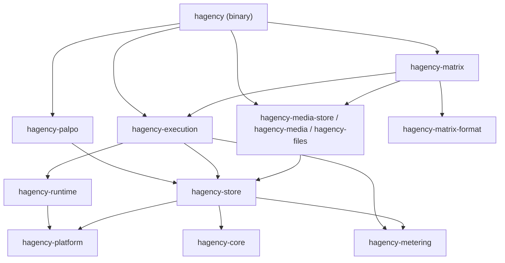
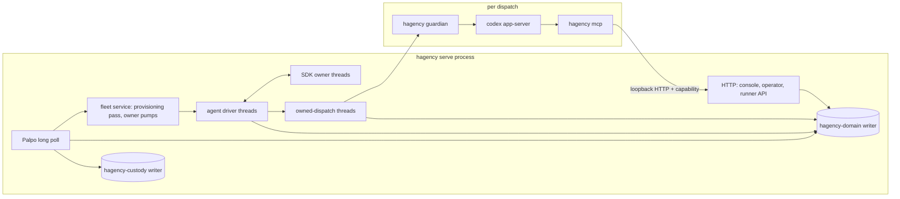
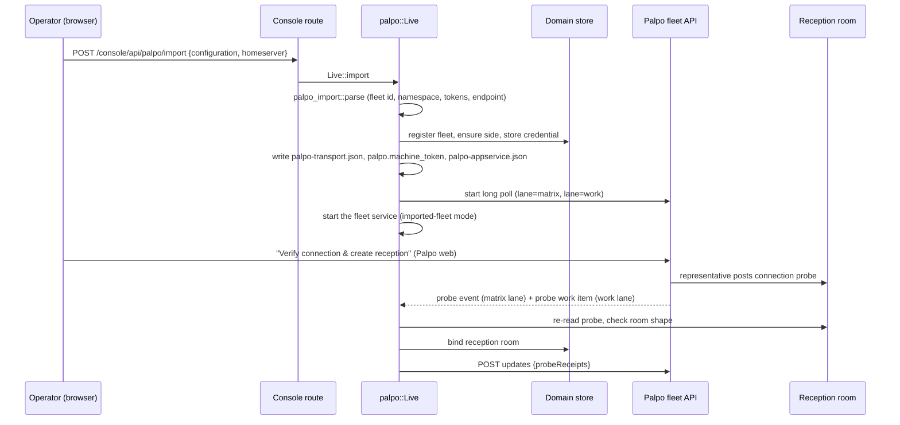
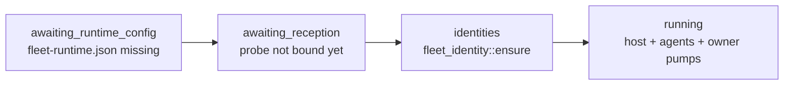
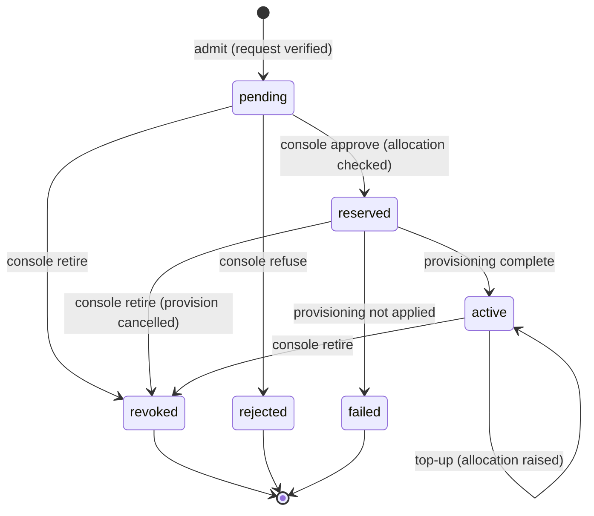
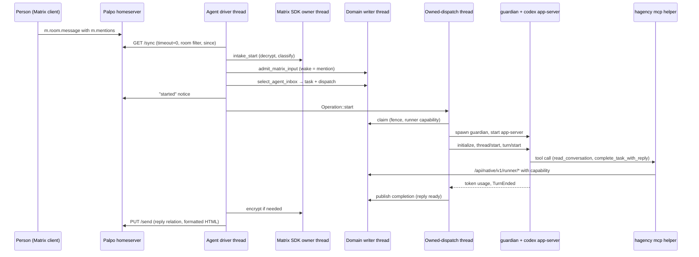
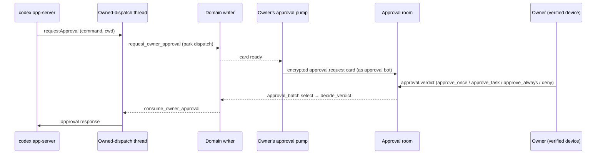

[English](architecture-walkthrough.md) | [中文](architecture-walkthrough.zh-CN.md)

# 代码导读：从 Palpo 申请到 agent 回复

本导读面向要修改 `native/` 下原生 Rust 服务的开发者。它沿着[使用指南](user-guide/README.zh-CN.md)背后的代码路径走一遍：
1. 连接一台 Palpo 服务器。
2. 项目申请一个 agent。
3. Hagency 批准并创建该 agent。
4. 有人 @ 提及 agent，并收到回复。

每一步都给出要打开的文件和函数，按函数名搜索即可。ADR 位于 [knowledge/decisions](../knowledge/decisions/)。第 15 节列出哪些已经实现、哪些尚未实现，以及已知缺口。第 16 节说明改动应放在哪里。

## 1. 术语

| 名称 | 含义 |
| --- | --- |
| Hagency | 运行编程 agent 并把它们借给项目的服务。一次安装就是一个 **车队（fleet）**。 |
| Palpo | 项目所在的 Matrix homeserver。它的网页端负责安装 Hagency 的 App Service，并向项目展示 agent 申请。 |
| 车队 id | `hf_` 加 32 个十六进制字符。Hagency 拥有的每个 Matrix 账号都以它为前缀，例如 `@hf_…_representative`。 |
| 代表（representative） | 车队自己的 Matrix 账号（App Service 的 sender）。它拥有接待房间，把 agent 邀请进项目房间，并读取所有者的密钥。 |
| 审批机器人 | Matrix 账号 `@<fleet>_approval`。它向所有者发送权限卡片，并读取所有者的裁决。在导入的车队上，它为每位所有者各配一台设备。 |
| 车队服务 | `hagency serve` 中负责为导入的车队创建 agent、运行审批的部分，不需要协调者（coordinator）agent（ADR-187）。 |
| 协调者 | 较早的部署方式：一个在 `agent-driver.json` 中配置的完整 agent 接洽，由它的接入流程承载创建和审批。已经采用它的安装仍可继续使用（ADR-187 §D）。 |
| 项目方（project side） | Hagency 对一台已连接 homeserver 的记录：凭据、API 基址和 token 预算。 |
| 资源（resource） | 提供给项目的一份可运行配置：框架、模型、推理档位和每月 token 上限。 |
| 席位（seat） | 资源所消耗的模型账号。多份资源可以共享一个席位的额度。 |
| 接洽（engagement） | 一个项目获批的一个 agent。它是分配 token、创建、暂停、追加额度和退役的基本单位。 |
| 所有者 | 接洽被接纳时记录在 `projects.owner_mxid` 中的项目方用户。只有所有者能回复审批卡片、与 agent 私聊。 |
| 所有者锚点 | 所有者的交叉签名主密钥，agent 和审批机器人都信任它。在导入的车队上，它在首次使用时固定下来（第 7 节）。 |
| 接待房间 | 一个未加密、仅限邀请的房间，由 Palpo 与代表共用。申请和连接探测以自定义事件的形式送到这里。 |
| 项目房间 | 人和 agent 一起工作的房间。它不加密，这样车队的接入流程才能读取。 |
| 审批室 | 一个加密房间，成员恰好是所有者和审批机器人。 |
| agent 私聊 | 一个加密房间，成员恰好是所有者和一个 agent。 |
| 身份房间 | agent 创建时就有的房间：它的私聊和项目房间。在 agent 的整个生命周期内固定不变。 |
| 加入的房间 | agent 之后受邀加入的房间。它按接洽保存在存储中，永远不会成为身份房间（ADR-188，第 10 节）。 |
| 会话、派发、尝试 | 会话（session）是一条对话路由（房间加可选的讨论串）。派发（dispatch）是从中选出的一个 agent 工作单元。尝试（attempt）是为该派发启动一次 runner。 |
| 保管记录（custody） | 在外部副作用发生之前写入的持久记录，说明尝试了什么。崩溃之后，由它决定是“检查结果”还是“重新执行”。 |
| 栅栏（fence） | 用来阻止过期工作的计数器或记录行。每个派发都带一个栅栏编号，持有旧编号的一方会被拒绝。 |

## 2. 仓库结构

| 路径 | 内容 |
| --- | --- |
| [native/](../native/) | 各 Rust crate（第 4 节）、测试数据和 spec 绑定检查脚本。工作区清单是仓库根目录的 [Cargo.toml](../Cargo.toml)。 |
| [mockup/](../mockup/) | 控制台的 Next.js 源码。Node 只是构建工具；发布构建把其静态导出内嵌进二进制（第 13 节）。 |
| [deploy/](../deploy/)、[install/install-native.sh](../install/install-native.sh) | `hagency serve` 的系统 unit 与 launchd plist，以及渲染它们的安装脚本。`hagency service install` 自己写入用户级 unit（[service.rs](../native/hagency/src/service.rs)），两者都不需要。 |
| [specs/](../specs/)、[knowledge/](../knowledge/) | 与测试绑定的任务契约，以及背后的 ADR 和需求 |
| [docs/](.) | 产品文档：本导读、[使用指南](user-guide/README.zh-CN.md)、运维 [guides/](guides/) 和 [history/](history/README.md)（TypeScript 时代的历史架构文档和指南）。`docs/` 下除 `user-guide/`、`guides/`、`history/` 和本导读之外的所有内容都是内部工作笔记，不是产品文档。例外有两个：许可说明 [LICENSING.md](LICENSING.md)，以及 `hagency-store` 编译进去的 agent 工作区模板（`workspace-*-template.md`）。 |

代码注释中常带行号引用 `backend-v2.js`、`bridge-matrix.js` 和 `lib/*.js`。它们指向被本服务取代的 TypeScript 产品。那部分代码已从仓库中删除；注释引用到时，请在 git 历史中查阅。

## 3. 从可执行文件开始

打开 [native/hagency/src/main.rs](../native/hagency/src/main.rs)。`Command` 枚举就是全部入口：

| 子命令 | 谁来运行 | 作用 |
| --- | --- | --- |
| `start` | 运维者，或用户级服务 | 车队入口（ADR-189）。它确定状态目录（未给 `--state-dir` 时用 [service.rs](../native/hagency/src/service.rs) 中的 `default_state_dir`），没有 `operator.token` 时运行 [setup.rs](../native/hagency/src/setup.rs) 中的 `init_state`，然后以内嵌控制台运行与 `serve --palpo-transport` 相同的 `serve` 函数体。二进制没有内嵌控制台、也没有传入 `--console-assets` 时，它拒绝启动。 |
| `service install`、`service uninstall` | 运维者 | 写入并加载一个运行 `start --no-open` 的用户级服务（[service.rs](../native/hagency/src/service.rs)）：macOS 上是 LaunchAgent `io.hagency`（`launchctl bootstrap gui/<uid>`），Linux 上是 `systemd --user` unit `hagency.service`（`enable --now`）。unit 中记录二进制的规范路径和安装时的 `PATH`。`uninstall` 保留状态目录。 |
| `serve` | `start`、install-native.sh 的 unit，或运维者 | 守护进程。第 5–14 节的内容都在其中运行。协调者安装用显式参数运行它。 |
| `guardian`（隐藏，仅 Unix） | `serve`，作为子进程 | 掌管一个 runner 的进程树（第 11 节）。 |
| `mcp` | Codex，作为 MCP 服务器 | 为 agent 提供工具的任务助手（第 12 节）。 |
| `task …` | agent，在 shell 中 | 以 CLI 形式提供相同的任务操作。 |
| `intake-refuse-stale-session` | 运维者 | 按摘要拒绝一个已被隔离、且属于会话前的 SDK 批次：其中每个事件的 `origin_ts` 都早于所属会话路由的 `ingress_since`，即该会话开始接纳 Matrix 输入的时刻。它为每个事件记录一条过期会话回执，不重试任何模型、SDK 应用或领域接纳（[bootstrap/intake_refusal.rs](../native/hagency/src/bootstrap/intake_refusal.rs)；`hagency-matrix/src/intake.rs` 中的 `refuse_stale_session_batch`，`hagency-store/src/domain/verified_ingress.rs` 中的 `stale_matrix_session_receipt`）。 |
| `setup` | 运维者，或车队模式下的安装脚本 | 设置页面第一步的命令行形式（第 13 节）。为导入的车队准备状态目录：新目录时先初始化，查找 Codex 及其登录目录，写入 `fleet-runtime.json`，并用 `serve` 的加载器校验（[bootstrap.rs](../native/hagency/src/bootstrap.rs) 中的 `check_fleet_runtime`；[setup.rs](../native/hagency/src/setup.rs)）。 |
| `init`、`account`、`registration`、`side-registration`、`provision` | 运维者 | 离线创建状态目录和凭据。只有 `account` 和 `registration register` 可以改用 `--listen` 操作正在运行的服务。 |
| `console-access`、`engagements`、`resources`、`alerts` | 运维者 | 运行中服务的回环客户端。 |
| `backup`、`restore`、`rotate` | 运维者 | 在线 SQLite 备份、恢复和凭据轮换（[ops/](../native/hagency/src/ops/)）。 |

`guardian` 和 `mcp` 在 `main` 构建任何 Tokio 运行时之前就分流出去。其余一切都运行在 `main` 构建的同一个多线程运行时上。

### `serve` 的两种运行方式

[bootstrap.rs](../native/hagency/src/bootstrap.rs) 中的 `Bootstrap::open_with_options` 根据启动参数选择模式：

| 参数 | 模式 | agent 来自 |
| --- | --- | --- |
| 有 `--palpo-transport`、没有 `--agent-driver` | **导入的车队**（ADR-187） | 车队服务。导入车队后由 `palpo::Live::with_fleet_service` 启动（第 7 节） |
| 有 `--agent-driver`（有无 `--palpo-transport` 均可） | **协调者安装** | `agent-driver.json`：协调者的驱动、审批泵和工厂（`fleet::Service::new`） |

[deploy/](../deploy/) 中的 unit 带有 `__AGENT_DRIVER__` 占位符（plist 中是 `<!--__AGENT_DRIVER_ARG__-->`）。[install-native.sh](../install/install-native.sh) 按 `--mode` 填写它：默认的 `fleet` 填空，unit 运行 `serve --palpo-transport`；`coordinator` 填 `--agent-driver`，且安装脚本只在 `--config-dir` 中有 `agent-driver.json` 时才接受。车队模式下，除非 `--config-dir` 已提供 `fleet-runtime.json`，安装脚本会运行 `hagency setup`。

`hagency start` 是不需要选择参数的导入车队模式。它调用与 `serve --palpo-transport` 相同的 `serve` 函数，只多一件事：[service.rs](../native/hagency/src/service.rs) 中的 `announce` 最多等待 60 秒让服务响应，再通过 `console::client::access` 向它申请控制台链接。在交互式终端上，它输出链接并打开它（macOS 用 `open`，Linux 用 `xdg-open`），除非传入 `--no-open`。stdout 不是终端时（例如在用户级服务中），它只在日志中写 `hagency console-access` 命令，因此链接不会进入日志文件。

`open_with_options` 先打开保管存储，再打开领域存储。在协调者安装中，它还会构建审批机器人泵、文件与接收服务以及工厂服务。最后构建 Palpo 传输（`palpo::Live`）。尚未导入车队的新安装不会拒绝启动；传输会等待控制台导入。

`Bootstrap::serve` 绑定唯一的监听端口，启动上限（每小时）、保留（60 秒）和提醒（1 秒）三个周期任务，然后启动 HTTP 服务器，再启动 Palpo。启动 Palpo 也会启动导入车队的车队服务。在协调者安装中，`serve` 还会：
- 为协调者启动邀请轮询器；
- 以 1–60 秒的退避反复重试审批机器人注册，直到成功；
- 成功之后才启动审批转发器、协调者的驱动和工厂循环。

所有 HTTP 流量共用一个回环端口（默认 `127.0.0.1:13300`）。[lib.rs](../native/hagency/src/lib.rs) 中的 `App::new` 拒绝任何非回环的监听地址。服务只通过出站连接访问 Palpo 和 Matrix。

| 路径 | 调用方 | 认证 |
| --- | --- | --- |
| `/health`、`/ready` | 进程管理器 | 无。只要有已配置的组件未就绪，`/ready` 就返回 503。 |
| `/console/**` | 运维者的浏览器 | 会话 cookie（第 13 节） |
| `/console/api/**` | 控制台的 JavaScript | 会话 cookie 加同源检查 |
| `/api/native/v1/**` | 运维 CLI | Bearer `operator.token`，由 [lib.rs](../native/hagency/src/lib.rs) 中的 `authorize` 检查：它先运行 `local_authority`，再以常数时间比较 bearer 令牌的 SHA-256 |
| `/api/native/v1/runner/**` | runner 内的 `mcp` 助手 | 每个派发独有的 runner 能力凭证（[runner.rs](../native/hagency/src/runner.rs)） |

`serve` 不读取 `.env`。它的配置就是 `--state-dir` 中的文件：

| 文件 | 用途 | 写入者 |
| --- | --- | --- |
| `operator.token` | 运维 bearer 密钥 | `hagency init` |
| `palpo-transport.json`、`palpo.machine_token`、`palpo-appservice.json` | 导入车队的传输配置和 App Service 注册信息 | Palpo 导入，[bootstrap/palpo_import.rs](../native/hagency/src/bootstrap/palpo_import.rs) 中的 `write` |
| `fleet-runtime.json` | 导入的车队：本地 Codex 可执行文件及其哈希、文件工具、限额和 agent 主目录（profile `palpo_fleet_runtime_v1`） | [setup.rs](../native/hagency/src/setup.rs) 中的 `configure`，由设置页面（`POST /console/api/setup/check`）或 `hagency setup` 调用；它还会为 `home.root` 创建 `agent-homes/`。或由运维者通过安装脚本的 `--config-dir` 提供。由 [bootstrap/config.rs](../native/hagency/src/bootstrap/config.rs) 中的 `load_fleet_runtime` 加载 |
| `representative.identity.json`、`matrix.representative_token`、`matrix.appservice_token`、`matrix.provisioning_key`、`approval-<owner>.*`、`approval-sdk-<owner>/` | 导入的车队：代表的设备、App Service token、agent 的创建密钥，以及每位所有者一台审批设备 | 车队服务（[bootstrap/fleet_identity.rs](../native/hagency/src/bootstrap/fleet_identity.rs)） |
| `runtime-home/` | 未配置 `local_codex` 块的导入车队：agent 的 `HOME` 和 `CODEX_HOME`（第 7 节） | `serve` 加载 `fleet-runtime.json` 时以仅所有者可访问的权限创建（[bootstrap/config.rs](../native/hagency/src/bootstrap/config.rs) 中的 `load_fleet_runtime`） |
| `fleet-workspace/` | 导入车队：车队主机的私有占位工作区，不会有派发路由到这里 | `serve`，在同一次加载中创建 |
| `factory-task-contexts/` | 导入车队：预热任务桥交给每次派发的任务上下文 | `serve`，在同一次加载中创建 |
| `console-logins.json` | 控制台访问链接和每个登录的 SHA-256 哈希，因此重启不会让运维者退出登录 | 控制台（[console/authority.rs](../native/hagency/src/console/authority.rs)） |
| `agent-driver.json`、`matrix.*`、`approval.*` | 协调者安装：runner、工作区、Matrix 与审批设置、工厂服务 | 运维者（[bootstrap/config.rs](../native/hagency/src/bootstrap/config.rs)） |
| `agent-matrix-provision_<engagement>/` | 每个已创建 agent 的凭据和 SDK 存储 | 创建流程（[hagency-matrix/src/token_provision.rs](../native/hagency-matrix/src/token_provision.rs)；目录名在 `TokenAccountProvision::configured` 中确定，为 `agent-matrix-` 加上副作用 id `provision_<engagement>`） |
| `domain.sqlite3`、`custody.sqlite3` | 领域状态；Palpo 传输的保管记录（第 5 节） | [native/hagency-store](../native/hagency-store/src/) |

## 4. 各个 crate

工作区成员列在根目录的 [Cargo.toml](../Cargo.toml) 中。大多数库 crate 在 `lib.rs` 顶部用 `//!` 注释说明自己的职责。

| Crate | 负责 |
| --- | --- |
| `hagency` | 二进制：启动装配、车队服务、控制台路由、runner API、`mcp` 助手、运维 CLI |
| `hagency-core` | 不做 IO 的领域类型和规则：申请及其校验、资源、回复、任务、审批范围 |
| `hagency-store` | 所有持久规则：领域和保管两个 SQLite 数据库，各自运行在独立的写线程上 |
| `hagency-matrix` | 所有 Matrix 副作用：同步与接入、SDK 加密所有者、发送、创建、加入的房间、审批机器人 |
| `hagency-palpo` | 出站 Palpo 传输：长轮询、确认、状态更新、目录发布 |
| `hagency-execution` | 一个派发从领取到结算的全过程：工作区、启动 runner、审批、用量绑定、预热运行时 |
| `hagency-runtime` | Codex app-server 协议（以及未启用的 Claude 协议代码）、自有子进程 IO |
| `hagency-platform` | 进程范围：Unix guardian 与进程组、Windows Job Object |
| `hagency-metering` | 规范化不可信的 token 用量报告 |
| `hagency-matrix-format` | 把 Markdown 格式化为 Matrix HTML |
| `hagency-files`、`hagency-media`、`hagency-media-store` | 文件投递所需的文件快照、附件加密和私有媒体存储 |
| `hagency-permissions`、`hagency-progress`、`hagency-progress-runtime`、`hagency-crypto-proof` | 二进制不使用它们，只有它们自己的测试在用。实际审批走 `hagency-execution/src/approval/`；实际进度通知来自 `hagency-store/src/domain/activity.rs`。 |

依赖方向向下；传递依赖的边已省略：

先读三个 crate：`hagency-core` 用类型表达术语，`hagency-store` 存放规则，`hagency-matrix` 承担副作用。

## 5. 进程模型

`hagency serve` 是一个进程。它的工作分布在下列线程和子进程上：

| 组件 | 执行方式 | 位置 |
| --- | --- | --- |
| HTTP 服务器、周期任务、Palpo 轮询、车队服务、审批泵 | 主多线程运行时上的任务 | `main`、`Bootstrap::serve`、`bootstrap/fleet_service.rs` |
| 领域数据库 | 线程 `hagency-domain`：一个有界 `mpsc` 通道，传递作用于 `&mut DomainRepository` 的闭包，结果通过 `oneshot` 返回 | `hagency-store/src/domain_worker.rs` |
| 保管数据库（Palpo 轮询、尝试和发布回执） | 线程 `hagency-custody`，模式相同 | `hagency-store/src/worker.rs`、`custody-migrations/002-outbound.sql` |
| 每个 agent（以及协调者，如有） | 线程 `hagency-agent-driver`，带自己的单线程运行时 | `bootstrap/driver.rs` |
| Matrix 加密与状态 | 每个身份一个 `hagency-matrix-sdk` 线程；持有 SQLite 加密存储锁 | `hagency-matrix/src/sdk.rs` |
| 一个正在运行的派发 | 线程 `hagency-owned-dispatch`（预热 agent：`hagency-warm-owned-runtime`） | `hagency-execution/src/operation.rs`、`warm.rs` |
| runner 进程树 | 子进程 `hagency guardian`，再由它启动 Codex | `hagency-platform` |
| 文件投递、接收文件 | 线程 `hagency-file-service`、`hagency-receive-service` | `file_service.rs`、`receive_service.rs` |
| agent 工具 | Codex 的子进程 `hagency mcp`，通过 HTTP 访问 runner API | `native/hagency/src/mcp.rs` |

**每个数据库只有一个写入者。** 对 `domain.sqlite3` 的每次读写，都是发给 `hagency-domain` 线程的一个作业。必须同时成立的规则，例如“插入审批并挂起派发”，作为一个作业在一个事务内执行。每个作业都带截止时间和字节预算。数据库使用 WAL 和 `synchronous=FULL`。`domain.lock` 和 `owner.lock` 上的排他锁阻止第二个进程打开同一个状态目录。领域库的 schema 版本是 60（`hagency-store/src/domain.rs` 中的 `DOMAIN_SCHEMA_VERSION`）。

**用 id 和栅栏代替锁。** 工作以 id 的形式跨线程、跨进程传递。派发上的栅栏、任务上的 epoch，以及注册、房间或传输上的 generation，让持有当前编号的一方可以行动，其余一律拒绝。派发一旦被栅栏隔开，它的 runner 发来的调用都会被拒绝，只有三条路由有意保持开放：完全相同的 `complete-task-with-reply` 重放、`late-output`（它把输出记录为被栅栏拒绝的输出，不结算任何派发；见 [REQ-TSS-FENCE](../knowledge/requirements/req-thread-scoped-agent-sessions.md)），以及对历史 `file-deliveries/{id}` 的读取。

**未知结果就记为未知。** 结果丢失的 Matrix 写入、进程清理或审批响应，被记为 `Unknown` 或 `uncertain`。恢复流程会去检查结果，或等待运维者处理（ADR-182、ADR-183）。失败的组件按退避重试，不会让进程退出。

**关闭。** SIGTERM 会取消一个 `CancellationToken`。随后 `Bootstrap::close`：
1. 让工厂服务、控制台、文件与接收服务静默；取消驱动；中止周期任务；取消 Palpo。
2. 关闭文件与接收服务和驱动。关闭 Palpo 时先关闭车队服务（它的 agent 和审批泵），再关闭传输。然后排空并关闭工厂的 agent。
3. 如有协调者，关闭它的 collector 和审批泵。
4. 先关闭领域写线程，再关闭保管写线程。

HTTP 服务器最后停止，有 5 秒宽限期。

## 6. 连接 Palpo 服务器

管理员的“添加 Hagency（Add Hagency）”和所有者的“下载 Hagency 配置（Download Hagency configuration）”都在 Palpo 网页端完成。运维者在控制台上传这份 JSON 时，Hagency 的部分才开始。

1. [console/palpo_import.rs](../native/hagency/src/console/palpo_import.rs) 接收上传，调用 [bootstrap/palpo.rs](../native/hagency/src/bootstrap/palpo.rs) 中的 `Live::import`。
2. [bootstrap/palpo_import.rs](../native/hagency/src/bootstrap/palpo_import.rs) 中的 `parse` 只接受一种格式：
   - 车队 id 是 `hf_` 加 32 个十六进制字符，sender 是 `<fleet>_representative`。
   - 恰好有一个排他的用户命名空间 `@<fleet>_…:<server>`，没有房间或别名命名空间。
   - `as_token`、`hs_token` 和机器 token 互不相同。
   - 传输模式为 `outbound`，端点是 `https://…/api/fleet/v2/<fleet>`（只有回环地址允许纯 `http`）。
   - 属于另一个车队的文件会以 `palpo_fleet_conflict` 拒绝：一个服务只运行一个车队。
3. 导入保存校验过的内容：
   - **领域存储：** 一行 `registrations`（车队、服务器、代表、审批机器人，以及在探测绑定前保持为空的接待房间），一行项目方记录及其 App Service 凭据。
   - **状态目录：** 三个私有文件。
   - 设置了 `--palpo-transport` 时，传输立即启动，无需重启。重新导入同一个车队会保留已绑定的接待房间和正在运行的车队服务。
4. 凭据只写不读。`hagency-store/src/domain/side_lifecycle.rs` 中的 `SideRecord` 只暴露 `credential_kind` 和 `has_credential`，从不暴露 token。导入路由只返回公开信息。
5. 传输层是 [hagency-palpo](../native/hagency-palpo/src/)。
   - `adapter.rs` 在两条通道上长轮询 `GET {endpoint}/poll`，然后调用 `POST ack` 和 `POST updates`。
   - **matrix 通道**转发 App Service 事务。**work 通道**承载探测和 agent 申请等作业。
   - 轮询等待 25 秒，目录每 15 秒重新发布一次（`config.rs`）。
   - 没有任何入站监听。位于 NAT 之后的 homeserver 无需暴露 Hagency 即可工作。
6. 在 Palpo 中点击“验证连接并创建接待房间（Verify connection & create reception）”，代表会发布一个 `com.hagency.connection.probe.v1` 事件。[bootstrap/palpo_work.rs](../native/hagency/src/bootstrap/palpo_work.rs) 中的 `work_once` 以代表身份重新读取该事件，[bootstrap/probe.rs](../native/hagency/src/bootstrap/probe.rs) 中的 `decide` 检查房间。只有房间仅限邀请且未加密、代表已加入、且尚未绑定其他接待房间时，才会绑定该房间。回执随下一次 `updates` 返回 Palpo。探测失败会一直重试，直到成功。
7. 同一个循环（`palpo_work.rs` 中的 `run`）每 15 秒让审批机器人接受私有审批室的邀请（`approval_invites_once`）。

测试示例：[hagency/tests/console/palpo_import.rs](../native/hagency/tests/console/palpo_import.rs) 中的 `native_palpo_import_route_saves_the_owner_download` 和 `native_palpo_import_route_refuses_a_foreign_file`。

## 7. 车队服务（ADR-187）

导入的车队不需要协调者 agent。规则由 [ADR-187](../knowledge/decisions/adr-187-palpo-fleet-without-coordinator.md) 及其修订规定。[bootstrap/fleet_service.rs](../native/hagency/src/bootstrap/fleet_service.rs) 中的 `FleetService::start` 运行一个监管任务。它依次经过四个阶段，每次切换都写日志，从不退出。两个 `awaiting_*` 阶段以固定的 5 秒间隔轮询；`identities` 阶段和被拒绝的配置按 1 秒到 60 秒退避（`BACKOFF_MIN`、`BACKOFF_MAX`）：

`build` 拒绝的配置会显示为 `refused_config`，随后重试。

**身份**（[bootstrap/fleet_identity.rs](../native/hagency/src/bootstrap/fleet_identity.rs) 中的 `ensure`）：
- 代表通过 App Service 登录获得一台设备。设备只创建一次，之后复用。如果 homeserver 不再接受已保存的 token，服务会拒绝而不是替换它，因为房间保管记录绑定在这个 token 上。
- App Service token 被复制到 `matrix.appservice_token`。agent 的创建密钥 `matrix.provisioning_key` 随机生成，只创建一次，从不发往任何地方。
- 早期手工搭建的安装留下的审批设备（`approval.access_token`）会被沿用，不会重建。

**运行。** `build` 用导入的文件和 `with_agent_rooms_pinned_anchors` 创建一个 `TokenProvisioningHost`，并创建以代表凭据执行的成员巡检。然后用 `Provider::Fleet` 创建 `fleet::Service`。接着 `run`：
1. 先调用一次 `prepare_owners`，让重启后重新挂接的 agent 能找到所有者的审批设备。
2. 启动 agent 服务（`fleet::Service::run`）。
3. 每 2 秒调用一次 `prepare_owners`，再调用 [hagency-matrix/src/provisioning.rs](../native/hagency-matrix/src/provisioning.rs) 中的 `provision_pass`。某个接洽的失败只记入本轮报告，不会影响其他接洽（ADR-182）。

**所有者**（`prepare_owners`）。对每个待创建、正在等待所有者或已经创建的接洽：
1. `fleet_identity::owner_anchor` 返回所有者已固定的主密钥。如果尚未固定，`fetch_master_key` 用代表的设备读取密钥（`POST /keys/query`）并固定下来。所有者还没有交叉签名密钥时，创建流程会等待；“没有密钥”绝不等于“不需要锚点”。
2. `owner_approval_device` 为每位所有者创建一次审批机器人设备，带独立的 token、SDK 密钥和存储（`approval-<slug>.*`；slug 是所有者 MXID 的哈希）。由于一次注册的用户集合是冻结的，每台设备只信任 {机器人, 该所有者}。
3. `owner_collector` 构建一个锚定在车队上的 `ApprovalCollector`（`HostApprovalConfig::for_fleet`），`attach_owner_approvals` 把它交给创建主机。在挂接之前，预热 agent 的创建流程会在领取任何东西之前等待。
4. `supervise_pump` 运行该所有者的审批泵。它会重试注册，并在某次排空因卡片被拒而结束时重新启动，因此一张坏卡片不会让该所有者的审批停摆。

**所有者锚点在首次使用时获得信任。** 数据表是 `owner_anchors`（[hagency-store/src/domain/owner_anchors.rs](../native/hagency-store/src/domain/owner_anchors.rs)、[migrations/059-owner-anchors.sql](../native/hagency-store/src/migrations/059-owner-anchors.sql)）。每位所有者一行：`master_key`、`source`（`first_use` 或 `operator`），以及记录之后出现的不同密钥的 `mismatch_key`/`mismatch_at`，后者永远不会被采用。这项决定针对导入的车队修订了 ADR-102：信任 homeserver 的第一次回答。车队服务不会重新读取已固定的密钥，变化只会表现为注册被拒绝（第 15 节）。

**Agent**（[bootstrap/fleet.rs](../native/hagency/src/bootstrap/fleet.rs)）。`Provider` 说明 agent 从哪里来：`Coordinator`（协调者的 collector）或 `Fleet`（创建主机）。`Service::admit` 最多接纳 16 个 agent。对于车队 agent，它会：
- 把所有者的审批泵交给 agent；所有者还没有审批泵时拒绝接纳；
- 记录 agent 的传输，使公开的“等待审批”通知由正在等待的 agent 发出；
- 启动 agent 自己的邀请轮询器（`AgentOwner.invites`，第 10 节）；
- 启动它的驱动以及文件和接收服务。

**Codex 登录。** 由用户自己登录 Codex；Hagency 从不执行登录。[setup.rs](../native/hagency/src/setup.rs) 中的 `detect_codex` 找到 `setup` 会使用的二进制，只运行 `codex --version` 和 `codex login status`（各有 10 秒超时）；状态输出决定 `signed_in` 和登录方式（`chatgpt` 或 `api_key`），由设置页面显示。车队 agent 的 Codex 凭据来自 `fleet-runtime.json`（[bootstrap/config.rs](../native/hagency/src/bootstrap/config.rs) 中的 `FleetRuntimeConfig`），该文件由设置页面或 `hagency setup` 写入（设置页面总是使用默认的 Codex 目录）：默认带 `local_codex` 块（preset `local_codex`、席位 `local_codex_seat`、用户的 `HOME` 和 Codex 目录），传入 `--no-local-codex` 时不带。setup 会报告该目录中是否有登录（`auth.json`），没有时输出 `CODEX_HOME=… codex login` 命令。配置了 `local_codex` 块时，agent 通过该块的 `codex_home` 复用主机上已有的 Codex 登录。没有该块时，`HOME` 和 `CODEX_HOME` 指向 `<state>/runtime-home`。车队运行时没有托管账户：`hagency account` 的凭据命名空间和 `agent-driver.json` 的 `managed_account` 只适用于协调者安装（启动环境在 [hagency-execution/src/host.rs](../native/hagency-execution/src/host.rs) 中设置）。

**申请只有一条接入路径。** 在导入的车队上，接待房间中的申请只由 Palpo work 通道接纳（`palpo_work.rs` 中的 `admit_request`，第 9 节）。

## 8. 资源与目录

资源在三个地方创建：
- **设置页面。** `POST /console/api/setup/resource`（[console/setup.rs](../native/hagency/src/console/setup.rs) 中的 `offer`）用模型、推理档位和每月上限（省略时为 20,000,000 token）创建一份已发布的 `local_codex` 资源。`hagency-core/src/qualification.rs` 中的 `configuration_choices` 未认定资格的组合会被拒绝（`setup_unqualified_model`），且需要已有 `fleet-runtime.json`（`setup_runtime_missing`）。它从该文件的 `local_codex.seat` 取席位，因此资源总与登录匹配。它通过 `edit_resource` 写入，与运维 API 是同一个存储调用。
- **运维 API。** `POST /api/native/v1/resources`（[resources.rs](../native/hagency/src/resources.rs) 中的 `put_resource`）按完整定义写入一份资源。API 不检查资源是否与 `local_codex` 登录匹配；有 `local_codex` 块时，由 `hagency-execution/src/local_codex.rs` 中的 `LocalCodex::admit_provision`（创建时）和 `LocalCodex::admit`（每次派发）拒绝以下资源：`seat_id` 与该块的 `seat` 不同、框架不是 `codex`、provider 已设置且不是 `openai`，或需要托管账户；没有该块时，任何 seat 都可以。
- **控制台。** `console/resources.rs` 中的资源路由把创建交给 `resource_configuration::create`，它复制一份已有的来源资源（`source_resource_id`），换上新的模型、推理档位或上限。这个页面无法凭空创建资源；设置页面可以。资源页面的空状态提示仍指向托管账户登记（`console/accounts.rs`），但绑定托管账户的资源会被车队主机拒绝，因为车队主机没有托管账户（`hagency-execution/src/host.rs`）。

`console/resource_configuration.rs` 还负责修改已有资源的模型、推理档位和每月上限，并用 `expectedRevision` 做乐观并发控制。

`hagency-core/src/project.rs` 中的 `Resource::qualifies` 只在以下四条全部成立时，才为某个角色提供该资源：
- 已发布；
- 框架是 `codex` 或 `claude`（`provisionable`）；
- 设有上限；
- 模型满足所申请角色的要求（`hagency-core/src/qualification.rs`）。

新资源在创建它的同一事务中发布（`hagency-store/src/domain.rs` 中的 `prepare_resource_write`）。撤回是持久的。资源有已预留或活动中的接洽时，其配置不能修改。

`hagency-palpo/src/catalog.rs` 中的 `publish_resources_once` 每 15 秒把冻结的目录发送给 Palpo。对每份资源，Palpo 收到一个不透明 id、显示名称、框架、模型和推理档位。上限、席位和预设 id 都留在 Hagency 内部（ADR-024、ADR-108、ADR-111）。同一次 `updates` 调用还携带接洽状态和探测回执。

控制台可以发布 `claude` 资源，但 `hagency-execution/src/host.rs` 会以 `UnsupportedRunner` 拒绝启动它。目前原生只运行 Codex。

## 9. 从 agent 申请到创建完成

项目成员在 Palpo 网页端定义一个 agent：名称、一份已发布的资源、角色、申请的 token 数和每日速率。Palpo 在接待房间中发布 `com.hagency.engagement.request.v1`，并排入一个作业。

**接纳。** [bootstrap/palpo_work.rs](../native/hagency/src/bootstrap/palpo_work.rs) 中的 `admit_request` 重新读取源事件，观察相关房间，并调用 `hagency-core/src/authority.rs` 中的 `verify_request`。以下条件必须成立：
- 接待房间和项目房间都仅限邀请且未加密。
- 申请人、所有者和代表都已加入项目房间。
- 所有者在该房间的权限等级为 100。
- 房间的 `com.hagency.admin.binding.v1` 状态写明了本车队、项目和所有者。
- 所有者的审批室已加密，成员恰好是所有者和审批机器人。
- 观察结果不超过 30 秒。

随后 `hagency-store/src/domain.rs` 中的 `DomainRepository::admit` 写入接洽：
- **Id：** `en_` 加上车队与申请 id 的 32 位十六进制哈希。重放返回已存的记录；同一 id 下内容不同则视为冲突。
- **名称：** 在该项目处于 pending、reserved 和 active 状态的接洽中必须唯一。`AgentName` 接受 Unicode 字母，规范化为 NFC，最多 64 个 UTF-16 单元。
- **写入：** `projects` 记录（所有者、审批室）和处于 `pending` 的 `engagements` 记录。

**批准。** 控制台的“接洽”页面使用三条路由：
- `GET …/candidates` 返回 `remainingTokens`，“全部剩余（All remaining）”按钮填入的就是它。
- `POST …/approve {allocatedTokens?}` 批准。agents 路由 `…/refuse` 拒绝待处理的申请。
- `approve_allocating` 调用 `check_grant`。`check_grant` 把申请量与 `headroom` 比较，后者取上限、席位和资源池三者余量中的最小值。上限一侧把每笔占用计为 `max(reserved, spent)`；席位和资源池按承诺量计算。拒绝结果为 `OverCommit`（消息会指出起约束作用的限额）、`InsufficientCapacity` 或 `NoCeiling`。
- 成功后接洽进入 `reserved`，并排入一个 `provision_<id>` 副作用。

`palpo_work.rs` 中的 `refresh_statuses` 把每个状态回报给 Palpo：`pending`、创建中的 `active`、`active` 加 `complete`、`rejected` 或 `ended`。它还会发送已分配的 token 数、agent 的 MXID，以及 agent 加入房间后的 `ready`。

**创建。** [hagency-matrix/src/provisioning.rs](../native/hagency-matrix/src/provisioning.rs) 中的 `provision_pass` 执行每个待处理的 `provision_<id>` 副作用，并让每个正在等待所有者的创建流程再检查一次。车队服务每 2 秒调用它一次；协调者安装则在协调者的接入轮次中调用（`hagency-matrix/src/intake.rs`）。每次领取都以副作用 id 作为栅栏。顺序来自 ADR-184：

1. 通过 App Service `/register` 创建 `@<fleet>_<32hex>:<server>`，再登录获得设备 `DEVICE_<engagement>`（`token_provision.rs`、`token_provision/application_service.rs`）。
2. 把显示名称设为项目给 agent 起的名字。
3. agent 创建自己的私聊：`private_chat`、Megolm、`m.federate: false`、历史可见性 `invited`，**不邀请任何人**。
4. 代表把 agent 邀请进项目房间；agent 加入。
5. `enroll_created_rooms` 上传 agent 的设备密钥和交叉签名身份。受信任的所有者密钥就是已固定的锚点（第 7 节）。
6. 到这时 `invite_owner` 才把所有者邀请进私聊。这一步会无限期等待，直到所有者加入。如果在等待期间重启，这一步返回 `OutcomeUnknown`，且没有任何机制恢复它（`token_provision/rooms.rs`）；运维者结束该接洽，所有者重新申请（第 15 节）。

第 5 步排在第 6 步之前，是为了保证所有者能打字之前，其客户端一定已经拿到 agent 的密钥。ADR-184 记录了促成这一顺序的事故。

每次 Matrix 写入前后都会记录一个保管阶段：`dm-possible`/`dm-response`、`invite-possible`/`invite-response` 等（`token_provision/rooms/custody.rs`）。响应丢失后，下一次尝试会检查房间，而不是重复写入。

**重启后重新挂接。** [hagency-matrix/src/provisioning/factory.rs](../native/hagency-matrix/src/provisioning/factory.rs) 中的 `reattach_factory` 恢复工厂已经创建完成的每个 agent。它沿用已保存的传输 generation；如果该 generation 已被栅栏隔开，就开启 generation + 1。被栅栏隔开后重新挂接时，私聊会话 id 会带上 generation（generation 1 为 `session_<engagement>`，之后为 `session_<engagement>_<n>`），因为存储永远不会重新绑定一个路由已被栅栏收回的会话。

**退役。**
- `POST …/retire` 撤销处于 pending、reserved 或 active 的接洽。reserved 接洽的创建副作用会被取消。如果创建已经开始，该调用会排入一个 `retire_<id>` 副作用，由 agent 的驱动执行：退出所有房间并注销设备（[hagency-matrix/src/retire.rs](../native/hagency-matrix/src/retire.rs)）。从未拿到凭据的 agent 由创建轮次中的 `settle_unattached_retirements` 结清。
- 退役失败后，只能通过 `POST …/cleanup-retry` 重新执行。

## 10. 房间，以及谁能和 agent 对话

| 房间 | 加密 | 成员 | 什么会唤醒 agent | 规则所在位置 |
| --- | --- | --- | --- | --- |
| 接待房间 | 否 | Palpo 的账号和代表 | 无。它承载申请和探测。 | `verify_request`、`probe.rs` |
| 项目房间 | 否 | 项目成员、代表、各 agent | 提及该 agent 的人类消息 | `hagency-store/src/domain/verified_ingress.rs` 中的 `admit_matrix_input` |
| agent 私聊 | 是 | 所有者和一个 agent | 所有者发来的任何消息 | `admit_matrix_input`；房间形态见 `domain/matrix_routes.rs` |
| 审批室 | 是 | 所有者和审批机器人 | 无。它承载卡片和裁决。 | `domain/approvals.rs` 中的 `observe_approval_room` |
| 加入的房间，未加密 | 否 | 邀请者拉进来的任何人 | 提及该 agent 的人类消息 | 与项目房间相同 |
| 加入的房间，只有所有者和 agent | 均可 | 所有者和该 agent | 所有者发来的任何消息 | `verified_ingress.rs` 中的 `owner_only_joined_room` |
| 加入的房间，加密且有其他人 | 是 | 所有者、该 agent 和其他人 | 无。agent 不在其中工作。 | `provisioning/factory.rs` 中的 `joined_rooms` |

所有成员都必须在车队自己的服务器上：`hagency-core/src/replies.rs` 中的 `matrix_user` 和 `matrix_room` 拒绝其他服务器名。

在群聊房间中，每个已加入的人都可以通过提及 agent 给它派活。所有者通过三种方式保持控制：
- 有风险的操作需要所有者批准（第 12 节）。
- 所有工作都消耗该接洽的额度（第 13 节）。
- 由所有者决定谁能进入房间。

只有人类消息会唤醒 agent；`!` 命令和 `/thread` 指令会被记录，但不唤醒任何人。任务完成后，只有原申请人在该任务讨论串中的回复才会唤醒 agent。

### 邀请

[bootstrap/invites.rs](../native/hagency/src/bootstrap/invites.rs) 中的 `poll_round` 每 10 秒为一个 agent 运行一次：
- 来自受信任邀请者的邀请会立即加入。受信任指该房间记录的项目所有者，或 agent 自己的所有者。
- 其他任何邀请，包括读不出邀请者的邀请，都会成为 `pending_invites` 中的一行。运维者在控制台的“邀请（Invitations）”页面接受或拒绝（`console/invites.rs`），下一轮随即加入或离开。
- 拒绝会被记住，同一个邀请不会再出现。
- 每次成功加入都会把房间记录为加入的房间（`bind_joined_room`）。

在导入的车队上，每个 agent 运行自己的轮询器（`fleet.rs` 中的 `AgentOwner.invites`）。在协调者安装中，只运行协调者的轮询器（`Bootstrap::serve`）。

测试示例：[hagency/tests/invites.rs](../native/hagency/tests/invites.rs) 中的 `untrusted_invite_becomes_a_pending_decision`、`owner_invite_takes_the_trusted_inviter_arm_and_joins` 和 `console_accept_queues_the_join_and_the_next_poll_performs_it`。

### 加入的房间（ADR-188）

[ADR-188](../knowledge/decisions/adr-188-agents-work-in-rooms-they-join.md) 让 agent 能在创建之后加入的房间里工作。数据路径如下：

1. **存储。** `joined_rooms`（[hagency-store/src/domain/joined_rooms.rs](../native/hagency-store/src/domain/joined_rooms.rs)、[migrations/074-joined-rooms.sql](../native/hagency-store/src/migrations/074-joined-rooms.sql)）每个（接洽, 房间）一行，`state` 为 `working`、`encrypted_shared` 或 `retired`，另有 `notice_at`。一个接洽最多持有 12 个有效的加入房间（`MAX_JOINED_ROOMS`）。重新加入已退役的房间会使它回到 `working`。
2. **驱动的每一轮。** `ProvisionedAgent::inboxes` 调用 `provisioning/factory.rs` 中的 `joined_rooms`：
   - 读取这些行。根据 `GET /joined_rooms`，agent 已不在其中的房间会被退役。
   - 逐个观察其余房间。成员不恰好是所有者和 agent 的加密房间记为 `encrypted_shared`；其他房间记为 `working`。
   - 对 working 房间，`joined_session` 解析出会话 `joined_<engagement>_<transport>_<generation>_<hash>`，并通过 `OwnedClaimRoom::joined_group` 把房间加入领取配置。
   - 无法观察或无法路由的房间在本轮跳过，绝不影响身份房间。
3. **Collector。** [hagency-matrix/src/collector.rs](../native/hagency-matrix/src/collector.rs) 中的 `Inner` 结构体在内存中维护两张表：`joined`（房间 → 是否工作）和 `joined_shared`。`host_rooms()` 返回身份房间加上 working 的加入房间，`observed()` 再加上接待房间。这些集合决定同步过滤器、接入目标和发送检查。
4. **存储准入。** `domain/matrix_routes.rs` 中的房间范围写入者，只有在 `joined_working` 找到一行 working 记录时，才接受项目房间以外的群聊房间。`domain/owned_dispatch.rs` 中的 `refresh_matrix_rooms` 允许加入的房间增减，但身份房间必须保持不变，且配置最多容纳 16 个房间。`domain/execution.rs` 中的领取查询同样检查 working 记录。
5. **唤醒规则。** 在 `admit_matrix_input` 中，群聊房间里的消息如果提及了 agent，或者 `owner_only_joined_room` 发现这是一个成员只有所有者和 agent 的 working 加入房间，就会唤醒 agent。
6. **加密且有他人。** agent 留在房间里，发一条纯文本 `m.notice`，说明自己无法在这里工作。之后如果有人发言，它最多每 15 分钟重复一次这条通知（`RENOTICE_GAP_MS`）。它只读取发送者和时间戳，从不读取消息内容。每一轮都会重新判断状态，所以当房间里只剩所有者时，它会变为 `working`。
7. **同步缺口。** `collector.rs` 中的 `scope_sync` 对加入房间的受限（截断）时间线直接丢弃缺口，而不是拒绝整批。房间进入过滤器后的第一次同步总是受限的，而加入的房间只接纳加入之后到达的消息。agent 已离开的房间出现在 `leave` 下时，其时间线会被清空。

审批和 token 不变：在加入的房间里工作消耗同一份额度，审批卡片发往所有者的审批室。

测试示例：[hagency-store/tests/joined_rooms.rs](../native/hagency-store/tests/joined_rooms.rs) 中的 `native_joined_room_record_state_and_notice`、`native_joined_group_room_scope_needs_a_working_join`、`native_joined_room_wake_rules` 和 `native_claim_profile_carries_joined_rooms`。

### 为什么加入的房间永远不进入 `HostConfig.rooms`

agent 的加密 SDK 存储绑定在一个摘要上。[hagency-matrix/src/config.rs](../native/hagency-matrix/src/config.rs) 中的 `binding()` 对以下字段做哈希：
- origin，以及注册指纹和注册 generation；
- 接洽、服务器、账号和设备；
- `HostConfig.rooms` 的房间 id 集合。

访问 token 以及传输和房间的 generation 被有意排除在外。SDK 所有者打开已有存储时，会把保存的 binding 与这个摘要比较，不一致就以 `Error::Identity` 拒绝（`hagency-matrix/src/sdk.rs`）。如果把加入的房间加进 `HostConfig.rooms`，下次重启时 agent 的存储就会拒绝打开。所以身份房间留在主机配置中，加入的房间则保存在存储和 collector 的 `joined` 表里。

## 11. 跟踪一条消息直到回复

有人在项目房间里发了一条顶层消息：`@coding-fast-01 add a sum() helper`。

**接入。** 每个活动的 agent 都有一个驱动：名为 `hagency-agent-driver` 的操作系统线程，带自己的单线程运行时（[bootstrap/driver.rs](../native/hagency/src/bootstrap/driver.rs) 中的 `Driver::start_agent`）。车队服务为每个已接纳的 agent 启动一个驱动。

`run_continuous` 反复执行 `run`：
1. `collector.collect`，然后恢复任何未完成的出站保管记录。
2. 刷新 agent 的房间和收件箱（`ProvisionedAgent::inboxes`，包括加入的房间），并据此构建 `HostIntakePlan`。
3. `collector.intake(plan)`。空闲轮次休眠 1 秒，出错时退避，最长 60 秒。

[hagency-matrix/src/intake.rs](../native/hagency-matrix/src/intake.rs) 中的 `Inner::intake` 处理一轮：
1. 用 `whoami` 确认 agent 的身份。
2. 发出一次 `GET /sync`，带 `timeout=0`、房间过滤器和已保存的 `since`，并把响应收窄到观察的房间（`scope_sync`）。
3. 把响应交给 SDK 所有者线程（`sdk.rs` 中的 `Owner::intake_start`）。它记录该批次，应用到加密状态存储，并重试之前缺少密钥的消息信封。

`event_batch.rs` 中的 `Batch::derive_with_history` 对每个事件分类：
- **Candidate：** 被接受的明文事件，或发送者与设备都匹配的已验证 Megolm 事件。
- **NotTarget：** 与该 agent 无关的事件。
- **Rejected：** 解密失败、加密房间中出现明文等。
- **Deferred：** 房间密钥尚未到达。

它还读取 `m.thread`，忽略编辑，并从 `m.mentions.user_ids` 获取提及，退而求其次时识别 pill 和 `@name` 文本。

**接纳。** `hagency-store/src/domain/verified_ingress.rs` 中的 `admit_matrix_input` 检查路由、成员资格、加密是否匹配以及 `ingress_since` 边界。它按内容摘要去重，然后无论消息是否唤醒 agent，都写入一行 `session_inputs`（ADR-023）。不唤醒的行成为 agent 下一轮的讨论上下文。

**派发。** `domain/messages.rs` 中的 `select_agent` 取最早的唤醒输入：
- 用确定性的 id 创建任务和派发。
- `freeze_window` 固定 agent 将看到的讨论范围。
- `enqueue_inbox` 把发给该 agent 的输入放进载荷。其余内容通过 `read_conversation` 获取。

驱动发出一条“已开始”通知。这条事件成为之后进度编辑所替换的锚点。

**领取。** `domain/execution.rs` 中的领取查询只在以下条件全部成立时租出一个派发：
- 它处于排队状态，或处于挂起状态且时间已到。
- 同一会话没有其他已租出、已开始或已挂起的派发。这保证每个对话同时只有一轮。
- 接洽处于 `active`，没有未解除的 `quota_holds` 记录，没有 agent 栅栏，也没有被隔离。
- 工作区租约空闲。
- 账号的就绪状态已知。
- 活动派发数少于 `max_live`（工厂 agent 为 8）。

租约会递增栅栏，并签发一个 `RunnerCapability`：派发 id、runner id、栅栏编号，以及一个只以哈希形式保存的密钥。

**执行。** [hagency-execution/src/operation.rs](../native/hagency-execution/src/operation.rs) 中的 `execute` 运行在 `hagency-owned-dispatch` 线程上：
1. `hagency-execution/src/host.rs` 解析工作区。agent 的工作区模式为 `worktree` 且会话有讨论串根时，派发获得自己的 `git worktree`；未配置 worktree 目录则拒绝（ADR-011）。其他派发都使用 agent 的共享工作区。它还设置环境变量（包括 `HAGENCY_RUNNER_API_ADDR` 和能力凭证），并把 argv 固定为 `["app-server"]`。
2. `OwnedSession::spawn`（`hagency-runtime/src/owned/session.rs`）启动 `hagency guardian`。
   - **Unix：** 一对 socket 承载 Prepare/Start 握手（[hagency-platform/src/supervisor/unix.rs](../native/hagency-platform/src/supervisor/unix.rs)）。guardian 把 Codex 放进独立的进程组，在 Linux 上成为 subreaper，停止时杀掉整个进程组。
   - **Windows：** 没有 guardian。子进程直接创建在关闭即终止的 Job Object 中（`hagency-platform/src/windows.rs`）。
3. Codex app-server 协议（`hagency-runtime/src/codex/session/driver.rs`）依次执行 `initialize`、`thread/start` 和 `turn/start`，然后读取更新直到 `TurnEnded`。
   - `thread/start` 设置 `sandbox: workspace-write`（或 `read-only`）、`approvalPolicy: on-request`、无网络、无额外可写目录（`codex/session.rs`）。`state.rs` 检查 Codex 是否原样回显了这些设置。
   - 单轮上限为 20 分钟（`hagency-runtime/src/codex.rs` 中的 `MAX_REQUEST_MS`）。超出操作预算只会发出通知，不会终止这一轮（ADR-183）。

**工具。** 在 `codex/session/task_mcp.rs` 中构建的 Codex MCP 配置，以 `hagency_task_writer` 的名义运行 `hagency mcp`。助手把每次调用转发到 `/api/native/v1/runner/*`，带上派发、runner 和栅栏请求头，由 `runner.rs` 认证。第 12 节列出每个工具背后的路由。

**完成。** `complete_task_with_reply`（`domain/owned_completion.rs`）：
1. 把任务移到 Done，并递增其执行 epoch。
2. 把回复存为 `held`，并对派发加栅栏，使旧的能力凭证失效。

guardian 证明进程树已经消失后，`publish_owned_completion` 把回复标记为 `ready`。如果无法证明清理完成，回复不会发布，驱动转而对 agent 加栅栏。

**回复。** `driver.rs` 中的 `finish_attempt` 领取最终回复并调用 `collector.send_final`。随后 [hagency-matrix/src/outgoing.rs](../native/hagency-matrix/src/outgoing.rs) 中的 `Inner::outgoing`：
- 查找这条回复之前的回执，如果有就直接返回。
- 构建内容：正文加上由 Markdown 渲染的 `formatted_body`（`hagency-matrix-format`，禁用原始 HTML）。
- 用 `reply_relation`（`outgoing/state.rs`）添加回复关系：源消息在讨论串中时用 `m.thread`，本例这种群聊顶层消息用 `m.in_reply_to`，私聊中不加。
- 加密房间通过 SDK 所有者加密，然后用 `PUT /send/{txn}` 发送。

恢复的发送复用同一个事务 id。

测试示例：[hagency/tests/two_agent_handoff.rs](../native/hagency/tests/two_agent_handoff.rs) 中的 `native_two_agent_task_handoff_observes_usage_on_the_right_engagement`。

## 12. 工具与审批

Codex 以 MCP 服务器 `hagency_task_writer` 的名义启动 `hagency mcp`。始终启用的工具是 `TASK_MCP_TOOLS`。另有三组可选工具，在运行时配置中由 `coordination_tools`、`send_file` 和 `receive_file` 开启（[hagency-runtime/src/task_mcp.rs](../native/hagency-runtime/src/task_mcp.rs)）。路由都在 `/api/native/v1/runner/` 之下；任务和协作类处理器把一个 `RunnerCommand`（`hagency-core/src/tasks.rs`）交给 `DomainStore::runner_command`。文件类路由则交给各自的服务线程：

| 工具 | 路由 | `runner.rs` 或 `runner/` 中的处理器 | 预先批准 |
| --- | --- | --- | --- |
| `get_task`、`list_tasks` | `tasks/{id}`、`tasks` | `get_task`、`list_tasks` | 是 |
| `update_task_execution`、`transition_task` | `tasks/{id}/operations` | `mutate` | 是 |
| `complete_task_with_reply` | `complete-task-with-reply` | `completion.rs` 中的 `finish` | 是 |
| `read_conversation` | `conversation` | `conversation_page` | 是 |
| `schedule_reminder` | `reminders` | `schedule_reminder` | 是 |
| `comment_task`（协作） | `tasks/{id}/operations` | `mutate` | 是（ADR-021） |
| `delegate_task`、`open_conversation`、`send_peer_message` 及其他协作工具 | `delegations`、`conversations…`、`peer-messages`、`peer-inbox` | `delegate`、`open_conversation`、`conversation`、`change_conversation`、`send_peer`、`peer_inbox` | 否：每次调用都需要所有者批准（ADR-180） |
| `send_file`、`get_file_delivery` | `file-deliveries`、`file-deliveries/{id}` | `files.rs`（`submit`、`inspect`），然后交给文件服务线程 | 否 |
| `list_received_files`、`receive_file` | `received-files` | `received.rs`，然后交给接收服务线程 | 否 |

runner API 还提供一些 Codex 从不作为工具调用的路由：`approval` 和 `approval/consume`、`inbox`、`tasks/{id}/comments`、`graphs/*`（[runner/workflows.rs](../native/hagency/src/runner/workflows.rs)）、`final-replies`（[runner/replies.rs](../native/hagency/src/runner/replies.rs)）、`late-output`（[runner/completion.rs](../native/hagency/src/runner/completion.rs)），以及对 `PATCH agent` 的固定拒绝。助手的目录对自有 Codex profile 隐藏了 `get_approval`、`consume_approval` 和 `accept_task`（`mcp.rs`）。

预先批准的集合由 `codex/session/task_mcp.rs` 写入 Codex 的 MCP 配置。其他所有工具调用，以及 Codex 想在沙箱之外执行的每条命令或文件修改，都会以审批请求的形式经 app-server 连接到达 Hagency。

- **准入。** Codex 适配器（`hagency-runtime/src/codex/approval.rs`）遇到格式错误、超长或方法未知的请求时，直接结束会话（ADR-046）。
- **挂起。** `hagency-store/src/domain/approvals.rs` 中的 `request_owner_approval_clock` 在一个事务内保存请求并挂起派发。
  - 请求的过期时间最多在 600 秒之后。
  - 未结请求有上限：每个派发栅栏 16 个，每个接洽 64 个，全局 1024 个。
- **长期授权。** `hagency-core/src/execution.rs` 中的 `derive` 把每个请求转换为一个范围：精确的命令加 cwd 和额外权限、网络主机加协议等（ADR-039）。授权按该范围键、agent 的上下文键和审批绑定的 generation 匹配。`task` 授权还要求同一任务和同一 epoch；`always` 授权则不要求。无法推导出范围时，所有者只能批准一次或拒绝。
- **投递。** [bootstrap/approval.rs](../native/hagency/src/bootstrap/approval.rs) 中的 `Pump::drain` 从存储重新读取每张卡片，以审批机器人的身份发送。在导入的车队上，每位所有者有一个审批泵，由 `supervise_pump` 监管（第 7 节）。
  - 审批室一旦出现第三名成员或失去加密，`observe_approval_room` 立即把它标为不可用。
  - 如果发送已经开始后失败，`deny_for_failed_delivery` 记录一次拒绝（ADR-137）。卡片送达后，会以 agent 的身份向任务讨论串发送一条脱敏的状态通知。投递预算为 45 秒（`hagency-matrix/src/approval_delivery.rs`，ADR-149）。
- **裁决。** `approval_batch.rs` 只在以下条件全部成立时接受所有者的裁决：
  - 它是来自所有者某台已验证设备的 Megolm 事件，且没有转发者。
  - 其严格格式的内容写明了本请求的摘要、agent、项目和房间。
  - `decide_verdict` 对照绑定关系和请求的过期时间重新检查上述全部内容。

  纯文本、`!` 命令和控制台点击都不能批准。
- **过期。** 所有者在 `approval_owner_wait_ms` 内未答复时，`deny_for_owner_wait_expiry` 记录一次与所有者点“拒绝”相同的拒绝，这一轮在没有该权限的情况下继续（ADR-046，所有者等待过期修订）。代码默认值（`bootstrap/config.rs` 中的 `default_approval_wait`）是 1000 毫秒，几乎立即拒绝；请在 `fleet-runtime.json` 或 `agent-driver.json` 中设置 `approval_owner_wait_ms`。`hagency setup` 写入 180000。
- **应用。** `consume_owner_approval` 在把响应写给 Codex 之前，先把请求移到 `applying`。重启后，处于 `applying` 的请求变为 `uncertain`，恢复流程会检查它而不是重发。

执行策略中保存了一个 `yolo` 标志（`domain/exec_policy.rs`），但所有原生审批上下文都以 `yolo: false` 构建，存储也会拒绝 yolo 上下文。

控制台可以列出审批、撤销授权（`console/approvals.rs`），也可以列出并解绑审批室（`console/approval_bindings.rs`）。批准只能在审批室中进行。

测试示例：[hagency-matrix/tests/approval_delivery/](../native/hagency-matrix/tests/approval_delivery/)，例如 `native_private_approval_fresh_enrollment_and_delivery` 和 `native_private_approval_send_cancellation_and_loss`。

## 13. Token、用量与控制台

**用量。** Codex 报告 `thread/tokenUsage/updated`。
- `hagency-execution/src/usage.rs` 中的 `UsageRun::record_pending` 把每份报告交给 `hagency-store/src/domain/usage.rs` 中的 `record_usage_clock`。
- 归属来自启动时绑定到该派发的 `usage_sources` 记录，从不依据对话记录。
- 报告按来源和调用去重，计入每日和每月的统计桶，并生成回执。

**暂停与追加额度（ADR-186）。**
- 每次记录用量后，`domain/quota_holds.rs` 中的 `evaluate` 汇总批准以来的输入 + 输出 + 缓存写入。总数达到额度时，它开启一个 `quota_paused` 暂停记录，并在任务讨论串中发布“Paused: used N of M tokens”（已暂停）。
- 正在进行的那一轮会跑完。新的派发保持排队，因为领取会跳过被暂停的接洽。
- 如果没有任何报告带有已知数量，用量记为未知，未知用量永远不会让 agent 暂停。
- `POST /console/api/engagements/{id}/allocation {addTokens}` 调用 `raise_allocation`。它做与批准时相同的余量检查，解除暂停，并发布“Resumed”（已恢复）。

**告警。** `sweep_ceiling_overruns`（`domain/ceiling_alerts.rs`）每小时运行一次，资源的占用超过上限时发出 `agent_ceiling_overrun`。告警只用于通知运维者；真正阻止新工作的是暂停。

测试示例：[hagency-store/tests/engagement_allocation.rs](../native/hagency-store/tests/engagement_allocation.rs) 中的 `native_quota_pause_when_spend_reaches_the_allocation` 和 `native_quota_no_pause_on_unknown_usage`，以及 `hagency/tests/console/engagements_allocation.rs` 中的 `native_allocation_route_top_up_lifts_the_pause_and_is_idempotent`。

**控制台。** 控制台是 [mockup/](../mockup/) 中的 Next.js 应用。
- `mockup/scripts/build-native-console.mjs` 静态导出原生页面，并附一个记录每个文件大小和 SHA-256 的 `manifest.json`。构建时 `HAGENCY_CONSOLE_DIR` 指向该导出目录时，[hagency/build.rs](../native/hagency/build.rs) 把其中每个文件内嵌进二进制。启动时，`serve` 若有 `--console-assets <dir>` 就加载它，否则加载内嵌文件（`Console::embedded_with_state`），两者都没有时不带控制台运行。两种来源都按清单校验，并在 `/console/` 下提供（[console/assets.rs](../native/hagency/src/console/assets.rs)）。客户端是 `mockup/lib/native-api.js`。
- 设置页面（ADR-189，[mockup/app/setup/page.jsx](../mockup/app/setup/page.jsx)）使用 [console/setup.rs](../native/hagency/src/console/setup.rs) 中的三个路由：
  - `GET /console/api/setup` 运行 `detect_codex`，报告编程代理、`runtimeConfigured`、Palpo 导入和传输状态，以及有资格的提供选项和资源数量。它不写入任何内容。
  - `POST /console/api/setup/check` 重新检测。不存在 `fleet-runtime.json`、且找到已登录的 Codex 时，它用服务自己的监听地址调用 `setup::configure`。协调者安装会被拒绝（`setup_not_fleet`）。
  - `POST /console/api/setup/resource` 创建首份或更多资源（第 8 节）。

  这两个写入路由与 Palpo 导入一样，需要具备生命周期权限的控制台会话（`check_lifecycle`）。车队服务每 5 秒检查一次 `awaiting_runtime_config`，下一次检查时就会读取新的 `fleet-runtime.json`。
- 登录：
  1. `hagency console-access` 出示 `operator.token`，得到一个在签发新链接之前一直有效的链接（控制台授权为它记录 `expires: None`；`console.rs` 在响应中设置、`console/client.rs` 校验的 `expires_in: 120` 并不生效）。
  2. 页面在 `POST /console/session` 用它换取一个 `HttpOnly; SameSite=Strict` 的 cookie。
- 每个控制台请求的 `Host` 必须是确切的监听地址，写操作必须带同源的 `Origin`，且不得带 `Authorization` 或转发类请求头（`console.rs`）。

## 14. 存储 schema 概览

领域数据库（`domain.sqlite3`）由 `hagency-store/src/domain.rs` 中按版本排列的迁移列表升级。迁移文件编号与 schema 版本并不一致，由该列表负责对应。最新的几项：

| 版本 | 文件 | 新增 |
| --- | --- | --- |
| 57 | `057-engagement-allocation.sql` | `engagements.allocated_tokens` |
| 58 | `058-quota-holds.sql` | `quota_holds`（ADR-186） |
| 59 | `059-owner-anchors.sql` | `owner_anchors`（ADR-187 §C） |
| 60 | `074-joined-rooms.sql` | `joined_rooms`（ADR-188） |

保管数据库（`custody.sqlite3`）的 schema 单独放在 `hagency-store/src/custody-migrations/` 下。

## 15. 已实现、尚未实现与已知缺口

使用指南中的[“已知限制”](user-guide/README.zh-CN.md#已知限制)是面向用户的清单；某个缺口补上时，请让两边保持一致。

| 方面 | 状态 |
| --- | --- |
| Codex runner、Palpo 出站传输、车队服务、创建、所有者审批、加入的房间、额度暂停与追加、文件投递 | 已在原生实现 |
| Claude runner | 已有运行时协议代码；启动会被拒绝（`UnsupportedRunner`） |
| 资源页面的空状态 | 设置页面可以创建车队的首份资源（第 8 节），但资源页面的空状态提示仍指向托管账户登记，而车队会拒绝托管账户。 |
| 设置页面上的编程代理 | 只有 Codex。Claude Code 和 Octos 各自需要一个检测器和一个运行时（ADR-189）。 |
| Linux 上的用户级服务 | `hagency service install` 写入并启用一个 `systemd --user` unit；unit 文本有单元测试，但这条路径还没有在真实的 Linux 主机上运行过。除非开启 lingering，用户级服务会在退出登录时停止。 |
| 发布 | [release-native.yml](../.github/workflows/release-native.yml) 为每个平台构建一个内嵌控制台的二进制，冒烟测试 `/console/setup/`，并计算 `SHA256SUMS`，但只在手动触发时运行。标签触发器被注释掉了，因此目前还不发布 GitHub release。 |
| agent 等待所有者加入私聊期间重启 | 不会恢复。只有观察到等待的那个作业才会继续它；重启后创建步骤返回 `OutcomeUnknown`（`token_provision/rooms.rs`），没有任何机制重新驱动它，控制台也没有恢复操作。变通办法：运维者在控制台结束该接洽（**接洽（Engagements）→ 结束接洽（Retire）**，它会取消创建作业并安排退役），然后所有者重新申请 agent。 |
| 所有者锚点不一致与重新固定 | 仅在存储层：`owner_anchors.rs` 记录不一致，`DomainStore::repin_owner_anchor` 重新固定；没有控制台路由显示或调用它们。后果：`owner_anchor` 不会重新查询已固定的密钥，所以所有者密钥变化只会表现为注册被拒绝，而重新固定也无法修复已经注册的 agent（ADR-187 修订）。 |
| 控制台中的加入房间与车队阶段 | 没有展示。ADR-188 描述了“已加入 · 不工作”标签，以及已退役房间中排队工作的展示，两者都未实现。车队服务的阶段只写在日志里。 |
| 在应用前被隔离的接入批次 | 未修复的缺陷：被历史校验拒绝的批次在 SDK 应用之前就被隔离，于是游标停在上一个已提交的 token，而 `sdk.rs` 中的 `Sdk::open` 期望被隔离批次自己的 token。后果：该 agent 的 SDK 存储拒绝重新打开（`Error::Storage`），直到运维者介入。 |
| 协调者安装中的 agent 与邀请 | 在协调者安装中，只有协调者轮询邀请；agent 不会处理自己的邀请 |
| 在 Palpo 上注销 agent 账号 | 未实现；退役只会退出房间并注销设备 |
| 在申请房间发布批准通知（“已批准 / Approved”） | 构建函数已存在（`bootstrap/engagement_notice.rs`），但没有调用方 |
| 批准时检查项目方预算 | 未实现；`approve_allocating` 只检查资源、席位和资源池的余量，项目方预算只保存和展示 |
| 入站 App Service 监听、Agent Ops 客户端（ADR-012） | 未实现；只通过出站方式访问 Matrix |
| `!` 命令 | 原生会回答 `!help`、`!offer`、`!request`、`!status`、`!agents`、`!sessions`；`bot_commands.rs` 中的 ACL 也接受其余命令，但它们不产生任何回复 |
| 联邦 | 按设计拒绝；车队假定 homeserver 不参与联邦 |
| runner 实际沙箱 | 已请求并校验回显；各操作系统上的资格验证仍未完成（`hagency-execution/src/lib.rs`） |

## 16. 如何做改动

**持久规则。** 在对应的 `hagency-store/src/domain/*.rs` 文件中为 `DomainRepository` 添加方法，并在 `domain_worker.rs` 中把它暴露为异步的 `DomainStore` 方法，使其作为一个作业在写线程上运行。所有必须同时成立的检查都放在这一个事务里。

**Schema 变更。**
1. 添加 `hagency-store/src/migrations/NNN-name.sql`。
2. 以下一个连续版本号把它追加到 `hagency-store/src/domain.rs` 中的版本化迁移列表，提高 `DOMAIN_SCHEMA_VERSION`，并在 `verify` 列表中为新列或新表加一条探测查询。
3. 扩展 `hagency-store/tests/` 中的 schema 测试数据（例如 `schema_fixtures.rs`），确保旧数据库仍能升级。

**agent 工具。**
1. 把名称加入 `hagency-runtime/src/task_mcp.rs` 中的 `TASK_MCP_TOOLS` 或某个可选组。
2. 在 `native/hagency/src/mcp/` 下的助手目录中描述它，在 `mcp.rs` 中分发，并在 `native/hagency/src/task_client/` 中添加 HTTP 调用。
3. 在 `runner.rs` 中添加 runner 路由，在 `hagency-core/src/tasks.rs` 中添加 `RunnerCommand` 变体。
4. 决定 `codex/session/task_mcp.rs` 是否预先批准它，并更新该文件的测试。会触及其他会话、或把数据发送到工作区之外的工具，需要所有者批准。

**agent 可用的房间。** 绝不要把它加进 `HostConfig.rooms`，那会改变 SDK 存储的 binding（第 10 节）。把它记录到 `joined_rooms`，由驱动的轮次接手。

**控制台路由。** 在 `native/hagency/src/console/` 下添加，并在 `console.rs` 中挂载。如果它支撑一个新页面，把该页面加入 `mockup/scripts/build-native-console.mjs` 中的 `ROUTES`。

**测试与契约。**
- 对改动过的 crate 运行 `cargo test --locked -p <crate>`，再运行 `cargo clippy --workspace --all-targets --locked -- -D warnings`。
- 行为通过 `specs/` 中的任务契约与测试绑定。添加或更新场景，并绑定到你的测试。`native/scripts/check-rust-spec-bindings.mjs` 检查这些绑定，`native/scripts/check-production-callers.mjs` 检查 spec 中每一行 `Production caller:` 都能在生产调用图中解析到（ADR-146）。

## 17. 延伸阅读

- [user-guide/README.zh-CN.md](user-guide/README.zh-CN.md)：从用户角度看同一流程。
- [knowledge/decisions](../knowledge/decisions/) 中的 ADR-002（所有者）、ADR-016（项目方）、ADR-023（房间上下文与私聊）、ADR-025（项目定义的 agent）、ADR-184（密钥注册顺序）、ADR-186（额度暂停）、ADR-187（无协调者的车队）、ADR-188（加入的房间）和 ADR-189（单一二进制，在网页应用中设置）。
- [specs/](../specs/)：把每项行为绑定到测试的任务契约。
