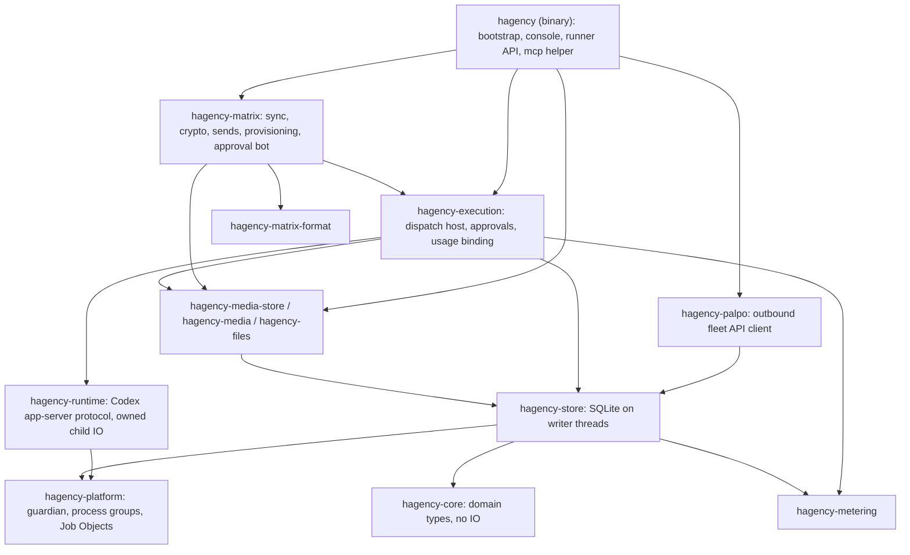
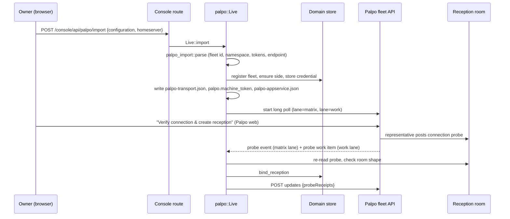
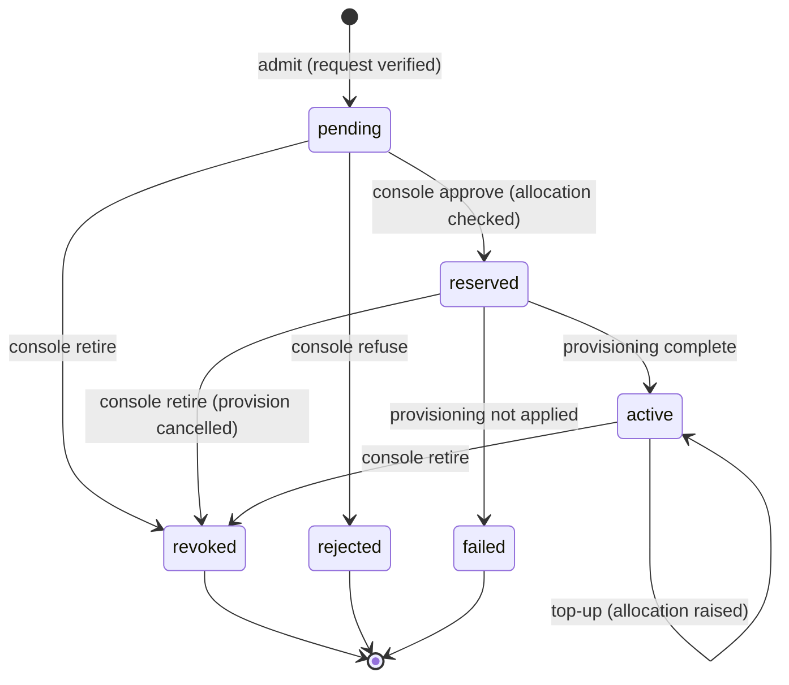
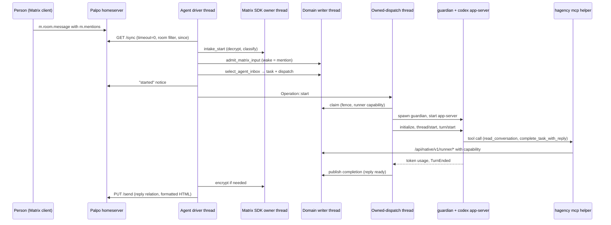
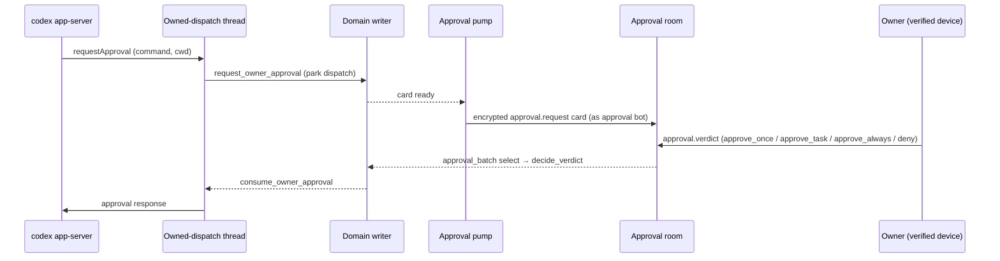
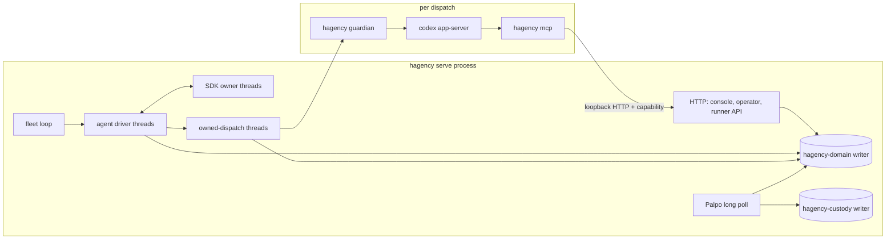

# 代码导读：从 Palpo 申请到 agent 回复

[English](architecture-walkthrough.md) | 简体中文

本导读面向要修改 `native/` 下原生 Rust 服务的开发者。它沿着[使用指南](user-guide/README.zh-CN.md)背后的代码路径走一遍：
1. 连接一台 Palpo 服务器。
2. 项目申请一个 agent。
3. Hagency 批准并创建该 agent。
4. 有人 @ 提及 agent，并收到回复。

每一步都给出要打开的文件和函数，按函数名搜索即可。ADR 位于 [knowledge/decisions](../knowledge/decisions/)。第 13 节列出代码目前实现了什么，以及哪些仍由 JavaScript 实现或尚待开发。第 14 节说明改动应放在哪里。

## 1. 术语

| 名称 | 含义 |
| --- | --- |
| Hagency | 运行编程 agent 并把它们借给项目的服务。一次安装就是一个 **fleet**。 |
| Palpo | 项目所在的 Matrix homeserver。它的网页端负责安装 Hagency 的 App Service，并向项目展示 agent 申请。 |
| Fleet id | `hf_` 加 32 个十六进制字符。Hagency 拥有的每个 Matrix 账号都以它为前缀，例如 `@hf_…_representative`。 |
| 代表（representative） | fleet 自己的 Matrix 账号。它拥有接待室，并把 agent 邀请进项目房间。 |
| 审批机器人 | 一个独立的 Matrix 账号（`@<fleet>_approval`），有自己的设备。它向所有者发送权限卡片，并读取所有者的裁决。 |
| Coordinator | fleet 的根接入会话。它的接入流程负责创建 agent，邀请轮询器也使用它的 Matrix 身份。它服务于整个 fleet，而不属于某个项目。 |
| 项目方（project side） | Hagency 对一台已连接 homeserver 的记录：凭据、API 基址和 token 预算。 |
| 资源（resource） | 提供给项目的一份可运行配置：框架、模型、思考强度和每月 token 上限。 |
| 席位（seat） | 资源所消耗的模型账号。多份资源可以共享一个席位的额度。 |
| 接洽（engagement） | 一个项目获批的一个 agent。它是分配 token、创建、暂停、追加额度和退役的基本单位。 |
| 所有者 | 接洽被接纳时记录在 `projects.owner_mxid` 中的项目方用户。只有所有者能回复审批卡片、与 agent 私聊。 |
| 接待室 | 一个未加密、仅限邀请的房间，由 Palpo 与代表共用。申请和连接探测以自定义事件的形式送到这里。 |
| 项目房间 | 人和 agent 一起工作的房间。它不加密，这样 fleet 的接入流程才能读取。 |
| 审批室 | 一个加密房间，成员恰好是所有者和审批机器人。 |
| agent 私聊 | 一个加密房间，成员恰好是所有者和一个 agent。 |
| 会话、派发、尝试 | 会话（session）是一条对话路由（房间加可选的讨论串）。派发（dispatch）是从中选出的一个 agent 工作单元。尝试（attempt）是为该派发启动一次 runner。 |
| 保管记录（custody） | 在外部副作用发生之前写入的持久记录，说明尝试了什么。崩溃之后，由它决定是“检查结果”还是“重新执行”。 |
| 栅栏（fence） | 用来阻止过期工作的计数器或记录行。每个派发都带一个栅栏编号，持有旧编号的一方会被拒绝。 |

## 2. 同一仓库中的两套实现

本仓库包含 Hagency 的两套实现：

| 实现 | 入口 | 运行什么 | 如何连接 Matrix |
| --- | --- | --- | --- |
| JavaScript | [backend-v2.js](../backend-v2.js)、[bridge-matrix.js](../bridge-matrix.js)、[push-relay.js](../push-relay.js) | tmux 窗格中的 Claude Code 和 Codex，HTTP API 位于 `:8090` | 入站 App Service 监听、edge 拉取、`/sync`，或出站 fleet 客户端（[lib/](../lib/)） |
| 原生 Rust | [native/hagency/src/main.rs](../native/hagency/src/main.rs) → `hagency serve` | 由 guardian 托管的 Codex `app-server` 进程，只占一个回环端口（默认 `127.0.0.1:13300`） | 只有出站：对 Palpo fleet API 的长轮询，加上每个 agent 各自的 `/sync` |

使用指南中连接 Palpo 的产品就是原生服务。[install/install-native.sh](../install/install-native.sh) 把它安装为 [deploy/hagency-native.service](../deploy/hagency-native.service)（Linux）或 [deploy/io.hagency.native.plist](../deploy/io.hagency.native.plist)（macOS），两者都运行 `hagency serve --agent-driver --palpo-transport --console-assets …`。

根目录的 [README](../README.md) 描述的是 tmux 产品。对于原生服务，本文档取代 [native/README.md](../native/README.md)。

有几项行为只存在于 JavaScript 中，第 13 节列出了它们。本文其余部分描述原生服务。

## 3. 从可执行文件开始

打开 [native/hagency/src/main.rs](../native/hagency/src/main.rs)。`Command` 枚举就是全部入口：

| 子命令 | 谁来运行 | 作用 |
| --- | --- | --- |
| `serve` | systemd/launchd | 守护进程。第 5–12 节的内容都在其中运行。 |
| `guardian`（隐藏，仅 Unix） | `serve`，作为子进程 | 掌管一个 runner 的进程树（第 9 节）。 |
| `mcp` | Codex，作为 MCP 服务器 | 为 agent 提供工具的任务助手（第 10 节）。 |
| `task …` | agent，在 shell 中 | 以 CLI 形式提供相同的任务操作。 |
| `intake-refuse-stale-session` | 运维人员 | 按摘要拒绝一个已知的、过期的会话前 SDK 批次（[bootstrap/intake_refusal.rs](../native/hagency/src/bootstrap/intake_refusal.rs)）。 |
| `init`、`account`、`registration`、`side-registration`、`provision` | 运维人员 | 离线创建状态目录和凭据，或用 `--listen` 操作正在运行的服务。 |
| `console-access`、`engagements`、`resources`、`alerts` | 运维人员 | 正在运行的服务的回环客户端。 |
| `backup`、`restore`、`rotate` | 运维人员 | SQLite 在线备份、恢复和凭据轮换（[ops/](../native/hagency/src/ops/)）。 |

`guardian` 和 `mcp` 在 `main` 中、构建任何 Tokio 运行时之前就分流出去。它们是由同一个二进制文件启动的短生命周期辅助进程。其余部分都运行在 `main` 构建的一个多线程运行时上。

`serve` 交给 [bootstrap.rs](../native/hagency/src/bootstrap.rs) 中的 `Bootstrap::open_with_options` 和 `Bootstrap::serve`。先读 `open_with_options`：它依次打开两个数据库、审批机器人的推送泵、文件和接收服务、fleet 服务以及 Palpo 传输。`serve` 绑定唯一的监听端口，并启动上限超额检查、保留期（60 秒）和提醒（1 秒）三个定时清扫、邀请轮询器、HTTP 服务器和 Palpo。随后它以 1–60 秒的退避重试审批机器人的设备登记，直到成功，然后才启动审批转发器、coordinator 的驱动器和 fleet 循环。`Bootstrap::close` 按相反顺序关闭它们（第 12 节）。

所有 HTTP 流量共用这一个回环端口。[lib.rs](../native/hagency/src/lib.rs) 中的 `App::new` 拒绝任何非回环的监听地址。

| 路径 | 调用方 | 认证 |
| --- | --- | --- |
| `/health`、`/ready` | 进程监管程序 | 无。只要有任一已配置组件未就绪，`/ready` 就返回 503。 |
| `/console/**` | 运维人员的浏览器 | 会话 cookie（第 11 节） |
| `/console/api/**` | 控制台的 JavaScript | 会话 cookie 加同源检查 |
| `/api/native/v1/**` | 运维 CLI | Bearer `operator.token`，由 `local_authority` 检查 |
| `/api/native/v1/runner/**` | runner 中的 `mcp` 助手 | 按派发签发的 runner 凭证（[runner.rs](../native/hagency/src/runner.rs)） |

`serve` 不读取 `.env`。它的配置就是 `--state-dir` 中的文件：

| 文件 | 用途 | 读取方 |
| --- | --- | --- |
| `operator.token` | 运维 bearer 密钥 | `Bootstrap::open_with_options` |
| `agent-driver.json` | runner 可执行文件、工作区、Matrix 与审批设置、factory 服务 | [bootstrap/config.rs](../native/hagency/src/bootstrap/config.rs) |
| `matrix.*`、`approval.*` | agent 身份与审批身份的访问令牌、SDK 存储密钥和 CA 证书 | `bootstrap/config.rs` |
| `palpo-transport.json`、`palpo.machine_token`、`palpo-appservice.json` | 由 Palpo 导入写入（第 5 节） | [bootstrap/palpo.rs](../native/hagency/src/bootstrap/palpo.rs) |
| `domain.sqlite3`、`custody.sqlite3` | 领域状态；Palpo 传输保管记录（第 12 节） | [native/hagency-store](../native/hagency-store/src/) |
| `sdk/`、`approval-sdk/` | Matrix 加密密钥存储与状态存储（均加密保存） | [hagency-matrix/src/sdk.rs](../native/hagency-matrix/src/sdk.rs) |

## 4. crate 与分层

大多数库 crate 在 `lib.rs` 顶部用 `//!` 注释说明自身职责。依赖方向自上而下，图中省略了传递依赖：

先读三个 crate：
- [hagency-core](../native/hagency-core/src/) 把术语表达为类型。`authority.rs` 中有 `ProjectRequest` 和 `verify_request`，`project.rs` 中有 `Resource` 和 `AgentName`，`replies.rs` 中有 `ReplyRoute`。
- [hagency-store](../native/hagency-store/src/) 承载所有持久化规则。
- [hagency-matrix](../native/hagency-matrix/src/) 承载所有 Matrix 副作用。

工作区中还有 `hagency-permissions`、`hagency-progress`、`hagency-progress-runtime` 和 `hagency-crypto-proof`，只有它们自己的测试会用到。实际运行的审批走 `hagency-execution/src/approval/`，进度通知来自 `hagency-store/src/domain/activity.rs`。

## 5. 连接 Palpo 服务器

管理员的 “Add Hagency” 和所有者的 “Download Hagency configuration” 都在 Palpo 网页端完成。所有者在控制台上传那个 JSON 文件后，才轮到 Hagency。

1. `console/palpo_import.rs` 接收上传，并调用 [bootstrap/palpo.rs](../native/hagency/src/bootstrap/palpo.rs) 中的 `Live::import`。
2. [bootstrap/palpo_import.rs](../native/hagency/src/bootstrap/palpo_import.rs) 中的 `parse` 只接受一种格式：
   - fleet id 是 `hf_` 加 32 个十六进制字符，发送者是 `<fleet>_representative`。
   - 恰好有一个独占的用户命名空间 `@<fleet>_…:<server>`，没有房间或别名命名空间。
   - `as_token`、`hs_token` 和机器令牌三者互不相同。
   - 传输模式为 `outbound`，端点是 `https://…/api/fleet/v2/<fleet>`（仅在回环地址上允许明文 `http`）。
   - 第二个 fleet 的文件会以 `palpo_fleet_conflict` 被拒绝：一个服务只运行一个 fleet。
3. 导入保存已校验的内容：
   - **领域存储：** 一条 `registrations` 记录（fleet、服务器、代表、审批机器人，以及暂时为空的接待室）、一条项目方记录及其 App Service 凭据。
   - **状态目录：** 三个私有文件。
   - 设置了 `--palpo-transport` 时，传输立即启动。
4. 凭据只写不读。`hagency-store/src/domain/side_lifecycle.rs` 中的 `SideRecord` 只公开 `credential_kind` 和 `has_credential`，从不暴露令牌本身。注册视图只显示 SHA-256 指纹。
5. 传输层是 [hagency-palpo](../native/hagency-palpo/src/)：
   - `adapter.rs` 在两条通道上长轮询 `GET {endpoint}/poll`，随后调用 `POST ack` 和 `POST updates`。
   - **matrix 通道**转发 App Service 事务，**work 通道**承载探测、agent 申请等任务。
   - 轮询等待 25 秒，资源目录每 15 秒重新发布一次（`config.rs`）。
   - 不监听任何入站连接。位于 NAT 之后的 homeserver 无需暴露 Hagency 也能工作。
6. 在 Palpo 中点 “Verify connection & create reception” 后，代表会发送一个 `com.hagency.connection.probe.v1` 事件。[bootstrap/probe.rs](../native/hagency/src/bootstrap/probe.rs) 中的 `work_once` 以代表身份重新读取该事件，只在以下条件都满足时才绑定该房间：房间仅限邀请且未加密、代表已加入、尚未绑定其他接待室。回执随下一次 `updates` 返回 Palpo。探测失败会一直重试，直到成功。

测试示例：[hagency/tests/console/palpo_import.rs](../native/hagency/tests/console/palpo_import.rs) 中的 `native_palpo_import_route_saves_the_owner_download` 和 `native_palpo_import_route_refuses_a_foreign_file`。

## 6. 资源与目录

提供方在控制台中设置资源：
- `console/resources.rs` 负责创建资源。
- `console/resource_configuration.rs` 修改模型、思考强度和每月上限，并用 `expectedRevision` 做乐观并发控制。

`hagency-core/src/project.rs` 中的 `Resource::qualifies` 只在以下四个条件都满足时，才为某个角色提供该资源：
- 资源已发布；
- 框架是 `codex` 或 `claude`；
- 设有上限；
- 模型满足所申请角色的要求（`hagency-core/src/qualification.rs`）。

新资源在创建它的同一事务中发布（`hagency-store/src/domain.rs` 中的 `prepare_resource_write`）。撤下发布是持久的。只要资源还有已预留或活跃的接洽，就不能修改它的配置。

`hagency-palpo/src/catalog.rs` 中的 `publish_resources_once` 每 15 秒把冻结后的目录发送给 Palpo。对每份资源，Palpo 收到一个不透明的 id `resource_<24hex>`、显示名称、框架、模型和思考强度。上限、席位和预设 id 只留在 Hagency 内部（ADR-024、ADR-108、ADR-111）。同一次 `updates` 调用还会带上接洽状态和探测回执。

控制台可以发布 `claude` 资源，但 `hagency-execution/src/host.rs` 中的 `Host::prepare_bound` 会以 `UnsupportedRunner` 拒绝启动它。目前原生服务只运行 Codex。

## 7. 从 agent 申请到 agent 创建完成

项目成员在 Palpo 网页端定义 agent：名称、一份已发布的资源、角色、申请的 token 数和每日速率。Palpo 在接待室发送 `com.hagency.engagement.request.v1`，并排入一个 work 任务。

**接纳。** [bootstrap/palpo_work.rs](../native/hagency/src/bootstrap/palpo_work.rs) 中的 `admit_request` 重新读取源事件、观察相关房间，并调用 `hagency-core/src/authority.rs` 中的 `verify_request`。以下条件必须全部成立：
- 接待室和项目房间仅限邀请且未加密。
- 申请人、所有者和代表都已加入项目房间。
- 所有者在该房间的权限等级为 100。
- 房间的 `com.hagency.admin.binding.v1` 状态写明了本 fleet、项目和所有者。
- 所有者的审批室已加密，成员恰好是所有者和审批机器人。
- 观察结果不超过 30 秒。

随后 `hagency-store/src/domain.rs` 中的 `DomainRepository::admit` 写入接洽：
- **Id：** `en_` 加上由 fleet 和申请 id 计算出的 32 位十六进制哈希。重放会返回已保存的记录；同一 id 下内容不同则视为冲突。
- **名称：** 在该项目处于待批、已预留和活跃状态的接洽中必须唯一。`AgentName` 接受 Unicode 字母，规范化为 NFC，最长 64 个 UTF-16 码元。
- **写入：** `projects` 记录（所有者、审批室）和状态为 `pending` 的 `engagements` 记录。

**批准。** 控制台的“接洽”页面用到三个路由：
- `GET …/candidates` 返回 `remainingTokens`，“全部剩余”按钮填入的就是这个值。
- `POST …/approve {allocatedTokens?}` 用于批准；agents 路由 `…/refuse` 用于拒绝待批申请。
- `approve_allocating` 调用 `check_grant`。`check_grant` 把申请额度与 `headroom` 比较，后者取上限、席位和资源池余量中的最小值。上限一侧把每笔占用计为 `max(reserved, spent)`；席位和资源池计入已承诺的额度。拒绝结果为 `OverCommit`（附带说明是哪项限额起作用）、`InsufficientCapacity` 或 `NoCeiling`。
- 成功后接洽变为 `reserved`，并排入一个 `provision_<id>` 副作用任务（effect）。

`palpo_work.rs` 中的 `refresh_statuses` 把每个状态回报给 Palpo：`pending`、创建过程中的 `active`、`active` 加 `complete`、`rejected` 或 `ended`。它还会发送已分配的 token 数、agent 的 MXID，以及 agent 加入房间后的 `ready`。

**创建。** coordinator 的接入回合调用 [hagency-matrix/src/provisioning.rs](../native/hagency-matrix/src/provisioning.rs) 中的 `resume_pending_provisions`。每次认领都以对应副作用任务的 id 作为栅栏。执行顺序来自 ADR-184：

1. 通过 App Service `/register` 创建 `@<fleet>_<32hex>:<server>`，再登录以获得设备 `DEVICE_<engagement>`（`token_provision/application_service.rs`）。
2. 把显示名称设为项目给 agent 起的名字。
3. agent 创建自己的私聊：`private_chat`、Megolm 加密、`m.federate: false`、历史可见性 `invited`，**不邀请任何人**。
4. 代表把 agent 邀请进项目房间，agent 加入。
5. `enroll_created_rooms` 上传 agent 的设备密钥和交叉签名身份。
6. 此时 `invite_owner` 才把所有者邀请进私聊。这一步会一直等到所有者加入，没有截止时间。如果等待期间服务重启，这一步交由运维人员处理。

第 5 步排在第 6 步之前，是为了保证所有者在能输入消息之前，其客户端就已拿到 agent 的密钥。ADR-184 记录了促成这一顺序的事故。

每一次 Matrix 写操作前后都会记录一个保管阶段：`dm-possible`/`dm-response`、`invite-possible`/`invite-response` 等（`token_provision/rooms/custody.rs`）。如果响应丢失，下一次尝试会先检查房间状态，而不是重复写入。

**退役。**
- `POST …/retire` 可撤销待批、已预留或活跃的接洽。已预留接洽的创建任务会被取消。如果创建已经开始，该调用会排入一个 `retire_<id>` 副作用任务，它会退出所有房间并注销设备（[hagency-matrix/src/retire.rs](../native/hagency-matrix/src/retire.rs)）。
- 退役失败后，只能通过 `POST …/cleanup-retry` 重新执行。

## 8. 房间，以及谁能和 agent 对话

| 房间 | 加密 | 成员 | 什么会唤醒 agent | 规则所在 |
| --- | --- | --- | --- | --- |
| 接待室 | 否 | Palpo 的账号和代表 | 无，只承载申请和探测 | `verify_request`、`probe.rs` |
| 项目房间 | 否 | 项目成员、代表、各 agent | 提及该 agent 的人类消息 | `hagency-store/src/domain/verified_ingress.rs` 中的 `admit_matrix_input` |
| agent 私聊 | 是 | 所有者和一个 agent | 所有者发来的任何消息 | `admit_matrix_input`；房间形态见 `domain/matrix_routes.rs` |
| 审批室 | 是 | 所有者和审批机器人 | 无，只承载卡片和裁决 | `domain/approvals.rs` 中的 `observe_approval_room` |

所有成员都必须在 fleet 自己的服务器上：`hagency-core/src/replies.rs` 中的 `matrix_user` 和 `matrix_room` 会拒绝其他服务器名。

在项目房间里，每个已加入的人都可以通过提及 agent 给它派活。所有者通过三种方式保持控制：
- 有风险的操作需要所有者审批（第 10 节）。
- 所有工作都消耗该接洽的额度（第 11 节）。
- 所有者决定谁能进入房间。

只有人类发送的消息会唤醒 agent；`!` 命令和 `/thread` 指令另行处理。任务完成后，只有原申请人在该任务讨论串里的回复才会再次唤醒 agent。

**邀请。**
- `bootstrap/invites.rs` 轮询 agent 收到的邀请。来自项目已记录所有者的邀请会被自动接受。
- 其他邀请（包括无法读出邀请人的邀请）会成为 `pending_invites` 中的一条记录。运维人员在控制台的“邀请”页面接受或拒绝（`console/invites.rs`），下一轮轮询随即加入或退出。
- 拒绝会被记住，同一邀请不会再次出现。
- 轮询器只为 coordinator 的采集器启动（`Bootstrap::serve`），因此已创建的 agent 目前还不会处理自己收到的邀请。使用指南把这一点列为已知限制。

测试示例：[hagency/tests/invites.rs](../native/hagency/tests/invites.rs) 中的 `untrusted_invite_becomes_a_pending_decision`、`owner_invite_takes_the_trusted_inviter_arm_and_joins` 和 `console_accept_queues_the_join_and_the_next_poll_performs_it`。

## 9. 跟踪一条消息直到回复

有人在项目房间发了一条顶层消息：`@coding-fast-01 add a sum() helper`。

**接入。** 每个活跃的 agent 都有一个驱动器：一个名为 `hagency-agent-driver` 的操作系统线程，带有自己的单线程（current-thread）运行时（[bootstrap/driver.rs](../native/hagency/src/bootstrap/driver.rs) 中的 `Driver::start_agent`）。fleet 循环为每个已创建的 agent 启动一个驱动器。

`run_continuous` 反复执行 `run`：
1. `collector.collect`，然后恢复尚未完成的出站保管记录。
2. 根据该 agent 的会话构建 `HostIntakePlan`。
3. `collector.intake(plan)`。空闲轮次休眠 1 秒，出错时退避，最长 60 秒。

[hagency-matrix/src/intake.rs](../native/hagency-matrix/src/intake.rs) 中的 `Inner::intake` 处理一轮：
1. 用 `whoami` 校验 agent 身份。
2. 发出一次 `GET /sync`，参数为 `timeout=0`、房间过滤器和已保存的 `since`。
3. 把响应交给 SDK 所有者线程（`sdk.rs` 中的 `Owner::intake_start`）。它先记录批次日志，再应用到加密的状态存储，并重试之前因缺少密钥而无法解密的消息。

`event_batch.rs` 中的 `Batch::derive_with_history` 对每个事件分类：
- **Candidate：** 被接受的明文事件，或发送者与设备都匹配的已验证 Megolm 事件。
- **NotTarget：** 与该 agent 无关的事件。
- **Rejected：** 解密失败、加密房间中出现明文等。
- **Deferred：** 房间密钥尚未到达。

它还会读取 `m.thread`、忽略编辑事件，并从 `m.mentions.user_ids` 中取提及；没有时退回到 pill 链接和 @名字 形式的文本。

**准入。** `hagency-store/src/domain/verified_ingress.rs` 中的 `admit_matrix_input` 检查路由、成员资格、加密是否匹配以及 `ingress_since` 边界，按内容摘要去重，然后无论消息是否唤醒 agent，都写入一条 `session_inputs` 记录（ADR-023）。不唤醒的记录会成为 agent 下一回合的讨论上下文。

**派发。** `domain/messages.rs` 中的 `select_agent` 取最早的唤醒输入：
- 用确定性的 id 创建一个任务和一个派发。
- `freeze_window` 固定 agent 将看到的讨论范围。
- `enqueue_inbox` 把发给该 agent 的输入放进载荷，其余内容通过 `read_conversation` 访问。

驱动器随后发送一条 “started” 通知。这个事件成为锚点，之后的进度编辑都替换它。

**认领。** `domain/execution.rs` 中的 `claim_clock` 只在以下条件全部成立时才租出一个派发：
- 它处于排队状态，或已挂起且到了恢复时间。
- 同一会话中没有其他派发处于已租出、已开始或已挂起状态，因此每个对话一次只运行一个回合。
- 接洽处于 `active`，且没有未结的 `quota_holds` 记录、agent 栅栏或隔离。
- 工作区租约空闲。
- 账号就绪状态已知（`dispatch_account_ready`）。
- 运行中的派发少于 `max_live`（factory agent 为 8）。

租约会递增栅栏编号，并签发一个 `RunnerCapability`：派发 id、runner id、栅栏编号和一个只以哈希形式保存的密钥。

**执行。** [hagency-execution/src/operation.rs](../native/hagency-execution/src/operation.rs) 中的 `execute` 运行在 `hagency-owned-dispatch` 线程上：
1. `Host::prepare_bound`（`host.rs`）解析工作区。当 agent 的工作区模式为 `worktree` 且会话有讨论串根时，该派发会在 `worktrees_dir` 下获得自己的 `git worktree`；若未配置该目录则拒绝执行（ADR-011）。其余派发都使用 agent 的共享工作区。它还设置环境变量（包括 `HAGENCY_RUNNER_API_ADDR` 和凭证），并把 argv 固定为 `["app-server"]`。
2. `OwnedSession::spawn`（`hagency-runtime/src/owned/session.rs`）启动 `hagency guardian`。
   - **Unix：** 一对 socket 承载 Prepare/Start 握手（[hagency-platform/src/supervisor/unix.rs](../native/hagency-platform/src/supervisor/unix.rs)）。guardian 把 Codex 放进独立的进程组，在 Linux 上成为 subreaper，停止时杀掉整个进程组。
   - **Windows：** 没有 guardian。子进程直接创建在一个“关闭即终止”的 Job Object 中（`hagency-platform/src/windows.rs`）。
3. Codex app-server 协议（`hagency-runtime/src/codex/session/driver.rs`）依次执行 `initialize`、`thread/start` 和 `turn/start`，然后读取更新，直到 `TurnEnded`。
   - `thread/start` 设置 `sandbox: workspace-write`（或 `read-only`）、`approvalPolicy: on-request`、禁用网络、不额外开放可写目录（`codex/session.rs`）。`state.rs` 检查 Codex 回显的设置与之一致。
   - 单个回合上限为 20 分钟。超出操作预算只会发出通知，不会终止回合（ADR-183）。

**工具。** `codex/session/task_mcp.rs` 构建的 Codex MCP 配置以 `hagency_task_writer` 的名义运行 `hagency mcp`。助手把每次调用连同派发、runner 和栅栏请求头转发到 `/api/native/v1/runner/*`，由 `runner.rs` 认证。第 10 节列出每个工具对应的路由。

**完成。** `complete_task_with_reply`（`domain/owned_completion.rs`）：
1. 把任务置为 Done，并递增其执行纪元。
2. 把回复保存为 `held`，并对该派发设栅栏，使旧凭证失效。

guardian 证明进程树已全部退出后，`publish_owned_completion` 把回复标记为 `ready`。如果无法证明清理完成，回复不会发布，驱动器转而对该 agent 设栅栏。

**回复。** `driver.rs` 中的 `finish_attempt` 认领最终回复并调用 `collector.send_final`。[hagency-matrix/src/outgoing.rs](../native/hagency-matrix/src/outgoing.rs) 中的 `Inner::outgoing` 接着：
- 查找该回复之前的回执，若已存在则直接返回。
- 构建内容：正文加上由 Markdown 渲染的 `formatted_body`（`hagency-matrix-format`，禁用原始 HTML）。
- 用 `reply_relation`（`outgoing/state.rs`）添加回复关系：源消息在讨论串中时用 `m.thread`；本例这种群聊顶层消息用 `m.in_reply_to`；私聊中不加。
- 对加密房间通过 SDK 所有者线程加密，再用 `PUT /send/{txn}` 发送。

恢复发送时沿用同一个事务 id。

测试示例：[hagency/tests/two_agent_handoff.rs](../native/hagency/tests/two_agent_handoff.rs) 中的 `native_two_agent_task_handoff_observes_usage_on_the_right_engagement`。

## 10. 工具与审批

Codex 把 `hagency mcp` 作为 MCP 服务器 `hagency_task_writer` 启动。始终开启的工具是 `TASK_MCP_TOOLS`。另有三组可选工具，由 `agent-driver.json` 中的 `coordination_tools`、`send_file` 和 `receive_file` 开启（[hagency-runtime/src/task_mcp.rs](../native/hagency-runtime/src/task_mcp.rs)）。路由都在 `/api/native/v1/runner/` 之下；任务类和协作类处理函数把一个 `RunnerCommand`（`hagency-core/src/tasks.rs`）交给 `DomainStore::runner_command`，文件类路由则交给各自的服务线程：

| 工具 | 路由 | `runner.rs` 或 `runner/` 中的处理函数 | 预先批准 |
| --- | --- | --- | --- |
| `get_task`、`list_tasks` | `tasks/{id}`、`tasks` | `get_task`、`list_tasks` | 是 |
| `update_task_execution`、`transition_task` | `tasks/{id}/operations` | `mutate` | 是 |
| `complete_task_with_reply` | `complete-task-with-reply` | `completion.rs` 中的 `finish` | 是 |
| `read_conversation` | `conversation` | `conversation_page` | 是 |
| `schedule_reminder` | `reminders` | `schedule_reminder` | 是 |
| `comment_task`（协作类） | `tasks/{id}/operations` | `mutate` | 是（ADR-021） |
| `delegate_task`、`open_conversation`、`send_peer_message` 及其他协作类工具 | `delegations`、`conversations…`、`peer-messages`、`peer-inbox` | `delegate`、`open_conversation`、`conversation`、`change_conversation`、`send_peer`、`peer_inbox` | 否：每次调用都需所有者批准（ADR-180） |
| `send_file`、`get_file_delivery` | `file-deliveries`、`file-deliveries/{id}` | `files.rs`（`submit`、`inspect`），再交给文件服务线程 | 否 |
| `list_received_files`、`receive_file` | `received-files` | `received.rs`，再交给接收服务线程 | 否 |

runner API 还提供一些 Codex 不会作为工具调用的路由：`approval` 和 `approval/consume`（供托管 Codex 配置之外的助手通过 `get_approval` 和 `consume_approval` 工具调用）、`inbox`、`tasks/{id}/comments`、`graphs/*`（[runner/workflows.rs](../native/hagency/src/runner/workflows.rs)）、`final-replies`（[runner/replies.rs](../native/hagency/src/runner/replies.rs)）、`late-output`（ADR-146），以及对 `PATCH agent` 的固定拒绝。助手的工具目录会对 Codex 的托管配置隐藏 `get_approval`、`consume_approval` 和 `accept_task`（`mcp.rs`）。

预先批准的工具集由 `codex/session/task_mcp.rs` 写入 Codex 的 MCP 配置。其他所有工具调用，以及 Codex 想在沙箱之外执行的命令或文件修改，都会通过 app-server 连接以审批请求的形式到达 Hagency。

- **准入。** Codex 适配层（`hagency-runtime/src/codex/approval.rs`）遇到格式错误、过大或方法未知的请求时会结束会话（ADR-046）。
- **挂起。** `hagency-store/src/domain/approvals.rs` 中的 `request_owner_approval_clock` 在同一事务中保存请求并挂起派发。
  - 请求的过期时间最多在 600 秒之后。
  - 上限按未结请求（pending、decided、applying、uncertain）计数：每个派发栅栏 16 个、每个接洽 64 个、全局 1024 个。
- **常设授权。** `hagency-core/src/execution.rs` 中的 `derive` 把每个请求转换成一个作用域：精确的命令加工作目录和额外权限、网络主机加协议等（ADR-039）。授权按该作用域键、agent 的上下文键和审批绑定的代次（generation）匹配。`task` 授权还要求任务和纪元相同；`always` 授权不需要。这些授权是唯一的常设规则。无法推导出作用域时，所有者只能批准一次或拒绝。
- **送达。** [bootstrap/approval.rs](../native/hagency/src/bootstrap/approval.rs) 中的 `Pump::drain` 从存储中重新读取每张卡片，并以审批机器人的身份发送。
  - 一旦审批室出现第三名成员或失去加密，`observe_approval_room` 立即把它标记为不可用。
  - 发送开始后若失败，`deny_for_failed_delivery` 记录一次拒绝（ADR-137）。卡片送达后，会以 agent 的身份在项目房间该任务的讨论串里发一条脱敏的状态通知。送达预算为 45 秒（ADR-149）。
- **裁决。** `approval_batch.rs` 只在以下条件全部满足时接受所有者的裁决：
  - 它是所有者的已验证设备发出的 Megolm 事件，且没有转发者。
  - 其严格格式的内容写明了本请求的摘要、agent、项目和房间。
  - `decide_verdict` 根据绑定关系和请求的过期时间重新检查上述全部内容。

  纯文本消息、`!` 命令和控制台点击都不能批准请求。
- **过期。** 所有者在 `approval_owner_wait_ms` 内未答复时，`deny_for_owner_wait_expiry` 记录一次与所有者点“拒绝”相同的拒绝，回合在没有该权限的情况下继续（ADR-046 的“owner-wait expiry”修订）。代码默认值（`bootstrap/config.rs` 中的 `default_approval_wait`）是 1000 毫秒，几乎会立即拒绝；请在 `agent-driver.json` 中设置 `approval_owner_wait_ms`。
- **执行裁决。** `consume_owner_approval` 先把请求置为 `applying`，再把响应写给 Codex。重启后，处于 `applying` 的请求变为 `uncertain`，恢复流程会检查它，而不是重新发送。

执行策略会保存一个 `yolo` 标志（`domain/exec_policy.rs`），但所有原生审批上下文都以 `yolo: false` 构建，存储层也会拒绝 yolo 上下文。

控制台可以列出审批、撤销授权（`console/approvals.rs`），也可以列出并解除审批室绑定（`console/approval_bindings.rs`）。批准只能在审批室中进行。

测试示例：[hagency-matrix/tests/approval_delivery/](../native/hagency-matrix/tests/approval_delivery/)，例如 `native_private_approval_fresh_enrollment_and_delivery` 和 `native_private_approval_send_cancellation_and_loss`。

## 11. Token、用量与控制台

**用量。** Codex 上报 `thread/tokenUsage/updated`。
- `hagency-execution/src/usage.rs` 中的 `UsageRun::record_pending` 把每次上报交给 `hagency-store/src/domain/usage.rs` 中的 `record_usage_clock`。
- 用量归属来自启动时绑定到该派发的 `usage_sources` 记录，从不依据对话记录推断。
- 上报按来源和调用去重，计入日、月两级统计，并生成回执。

**暂停与追加（ADR-186）。**
- 每次记录用量后，`domain/quota_holds.rs` 中的 `quota_holds::evaluate` 汇总自批准以来的输入 + 输出 + 缓存写入。总量达到分配额度时，它开启一个 `quota_paused` 暂停，并在任务讨论串中发送 “Paused: used N of M tokens”。
- 正在运行的回合会继续完成。新的派发保持排队，因为认领会跳过被暂停的接洽。
- 如果没有任何上报带有已知计数，用量视为未知；未知用量永远不会让 agent 暂停。
- `POST /console/api/engagements/{id}/allocation {addTokens}` 调用 `raise_allocation`。它按与批准相同的余量规则检查，解除暂停，并发送 “Resumed”。

**告警。** `sweep_ceiling_overruns`（`domain/ceiling_alerts.rs`）每小时运行一次，当某资源的占用超过上限时发出 `agent_ceiling_overrun`。告警只用于通知运维人员；真正阻止新工作的是暂停。

测试示例：[hagency-store/tests/engagement_allocation.rs](../native/hagency-store/tests/engagement_allocation.rs) 中的 `native_quota_pause_when_spend_reaches_the_allocation` 和 `native_quota_no_pause_on_unknown_usage`，以及 `hagency/tests/console/engagements_allocation.rs` 中的 `native_allocation_route_top_up_lifts_the_pause_and_is_idempotent`。

**控制台。** 控制台是 [mockup/](../mockup/) 中的 Next.js 应用。
- `mockup/scripts/build-native-console.mjs` 把原生页面静态导出，`serve --console-assets <dir>` 在 `/console/` 下提供它们（[console/assets.rs](../native/hagency/src/console/assets.rs)）。客户端代码是 `mockup/lib/native-api.js`。
- 登录：
  1. `hagency console-access` 出示 `operator.token`，获得一个 120 秒内有效的链接。
  2. 页面在 `POST /console/session` 用它换取一个 `HttpOnly; SameSite=Strict` cookie。
- 每个控制台请求的 `Host` 必须正好是监听地址，写操作必须带同源的 `Origin`，且不得带 `Authorization` 或转发类请求头（`console.rs`）。

## 12. 服务如何运行

| 组件 | 运行方式 | 位置 |
| --- | --- | --- |
| HTTP 服务器、fleet 循环、定时清扫、Palpo 轮询、审批推送泵 | 主多线程运行时上的任务 | `main`、`Bootstrap::serve` |
| 领域数据库 | 专用线程 `hagency-domain`；一个有界 `mpsc` 通道，接收作用于 `&mut DomainRepository` 的装箱闭包，通过 `oneshot` 返回结果 | `hagency-store/src/domain_worker.rs` |
| 保管数据库（Palpo 轮询、尝试和发布回执） | 专用线程 `hagency-custody`，模式相同 | `hagency-store/src/worker.rs`、`custody-migrations/002-outbound.sql` |
| 每个 agent（以及 coordinator） | 线程 `hagency-agent-driver`，带自己的单线程运行时 | `bootstrap/driver.rs` |
| Matrix 加密与状态 | 每个身份一个线程 `hagency-matrix-sdk`；持有 SQLite 加密存储的锁 | `hagency-matrix/src/sdk.rs` |
| 一个运行中的派发 | 线程 `hagency-owned-dispatch`（常驻 agent 为 `hagency-warm-owned-runtime`） | `hagency-execution/src/operation.rs`、`warm.rs` |
| runner 进程树 | `hagency guardian` 子进程，其下是 Codex | `hagency-platform` |
| 文件发送、接收文件 | 线程 `hagency-file-service`、`hagency-receive-service`，各带 `LocalSet` | `file_service.rs`、`receive_service.rs` |
| agent 工具 | Codex 的子进程 `hagency mcp`，通过 HTTP 访问 runner API | `native/hagency/src/mcp.rs` |

**每个数据库只有一个写入者。** 对 `domain.sqlite3` 的每次读写都是发给 `hagency-domain` 线程的一个任务。必须同时成立的规则（例如“插入审批并挂起派发”）作为一个任务在同一事务中执行。每个任务都带有截止时间和字节预算。`/health` 报告两个写入线程的通道是否仍然打开。数据库使用 WAL 和 `synchronous=FULL`。对 `domain.lock` 和 `owner.lock` 的独占锁防止第二个进程打开同一个状态目录。

**用 id 和栅栏代替锁。** 工作在线程和进程之间按 id 传递。派发上的栅栏编号、任务上的纪元、注册记录或房间上的代次，让持有当前编号的一方行动，拒绝其他所有人。派发一旦被设栅栏，其 runner 的调用都会被拒绝；只有三个路由有意放在认证钩子之外：对 `complete-task-with-reply` 的完全相同的重放、`late-output`（ADR-146），以及对历史 `file-deliveries/{id}` 的读取。

**未知结果保持未知。** 结果丢失的 Matrix 写入、进程清理或审批响应会被记录为 `Unknown` 或 `uncertain`。恢复流程会检查结果，或等待运维人员处理（ADR-182、ADR-183）。

**关闭。** SIGTERM 会取消一个 `CancellationToken`。随后 `Bootstrap::close`：
1. 让 fleet、控制台、共享工作区以及接收和文件服务停止接收新工作；停止 agent 驱动器和定时清扫；取消 Palpo。
2. 关闭文件和接收服务、驱动器和 Palpo，然后排空并关闭 fleet 中的各 agent。
3. 关闭 coordinator 的采集器和审批推送泵。
4. 先关闭领域写入线程，再关闭保管写入线程。

HTTP 服务器最后停止，有 5 秒宽限期。

## 13. 已实现、仅 JavaScript 实现、尚未实现

使用指南中的“已知限制”是面向用户的清单；某项缺口补上时，请同步更新两处。

| 方面 | 状态 |
| --- | --- |
| Codex runner、Palpo 出站传输、agent 创建、所有者审批、额度暂停与追加、文件发送 | 原生已实现 |
| Claude runner | 已有运行时协议代码；启动会被拒绝（`UnsupportedRunner`） |
| agent 处理自己收到的邀请 | 尚未实现；只轮询 coordinator 收到的邀请 |
| 在 Palpo 上退役 agent 账号（`retire-agent`） | 仅 JavaScript 实现（`lib/palpo-agent-retirement.js`）；原生只退出房间并注销 |
| 在申请房间发送批准通知（“已批准 / Approved”） | 构建函数已存在（`bootstrap/engagement_notice.rs`），但没有调用方；JavaScript 会发送 |
| 批准时检查项目方预算 | 仅 JavaScript 实现（`refuseOverSideAllocation`）；原生只保存并显示项目方预算 |
| 入站 App Service 监听、edge 中转、Agent Ops 客户端（ADR-012） | 仅 JavaScript 实现 |
| `!` 命令 | 原生处理 `!help`、`!offer`、`!request`、`!status`、`!agents`、`!sessions`；`bot_commands.rs` 中的权限表接受其余命令，但不会回复 |
| 联邦 | 按设计拒绝；fleet 假定 homeserver 不启用联邦 |
| runner 沙箱的实际效果 | 已请求并校验回显；各操作系统上的资格验证仍未完成（`hagency-execution/src/lib.rs`） |

## 14. 如何修改

**持久化规则。** 在 `hagency-store/src/domain/*.rs` 对应文件中给 `DomainRepository` 添加方法，并在 `domain_worker.rs` 中以异步 `DomainStore` 方法暴露它，使其作为写入线程上的一个任务运行。所有必须同时成立的检查都放在这一个事务里。

**数据库结构变更。**
1. 添加 `hagency-store/src/migrations/NNN-name.sql`。
2. 把它追加到 `hagency-store/src/domain.rs` 中带版本号的迁移列表，版本号取下一个连续值（可以与文件编号不同）；提高 `DOMAIN_SCHEMA_VERSION`，并在 `verify` 列表中为新增的列或表加一条探测查询。
3. 扩充 `hagency-store/tests/` 中的结构回退测试（例如 `schema_fixtures.rs`），确保旧数据库仍能升级。

**agent 工具。**
1. 把工具名加入 `hagency-runtime/src/task_mcp.rs` 中的 `TASK_MCP_TOOLS` 或某个可选组。
2. 在 `native/hagency/src/mcp/` 下的助手工具目录中描述它，在 `mcp.rs` 中分派它，并在 `native/hagency/src/task_client/` 中添加对应的 HTTP 调用。
3. 在 `runner.rs` 中添加 runner 路由，并在 `hagency-core/src/tasks.rs` 中添加一个 `RunnerCommand` 变体。
4. 决定 `codex/session/task_mcp.rs` 是否预先批准它，并更新该文件中的测试。会触及其他会话、或把数据发出工作区的工具，需要所有者批准。

**控制台路由。** 在 `native/hagency/src/console/` 下添加，并在 `console.rs` 中挂载。如果它服务于一个新页面，再把该页面加入 `mockup/scripts/build-native-console.mjs` 的 `ROUTES`。

**测试与契约。**
- 对改动过的 crate 运行 `cargo test --locked -p <crate>`，然后运行 `cargo clippy --workspace --all-targets --locked -- -D warnings`。
- 行为通过 `specs/` 中的任务契约与测试绑定。添加或更新场景，并把它绑定到你的测试。CI 会运行 `native/scripts/check-rust-spec-bindings.mjs`；`native/scripts/check-production-callers.mjs` 检查契约中每一行 `Production caller:` 都能在生产调用图中找到（ADR-146）。

## 15. 延伸阅读

- [user-guide/README.zh-CN.md](user-guide/README.zh-CN.md)：从用户角度看同一流程。
- [FOR-PROJECT-SIDES.md](FOR-PROJECT-SIDES.md)：homeserver 运维方必须完成的配置。
- [knowledge/decisions](../knowledge/decisions/) 中的 ADR-002（所有者）、ADR-016（项目方）、ADR-023（房间上下文与私聊）、ADR-025（由项目定义 agent）、ADR-184（密钥登记顺序）和 ADR-186（额度暂停）。
- [specs/](../specs/)：把每项行为绑定到测试的任务契约。
