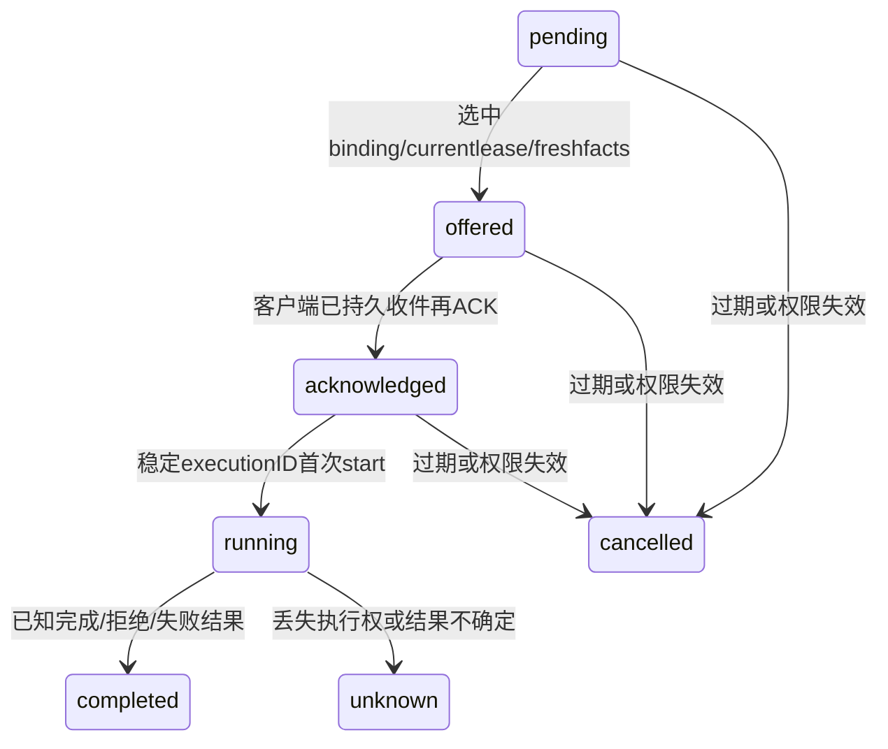
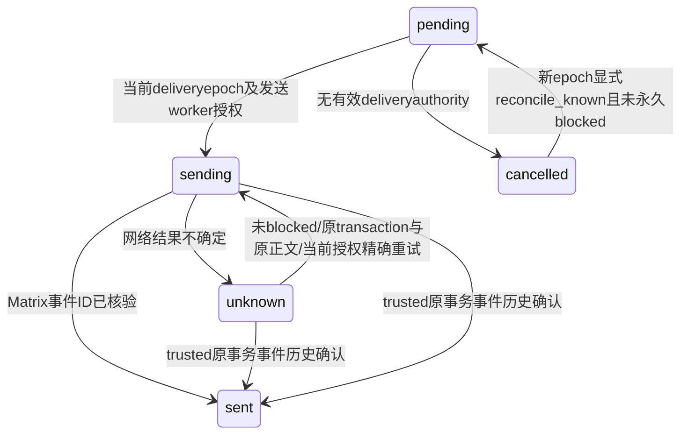

# 新 Agent 数据字典与状态协议

日期：2026-10-07。本文件描述当前实际存储与转换，不将实施报告中的候选逻辑实体当作物理表。SQL 约束、Rust 操作与 OpenAPI 共同构成合同；任何 schema 更新都须重新审核此文。没有旧数据兼容或 owner 迁移。

## 身份与作用域

- server `deployment` 固定 schema version、server name、issuer；`domain_deployment` 固定新 namespace。
- server `users` 固定 issuer/subject/MXID，Agent owner 引用其 ID。设备持有 bearer 摘要及 generation；当前没有设备公钥字段，不宣称已有 crypto 设备凭据。
- `projects.space_id` 唯一；`rooms.room_id` 当前唯一登记到一个 Project。Agent 没有唯一 Project 字段；binding 的 Agent/Project/Room 身份不可修改。
- 客户端按 `(origin, issuer, OAuth subject, Matrix MXID)` 的规范 JSON SHA-256 选择私有身份目录；目录 `profile-identity.json` 和 SQLite `profile_identity.digest` 双重固定身份，`identity.owner` 不可改变。上下文 key 为 owner/agent/binding/room/requester/thread，政策额度 key 分 Agent、binding、requester 三层。
- 密钥与模型凭证不在下列业务表中：AS/HS 注册及 Matrix/Pasion 密钥在服务端私有文件，模型登录在 owner 独立 Codex home/keyring，OAuth 运行授权在 Rust 内存。备份目录不是恢复 bearer 授权的依据。
- `creation_policy` 当前是 JSON 编码的 SQL text；HTTP 返回也是字符串，管理请求则接受对象。政策 revision 与 binding generation 分工不同；禁止新创建不自动撤销既有执行。

本机控制台授权也不在业务表中：IPC 票据最长 60 秒且锁内单次消费，兑换的本地 cookie 会话最长 900 秒；均不持久恢复。它不替代 Pasion/Hagency 用户 bearer、设备 generation/lease 或模型提供方授权。

## 实际 SQL 表与字段

以下由当前 SQL 定义逐表核对。`REFERENCES` 和 `UNIQUE` 是实际约束；表外 triggers 另见后文。SQLite 的 `STRICT`、外键及事务不能替代 owner/作用域检查。

### 身份与设备

来源：[schema.sql](../../../hagency-server/crates/agent-service/src/schema.sql)；本次核对 SHA-256 `502116a37f5338b09d18720339b691d0efc4ee72eee8423475e62e37391ea271`。

#### `hagency_agent_v1.deployment`

| 字段 | SQL 声明 |
|---|---|
| `singleton` | `boolean PRIMARY KEY DEFAULT true CHECK(singleton)` |
| `version` | `integer NOT NULL CHECK(version=1)` |
| `server_name` | `text NOT NULL` |
| `issuer` | `text NOT NULL` |

#### `hagency_agent_v1.users`

| 字段 | SQL 声明 |
|---|---|
| `id` | `text PRIMARY KEY` |
| `issuer` | `text NOT NULL` |
| `subject` | `text NOT NULL` |
| `mxid` | `text NOT NULL UNIQUE` |
| `active` | `boolean NOT NULL DEFAULT true` |

表级约束：`UNIQUE(issuer,subject)`。

#### `hagency_agent_v1.sessions`

| 字段 | SQL 声明 |
|---|---|
| `id` | `text PRIMARY KEY` |
| `user_id` | `text NOT NULL REFERENCES hagency_agent_v1.users(id)` |
| `token_hash` | `text NOT NULL UNIQUE` |
| `client_id` | `text NOT NULL` |
| `valid_until_ms` | `bigint NOT NULL` |
| `revoked` | `boolean NOT NULL DEFAULT false` |

表级约束：`UNIQUE(id,user_id)`。

#### `hagency_agent_v1.devices`

| 字段 | SQL 声明 |
|---|---|
| `id` | `text PRIMARY KEY` |
| `user_id` | `text NOT NULL REFERENCES hagency_agent_v1.users(id)` |
| `installation_id` | `text NOT NULL` |
| `name` | `text NOT NULL` |
| `session_id` | `text NOT NULL REFERENCES hagency_agent_v1.sessions(id)` |
| `token_hash` | `text NOT NULL UNIQUE` |
| `generation` | `bigint NOT NULL CHECK(generation>0)` |
| `revoked` | `boolean NOT NULL DEFAULT false` |

表级约束：`UNIQUE(user_id,installation_id)`。

表级约束：`FOREIGN KEY(session_id,user_id) REFERENCES hagency_agent_v1.sessions(id,user_id)`。

### 领域

来源：[domain_schema.sql](../../../hagency-server/crates/agent-service/src/domain_schema.sql)；本次核对 SHA-256 `226a33b10ae394ca96a7620c1d60be01df90cc4eb67a782e7c2c76cc82311775`。

#### `hagency_agent_v1.domain_deployment`

| 字段 | SQL 声明 |
|---|---|
| `singleton` | `boolean PRIMARY KEY DEFAULT true CHECK(singleton)` |
| `version` | `integer NOT NULL CHECK(version=1)` |
| `namespace` | `text NOT NULL` |

#### `hagency_agent_v1.projects`

| 字段 | SQL 声明 |
|---|---|
| `id` | `text PRIMARY KEY` |
| `space_id` | `text NOT NULL UNIQUE` |
| `active` | `boolean NOT NULL DEFAULT true` |
| `creation_policy` | `text NOT NULL` |
| `revision` | `bigint NOT NULL DEFAULT 1 CHECK(revision>0)` |

#### `hagency_agent_v1.rooms`

| 字段 | SQL 声明 |
|---|---|
| `room_id` | `text PRIMARY KEY` |
| `project_id` | `text NOT NULL REFERENCES hagency_agent_v1.projects(id)` |
| `active` | `boolean NOT NULL DEFAULT true` |
| `creation_policy` | `text NOT NULL` |
| `revision` | `bigint NOT NULL DEFAULT 1 CHECK(revision>0)` |

表级约束：`UNIQUE(room_id,project_id)`。

#### `hagency_agent_v1.agents`

| 字段 | SQL 声明 |
|---|---|
| `id` | `text PRIMARY KEY` |
| `owner_user_id` | `text NOT NULL REFERENCES hagency_agent_v1.users(id)` |
| `puppet_mxid` | `text NOT NULL UNIQUE` |
| `display_name` | `text NOT NULL` |
| `state` | `text NOT NULL CHECK(state IN ('creating','active','suspended','retiring','retired'))` |
| `generation` | `bigint NOT NULL DEFAULT 1 CHECK(generation>0)` |

#### `hagency_agent_v1.bindings`

| 字段 | SQL 声明 |
|---|---|
| `id` | `text PRIMARY KEY` |
| `agent_id` | `text NOT NULL REFERENCES hagency_agent_v1.agents(id)` |
| `project_id` | `text NOT NULL REFERENCES hagency_agent_v1.projects(id)` |
| `room_id` | `text NOT NULL` |
| `state` | `text NOT NULL CHECK(state IN ('joining','active','suspended','leaving','left','revoked'))` |
| `generation` | `bigint NOT NULL DEFAULT 1 CHECK(generation>0)` |
| `admin_project_paused` | `boolean NOT NULL DEFAULT false` |
| `admin_room_paused` | `boolean NOT NULL DEFAULT false` |

表级约束：`UNIQUE(agent_id,room_id)`。

表级约束：`FOREIGN KEY(room_id,project_id) REFERENCES hagency_agent_v1.rooms(room_id,project_id)`。

#### `hagency_agent_v1.scope_pauses`

| 字段 | SQL 声明 |
|---|---|
| `kind` | `text NOT NULL CHECK(kind IN ('project','room'))` |
| `scope_id` | `text NOT NULL` |
| `paused` | `boolean NOT NULL DEFAULT false` |

表级约束：`PRIMARY KEY(kind,scope_id)`。

#### `hagency_agent_v1.domain_commands`

| 字段 | SQL 声明 |
|---|---|
| `actor_user_id` | `text NOT NULL REFERENCES hagency_agent_v1.users(id)` |
| `operation` | `text NOT NULL` |
| `key` | `text NOT NULL` |
| `digest` | `text NOT NULL` |
| `agent_id` | `text NOT NULL REFERENCES hagency_agent_v1.agents(id)` |
| `binding_id` | `text REFERENCES hagency_agent_v1.bindings(id)` |

表级约束：`PRIMARY KEY(actor_user_id,operation,key)`。

#### `hagency_agent_v1.domain_audit`

| 字段 | SQL 声明 |
|---|---|
| `sequence` | `bigint GENERATED ALWAYS AS IDENTITY PRIMARY KEY` |
| `actor_user_id` | `text NOT NULL REFERENCES hagency_agent_v1.users(id)` |
| `operation` | `text NOT NULL` |
| `object_id` | `text NOT NULL` |
| `at_ms` | `bigint NOT NULL` |

### 投递

来源：[transport_schema.sql](../../../hagency-server/crates/agent-service/src/transport_schema.sql)；本次核对 SHA-256 `478b020f711e5d97416a4a9a1884bc7ce8bc2715f32d8c558690103091a5a28d`。

#### `hagency_agent_v1.execution_leases`

| 字段 | SQL 声明 |
|---|---|
| `agent_id` | `text PRIMARY KEY REFERENCES hagency_agent_v1.agents(id)` |
| `owner_user_id` | `text NOT NULL REFERENCES hagency_agent_v1.users(id)` |
| `device_id` | `text NOT NULL REFERENCES hagency_agent_v1.devices(id)` |
| `device_generation` | `bigint NOT NULL` |
| `epoch` | `bigint NOT NULL CHECK(epoch>0)` |
| `expires_at_ms` | `bigint NOT NULL` |

表级约束：`UNIQUE(agent_id,epoch)`。

#### `hagency_agent_v1.owner_events`

| 字段 | SQL 声明 |
|---|---|
| `id` | `text PRIMARY KEY` |
| `binding_id` | `text NOT NULL REFERENCES hagency_agent_v1.bindings(id)` |
| `agent_id` | `text NOT NULL REFERENCES hagency_agent_v1.agents(id)` |
| `owner_user_id` | `text NOT NULL REFERENCES hagency_agent_v1.users(id)` |
| `event_id` | `text NOT NULL` |
| `room_id` | `text NOT NULL` |
| `requester_mxid` | `text NOT NULL` |
| `thread_root` | `text NOT NULL` |
| `body` | `text NOT NULL` |
| `digest` | `text NOT NULL` |
| `binding_generation` | `bigint NOT NULL` |
| `state` | `text NOT NULL CHECK(state IN ('pending','offered','acknowledged','running','completed','unknown','cancelled'))` |
| `dispatch_epoch` | `bigint` |
| `dispatch_device_id` | `text REFERENCES hagency_agent_v1.devices(id)` |
| `execution_id` | `text` |
| `outcome` | `text` |
| `created_at_ms` | `bigint NOT NULL` |

表级约束：`UNIQUE(binding_id,event_id)`；`UNIQUE(agent_id,execution_id)`。

#### `hagency_agent_v1.agent_threads`

| 字段 | SQL 声明 |
|---|---|
| `binding_id` | `text NOT NULL REFERENCES hagency_agent_v1.bindings(id)` |
| `thread_root` | `text NOT NULL` |

表级约束：`PRIMARY KEY(binding_id,thread_root)`。

#### `hagency_agent_v1.reply_outbox`

| 字段 | SQL 声明 |
|---|---|
| `id` | `text PRIMARY KEY` |
| `owner_event_id` | `text NOT NULL UNIQUE REFERENCES hagency_agent_v1.owner_events(id)` |
| `agent_id` | `text NOT NULL REFERENCES hagency_agent_v1.agents(id)` |
| `binding_id` | `text NOT NULL REFERENCES hagency_agent_v1.bindings(id)` |
| `owner_user_id` | `text NOT NULL REFERENCES hagency_agent_v1.users(id)` |
| `room_id` | `text NOT NULL` |
| `puppet_mxid` | `text NOT NULL` |
| `thread_root` | `text NOT NULL` |
| `body` | `text NOT NULL` |
| `payload_digest` | `text NOT NULL` |
| `matrix_txn_id` | `text NOT NULL UNIQUE` |
| `binding_generation` | `bigint NOT NULL` |
| `dispatch_epoch` | `bigint NOT NULL` |
| `delivery_epoch` | `bigint NOT NULL CHECK(delivery_epoch>0 AND delivery_epoch>=dispatch_epoch)` |
| `state` | `text NOT NULL CHECK(state IN ('pending','sending','sent','unknown','cancelled'))` |
| `delivery_blocked` | `boolean NOT NULL DEFAULT false` |
| `worker_token` | `text` |
| `worker_until_ms` | `bigint NOT NULL DEFAULT 0` |
| `matrix_event_id` | `text` |
| `created_at_ms` | `bigint NOT NULL` |

### 客户端账本与收件

来源：[schema.sql](../../native/hagency-agent-local/src/schema.sql)；本次核对 SHA-256 `ca2206370aafafc1958ceccf0d2944591440c1eb3f5e7a33f5631cedbc4cde37`。

#### `profile_identity`

| 字段 | SQL 声明 |
|---|---|
| `singleton` | `INTEGER PRIMARY KEY CHECK(singleton=1)` |
| `digest` | `TEXT NOT NULL CHECK(length(digest)=64)` |

`permanent_profile` 拒绝修改，`retain_profile` 拒绝删除。新账本在其他业务表仍为空时写入身份 digest；同 MXID、不同服务器或 OAuth subject 的复制库也拒绝打开。已填充但没有 profile pin 的旧原型库不采用、不迁移。

#### `identity`

| 字段 | SQL 声明 |
|---|---|
| `owner` | `TEXT NOT NULL PRIMARY KEY` |

#### `bindings`

| 字段 | SQL 声明 |
|---|---|
| `id` | `TEXT PRIMARY KEY` |
| `agent` | `TEXT NOT NULL` |
| `room` | `TEXT NOT NULL` |

#### `policies`

| 字段 | SQL 声明 |
|---|---|
| `scope` | `TEXT PRIMARY KEY` |
| `revision` | `INTEGER NOT NULL` |
| `config` | `TEXT NOT NULL` |

#### `accounts`

| 字段 | SQL 声明 |
|---|---|
| `scope` | `TEXT NOT NULL` |
| `window` | `TEXT NOT NULL` |
| `spent` | `INTEGER NOT NULL` |
| `held` | `INTEGER NOT NULL` |

表级约束：`PRIMARY KEY(scope,window)`。

#### `calls`

| 字段 | SQL 声明 |
|---|---|
| `id` | `TEXT PRIMARY KEY` |
| `binding` | `TEXT NOT NULL REFERENCES bindings(id)` |
| `scope` | `TEXT NOT NULL` |
| `digest` | `TEXT NOT NULL` |
| `reserved` | `INTEGER NOT NULL` |
| `snapshots` | `TEXT NOT NULL` |
| `state` | `TEXT NOT NULL CHECK(state IN ('pending','unknown','settled'))` |
| `usage` | `TEXT` |

#### `approvals`

| 字段 | SQL 声明 |
|---|---|
| `digest` | `TEXT PRIMARY KEY` |
| `binding` | `TEXT NOT NULL` |
| `proposal` | `TEXT NOT NULL` |
| `expires` | `INTEGER NOT NULL` |
| `consumed` | `INTEGER NOT NULL DEFAULT 0` |

#### `contexts`

| 字段 | SQL 声明 |
|---|---|
| `scope` | `TEXT PRIMARY KEY` |
| `model_session` | `TEXT NOT NULL` |

#### `model_profiles`

| 字段 | SQL 声明 |
|---|---|
| `agent` | `TEXT PRIMARY KEY` |
| `model` | `TEXT NOT NULL` |
| `credential_ref` | `TEXT NOT NULL` |
| `workspace_root` | `TEXT NOT NULL` |

#### `dispatches`

| 字段 | SQL 声明 |
|---|---|
| `id` | `TEXT PRIMARY KEY` |
| `scope` | `TEXT NOT NULL` |
| `policies` | `TEXT NOT NULL` |

#### `codex_usage`

| 字段 | SQL 声明 |
|---|---|
| `scope` | `TEXT PRIMARY KEY` |
| `counters` | `TEXT NOT NULL` |

#### `local_inbox`

| 字段 | SQL 声明 |
|---|---|
| `id` | `TEXT PRIMARY KEY` |
| `binding` | `TEXT NOT NULL REFERENCES bindings(id)` |
| `event_id` | `TEXT NOT NULL` |
| `immutable_digest` | `TEXT NOT NULL` |
| `envelope` | `TEXT NOT NULL` |
| `state` | `TEXT NOT NULL CHECK(state IN ('received','acknowledged','prepared','running','reply_ready','replied','rejected','failed','unknown'))` |
| `execution_id` | `TEXT UNIQUE` |
| `reply` | `TEXT` |
| `reply_digest` | `TEXT` |
| `received_at` | `INTEGER NOT NULL` |

表级约束：`UNIQUE(binding,event_id)`。

#### `inbox_limits`

| 字段 | SQL 声明 |
|---|---|
| `singleton` | `INTEGER PRIMARY KEY CHECK(singleton=1)` |
| `max_records` | `INTEGER NOT NULL` |
| `max_bytes` | `INTEGER NOT NULL` |

### Appservice 内部表

来源：[appservice.rs](../../../hagency-server/crates/agent-service/src/appservice.rs)，由 Inbox 初始化创建；不属于用户上传的 HTTP DTO。

| 表 | 字段及约束 | 用途 |
|---|---|---|
| `inbound_transactions` | `id` PK、`digest` text、`body` jsonb、`received_at_ms` bigint | 先持久收件再 ACK，重复内容冲突检测 |
| `routing_jobs` | `transaction_id` PK/FK、`state` pending/routed、`received_at_ms` | 路由意图与原 AS 入站时间；重试不重置 TTL |
| `routing_rejections` | `(transaction_id,event_id,binding_id)` PK、`reason` | 拒绝审计样本；每事务最多 16 条，不是后续路由的执行禁令 |
| `readiness_room` | `singleton` PK/check、`room_id` | 私密启动探测 Room |
| `readiness_receipts` | `event_id` PK、`received_at_ms` | 短期启动事件证明，独立于正文压缩 |

## 本地账号配置与切换协议

当前登录 UI 只展示去重的服务器 origin 历史，用户名只在 Pasion 中输入。已有有效本机授权及绑定时先 `switch {profileId:null}` 停止并撤销旧账号，再以所选服务器启动 OAuth；停止/撤销失败则不发起新登录。本机授权过期后可直接对已授权服务器启动 Pasion；回调必须匹配曾授权的完整身份，成功才撤旧授权、停止任务并切换账号。登录后的完整 subject/MXID 用于匹配独立账号数据，UI 不以服务器选择冒充某个账号选择。

私有 `server-login-profiles.json` 保存 version、账号 Binding 列表和 active profile ID；Binding 是 origin、OAuth client ID、installation ID、默认设备名、已核验 subject/MXID 等描述性元数据，不保存可恢复授权的会话、设备或 OAuth token。`server-login.json` 只选择当前候选/账号，选中历史配置不能自动恢复登录。待撤销凭据仍使用独立、有限的持久撤销队列。

| 本地接口 | 合同 |
|---|---|
| `GET /console/server-login` | 返回安全 `profiles[{profileId,server,issuer,mxid,name}]`、`activeProfileId`、`localAccessReady` 和当前状态；localAccessReady 只描述当前 cookie 的本机授权有效性，不签发权限，共享状态不授权当前浏览器 |
| `POST /console/server-login/switch` | 必须明确传 `profileId:string|null`；已选身份固定 server/sub/MXID，null 允许添加其他账号/服务器；校验当前本机控制权和目标存在性后，串行撤销全部旧会话与设备执行权限，再停止运行器/提供方、持久化撤销和目标选择 |
| switch 成功 | `{activeProfileId,needsLogin:true,server}` 加新的有限本机启动 cookie；此 cookie 没有 Matrix/Agent 执行权，仍需 Pasion 授权 |
| `POST /console/server-login/start` | 默认设备名；native DCR/PKCE、state 与本机 nonce；`prompt=login`；有效本机授权下已选 profile 固定 subject/MXID，过期时仅已授权服务器可开始、回调仅接受曾授权完整身份 |
| `GET /console/server-login/callback` | 完整身份复核后写入正确 profile，成功回新的 `/console/` 页面；旧 pending state 不能恢复旧执行权，OAuth 签发后的失败进入持久撤销队列，不签本机 cookie |
| `POST /console/server-login/sign-out` | 旧 profile 的失效 cookie 不得停止新账号；当前账号退出先封全部旧授权再停任务，原有效用户可继续使用有限本机启动 cookie 选择其他账号，已过期用户不能借退出新获控制权 |

Codex 目录、keyring 引用、运行器 key、审批与账本全部使用完整 profile 身份。原 origin/MXID 原型目录保留但不自动采用，不从旧 Fleet 导入；有远端执行历史而缺当前同身份账本时，费用连续性检查依然返回 `ledger_recovery_required`，不能因账号切换清空历史费用后继续推理。

## 数据库触发器和运行检查

永久用户 ID/issuer/subject/MXID、Agent ID/owner/puppet、Project/Space、Room/Project 和 binding 身份由 trigger 保留。Agent 不能删除，retiring 只能继续 retired，retired 不能重启。会话 revocation 不可复活；设备重新登记递增 generation，不改变 owner/installation。

租约 epoch 不减小。started dispatch 的 execution ID、原 epoch/device 和所有消息作用域不可修改。terminal dispatch 不返回队列。数据库允许 unknown→completed 作为约束上界；当前 known-reply API 保留 execution unknown，只记录 known_reply_reconciled，已知文本不能证明模型费用或工具副作用已经确定。回复正文、digest、transaction、原 dispatch epoch 不变；delivery epoch 可在有效新租约下显式推进。`delivery_blocked` 不可清除，sent 的 event ID 不可更换。

`validate_transport_scope` 还执行跨记录校验：lease 的主人/设备，event 的 binding/owner/Room/generation，以及 reply 的原 dispatch/傀儡/thread/epoch。普通 FK 不独立保证这些关系。

这些约束不代替当前权限检查：每个关键操作仍核验有限会话、设备 generation、Agent lease、绑定 generation 及可信 Matrix 事实。成员失效先独立提交 binding 暂停与新 generation，后续失败不会回滚。新创建政策不能冒充运行授权变更。

## 服务端状态机

### 身份与接入

| 对象 | 状态及转换 | 不允许的行为 |
|---|---|---|
| Agent | `creating → active`；active/suspended 由 owner 暂停/恢复；`retiring → retired` | retired 复活、删除永久身份、换 owner/MXID |
| binding | `joining → active`；active→suspended；资格复核后显式恢复→active 且 generation 增长；退出 `leaving → left`；left 可在重新核验创建资格后显式 rebind→joining 并递增 generation；退役等撤销为 revoked，可信退出确认后 revoked→left | 重新加入自动恢复；复活旧 generation 的任务；修改绑定到另一 Room |
| 接入 command | `domain_commands` 保留 actor/operation/key/digest 与 Agent/binding；查询由当前 binding 状态推导：joining 映射 pending，active 映射 active，其余保留状态 | 伪称有独立 command_state 列；同键换参数；pending 当已经入房 |
| 管理员 scope pause | Project/Room 的持久 paused，可在零 binding 时设置；解除只恢复 eligibility | 借新 binding 绕过；解除后自动恢复 owner binding |

Agent 单一设备 lease 可以服务多个明确启动的 binding；Room 独立暂停使用 binding generation，不要求推进整个 Agent epoch而中断其他合法 Room。lease 到期/接管则封存旧 epoch 的 running 为 unknown。

### 设备切换与账本连续性契约

实现来源：[服务端历史分页](../../../hagency-server/crates/agent-service/src/transport_history.rs)、[本地凭证核验](../../native/hagency-agent-local/src/inbox.rs)及[客户端运行入口](../../native/hagency/src/console/owned_runtime.rs)。

`POST /api/hagency/v1/execution/history` 使用当前 owner/device bearer，不要求预先持有该 Agent lease。请求 `{agentId,cursor,snapshot}`；第一页可用 null，后续 cursor 必须携带原 `{count,digest}` 快照。响应为 `{history:{agentId,snapshot,executions,nextCursor}}`，最多 128 条，按 dispatch ID 的 C collation 排序。历史包含全部 binding、旧 epoch 和退役记录中 execution ID 非空的条目。其他 owner 无权读取。

每条仅返回 dispatchId、executionId、bindingId、agentId、eventId、roomId、requesterMxid、threadRoot、bindingGeneration、原 dispatchEpoch/deviceId 和 immutableDigest。immutableDigest 与客户端原始九字段收件元组 SHA-256 相同，包含原正文摘要，但不返回正文；snapshot digest 则以 `hagency-started-executions-v1\n` 为前缀，依排序追加 `[dispatchId,executionId]` 的 JSON 及换行后取 SHA-256。服务器不接收费用或本地模型凭证。

`execution/leases/acquire` 的 `historySnapshot` 必填；缺失不兼容，历史变化返回 `execution_history_changed`，并且不修改 lease/epoch。历史检查与 start 共用事务 advisory lock；取得 lease 后客户端再次核验快照。已启动事件不能删除，execution ID、原设备/epoch 和事件 scope 不可修改；正文清理、TTL 或退休不得伪造“无历史”。当前没有 owner_events 正文压缩路径。

客户端逐页核验永久 inbox 身份/摘要及同 scope 的 calls；预留 digest、三层 snapshot scope、usage 与 accounts 在一致 SQLite 读取事务内核对。settled 费用重新汇总，pending/unknown 保留 held；正常拒绝只由可信 host 在本地终态事务写入专用 no-provider-call 零费用凭证，不能给缺失或 unknown 自动补零。空账本只在远端无历史时合格。缺失凭证返回 `ledger_recovery_required`，没有选定 binding 的已知原文回复或没有显式恢复动作时，取得 lease 前就拒绝；有已知回复时可进入恢复模式，但不 poll/ACK 新请求或调用模型。不能通过 Estimated、接管选项或管理员操作豁免。

### 领取、执行与回复

这是业务主路径，不表示所有转换都仅靠这一事件触发。epoch 换代的未开始请求由运输层按当前资格处理；已经 started 的执行绝不转回 pending。poll 必须传 bindingId，SQL 在 limit 前过滤；ACK 与 start 分离，重复 start 的 `newlyStarted:false` 不授予重跑权。

`queue.event_ttl_ms` 默认 24h（1s..30d），从原 AS 入站时间计时。过期不开始新模型/工具动作。已开始任务的已知原结果仍可在当前权限核验后提交，保守成本与副作用证据不能因此清理。

sent 终态不证明模型未重复：避免重复还依赖 dispatch/execution 和本地账本。actual HTTP 403 或已观测 Room 成员/发言权撤销会永久 blocked；被 blocked 的 unknown 保留原网络不确定性，不能借恢复重新发送。未 blocked 的网络 unknown 可以按原 transaction、原正文和当前授权精确重试。设备、会话或 lease 失效只撤销当前发送权；主人可在新 epoch 显式恢复未 blocked 的已知回复。trusted reconcile_reply_sent 在撤权后仍可核验原事务的真实事件并收敛为 sent；它不发送新消息，也不解除 blocked。claim worker token 私有，不能从客户端指定。稳定 Matrix transaction ID 不能被新 UUID 替换。

## 客户端状态与审批协议

| 对象 | 实际状态 | 转换规则 |
|---|---|---|
| `calls` | pending、unknown、settled | 模型前原子三层预留；实际用量一次结算；Drop/失权/未知结果保留 hold，unknown 不自动归零 |
| `local_inbox` | received、acknowledged、prepared、running、reply_ready、replied、rejected、failed、unknown | 写入后 ACK；稳定 execution ID 写入后 start；原结果持久化后发送；只有 Matrix sent/event ID 后 replied |
| `approvals` | proposal/digest、expires、consumed | 精确 owner/device/nonce/政策快照核验；过期/参数改变/一次消费后拒绝；不代替远端资格 |
| Matrix 创建 journal | creating、created、unknown、partial、complete | POST 前持久 creating；未知 createRoom 不盲目重建；核验原 creator/marker/owner/私密规则后恢复 link/adopt；GET 不创建 |

当前 Codex 路径只有整 turn 用量先结算成功才返回 Failed 并写入本地 failed；提供方失败但用量缺失时返回 Unknown，保留预留并封存 inbox unknown。历史核验因此要求 failed 有 settled 费用，而完整 unknown hold 仍可保留；不能仅凭“模型失败”补零费用。
| Runtime | Agent supervisor + per-binding status | 一个 acquire/heartbeat/release；每个 Room 显式 start/stop；最后 worker 退出才 release；已接受启动在关闭竞态中有可见终态 |

客户端重启将 prepared/running 及 pending calls 保守封存 unknown，不自动重复模型或工具。reply_ready 保留原 execution/reply，跨 epoch 显式 reconcile-known。replied 压缩正文仍保留 digest/执行/作用域/回复摘要，永久元数据仍占容量，不宣称安全擦除。

Matrix 创建 journal 限 256 命令/1MiB；恢复候选超过64个 Room 要求已知 Room ID。Matrix state 无 conditional CAS，preflight 拒绝既有不同关联不能冒充并发写保护。journal 位于 owner 私有目录，不是服务器 command 表。

## Wire 合同与验收证据

- [用户/设备 OpenAPI 3.1：46 操作](../../../hagency-server/crates/agent-service/openapi/hagency-v1.openapi.json)
- [Appservice OpenAPI：4 操作](../../../hagency-server/crates/agent-service/openapi/appservice-v1.openapi.json)
- [REST 身份、严格字段及恢复边界](../../../hagency-server/crates/agent-service/openapi/README.zh-CN.md)
- [实施报告与真实测试层次](2026-10-07-server-appservice-client-refactor.zh-CN.md)
- [架构 ADR](2026-10-07-agent-architecture-adr.zh-CN.md)

HTTP JSON 是版本化合同；内部 schema/DDL 不是对模型开放的协议。server 不读取客户端 SQLite，client 不持有 AS/HS 密钥。真实模型任务及发布恢复门槛只有相应实际证据才能确认，静态字典不替代验收。

## Projects 工作区的展示和 Space 候选

Project/Room 列表额外返回实时 Matrix `name`、`topic`（可为 null），不新增持久列；重命名 Space 会同步反映 Project 展示名称。项目成员可见性仍按原规则检查，显示 metadata 不授予创建权限。

`GET /console/api/owner-projects/space-candidates?cursor=<最后扫描的已加入Room ID>` 是固定服务器上的用户 OAuth 操作，仅接受单个合法 cursor。返回 `{spaces:[{spaceId,name,topic,projectId}],nextCursor,incomplete,errors:[{roomId,code}]}`；最多32个候选、扫描128个Room，失败状态不生成可选候选，4096个joinedRoom上限显式报错。不使用 AS 读取全服务器候选，也不将列在候选中当作管理权证明；绑定仍走现有服务器adopt权限校验。

Project 创建默认 Matrix Space create → adopt；绑定已有Space只adopt。Room创建或登记仅在项目详情发起。浏览器按 activeProfileId/project 保存原创建 commandId/input；404保留原ID，只能重试原请求。组件卸载后迟到响应不能导航、更新新表单或删除旧账号恢复记录。
