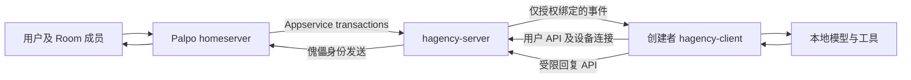

# Hagency 服务端 Appservice 与本地客户端重构实施细则

日期：2026 年 10 月 7 日。状态：需求与实施方案；已纠正项目位置和实现基线。新增领域代码仅为未集成草稿，正式重构未完成。跨 Project、Codex 优先与加密复用要求已确认。

本次重构将 Hagency 从以资源提供者为中心的 Fleet 服务，改为以用户为中心的 Agent 身份管理服务：新架构取消 Fleet 业务概念，hagency-server 自带 Appservice，并作为集成 Palpo 部署的必装组件，管理用户创建 Agent 的资格、傀儡账号及 Room 绑定；hagency-client 在创建者设备上运行 Agent，管理模型凭证、资源配额、请求过滤和工具调用策略。Project 对应 Matrix Space，讨论组对应独立 Room。

该方向合理且可以实现，但属于领域模型和信任边界重构，不能通过给现有服务改名或取消一次审批完成。现有 Appservice 账号创建、可靠消息托管和本地执行模块可以复用；Agent 与 Engagement 绑定、Project 与单一 Room 绑定、资源批准作为启动前提等规则必须改变。

## 阅读范围与证据基线

本方案的正式实现基线是 `/Volumes/Data/Works/chrislearn/hagency-client` 与 `/Volumes/Data/Works/chrislearn/hagency-server` 两个已存在的独立 Git 仓库。此前错误使用 `hagency-org/hagency-rs` 与外置 Palpo web-admin 作为主要基线，并在 `hagency-org` 新建同名目录；本次已撤除误建目录，将报告移到真实客户端，将新增服务端领域草稿保存在真实服务端 `refactor-drafts/appservice-domain/`。草稿不接入生产 workspace，不代表真实服务端已经实现目标。

位置修正时客户端 HEAD 为 `792fd144d07c9a77ee2181c7d260503c46a35036`，服务端 HEAD 为 `59521407358d33df41a9248723625b6de2e95f78`。客户端已有 README、开发脚本与 `server_login` 源码/测试等未提交修改，必须保留。服务端根 workspace 已有 backend、operations、hagency-contract、frontend 和 xtask；backend 集成 Palpo 与 Pasion，Hagency 使用 PostgreSQL 存储。Palpo 依赖按服务端根 `Cargo.toml` 固定至 `c8568d9844a6be0a3172d98d7c9810e3a1f7521c`，不能把外置 Palpo 的其他提交当作此产品运行版本。

新架构仍使用全新数据结构，不兼容、不导入、不迁移旧 Hagency 数据，也不提供旧模式运行入口。这里的“不兼容”约束针对 Hagency 业务数据，不授权重建 Palpo 或 Pasion 数据库，也不意味着要抛弃现有服务端工程、认证接入或部署工具。

文中“必须”表示本次需求或实现不可缺少的约束；“建议默认”表示为补齐原需求而提出的产品选择；“后续阶段”表示明确延后的能力，不得在首期界面宣称已经可用。已确认本地客户端项目为 `hagency-client`，服务端项目为 `hagency-server`，两者位于 `chrislearn` 下的同级独立仓库。当前两个产品已有实现，但尚未完成本报告规定的新领域重构。

| 项目 | 目录 | 实施范围 |
|---|---|---|
| hagency-client | `/Volumes/Data/Works/chrislearn/hagency-client` | 本地客户端、模型与工具执行、额度及发言者策略 |
| hagency-server | `/Volumes/Data/Works/chrislearn/hagency-server` | 用户认证、永久 owner、Project/Room 权限、Appservice 和消息路由 |

两个项目独立构建、发布、运行和保存数据。服务端不是客户端 workspace 内的子项目，客户端不嵌入服务端运行环境；共享协议以明确版本契约维护，避免共享旧运行器或数据库形成隐式耦合。本报告继续保存在 `hagency-client/docs/design/`。

## 核心问题的直接结论

### 现有 Fleet 接入本质

Fleet 是一个外部 Hagency 服务的身份、凭证、命名空间、传输队列和资源目录的接入单位。它不是用户创建的某一个 Agent，也不是 Matrix Space。

真实服务端的 `crates/backend/src/admin/fleet.rs`、`native_client.rs` 和 `outbound.rs` 承担 Fleet 注册、用户接入和传输；`crates/operations` 承担审批工作流与投递。它沿用按 Fleet 隔离的身份、Appservice、凭据和资源服务模型。本地客户端导入接入凭据后使用出站传输接收事件并回传状态，避免要求本机公开回调地址。Palpo 旧 web-admin 仅作为这套行为的历史来源，不是当前 Hagency 产品的业务落点。

有两种不同的“接入请求”，必须在界面和代码中区分：

1. Fleet 接入：授权外部服务连接 Palpo，安装注册、交付凭证、验证事件实际到达。
2. Agent 服务申请：用户请求某个 Fleet 的资源服务某个项目房间，当前实现把它变成待批准的 Engagement，批准和资源分配后创建并绑定工作账号。

目标架构取消 Fleet 接入流程。集成 Palpo 的安装、初始化和升级流程负责安装并维护 hagency-server Appservice，不提供逐用户安装或授权 Appservice 的步骤。普通用户创建 Agent、修改本地额度和工具策略不需要部署授权，也不申请服务器管理员的模型资源。

### hagency-server Appservice 是集成 Palpo 的必装组件

这是已确认的部署要求。每个集成 Palpo 部署必须安装 hagency-server 及其服务级 Appservice，集中托管所管理的 Agent 账号；不需要为每位用户或每台客户端安装独立 Appservice。用户设备只连接 Hagency 服务，服务器按 Agent owner、Room binding 和设备执行权投递事件。

Appservice 注册及命名空间属于部署侧配置。Matrix 标准描述配置文件注册；当前 Palpo 另外实现了管理员注册 API，安装器可在受控部署权限下使用它。注册自动安装不等于普通用户可任意注册命名空间。`as_token` 用于服务访问 homeserver，`hs_token` 用于 homeserver 调用服务；二者都只留在服务器。[Matrix Appservice 规范](https://spec.matrix.org/latest/application-service-api/#registration)

安装和升级必须使用稳定注册 ID、明确限定的命名空间及持久化密钥，幂等核对既有注册，不在每次启动时生成新的身份或凭证。Appservice 与 homeserver 可以分进程部署，但属于同一必备产品组合；Palpo 可先启动供安装器完成注册，再验证真实事件到达。缺失注册、注册不匹配或 Hagency 不可达时，集成 Agent 功能应报告未就绪并拒绝新创建，不能显示安装完整。服务故障期间普通 Matrix 聊天按 Palpo 自身能力继续，不能要求每条普通聊天等待客户端执行。

必装要求属于 Hagency 与 Palpo 的集成部署组合，不改变独立 Palpo 的默认产品功能。安装和编排逻辑放在 Hagency 或集成部署工具中，只使用 Palpo 已有的 Appservice 注册、Matrix 账号、Room、Space、成员和权限 API。不得修改 Palpo 默认注册、聊天、加入、权限判定或管理界面，不增加 Hagency 专属的 homeserver 授权旁路。部署所需的标准注册配置是接入配置，不是对 Palpo 功能的修改。

首期以单一 homeserver 为边界；数据模型保留 server identity。跨 homeserver 的注册、远端用户认证和联邦策略属于独立阶段，不能用 URL 字符串相同推断身份相同。

### Project 与 Space 的对应关系

建议一个 Project 对应一个 Space，包含多个讨论 Room。Space 是特殊类型的 Room，关联子 Room，并不自动复制成员或权限。可使用 restricted join rule 让 Space 成员具有加入普通 Room 的资格；用户仍需实际加入，且退出 Space 不等于退出此前加入的 Room。私密 Room 继续使用独立邀请与成员设置。[Matrix Spaces](https://spec.matrix.org/latest/client-server-api/#spaces)、[Matrix restricted rooms](https://spec.matrix.org/latest/client-server-api/#restricted-rooms)

因此“共用用户集合”需要分成两个产品能力：首期实现共享加入资格；自动邀请、自动加入或自动移除属于额外的成员同步功能。本方案不把成员同步设为首期前提。

## 完善后的需求

### 已确认的目标

| 编号 | 必须提供的行为 | 责任组件 |
|---|---|---|
| R01 | 用户通过 REST API 创建 Agent，并申请绑定目标 Room | server |
| R02 | server 为 Agent 创建独立 Matrix 傀儡账号，保存创建者与账号对应关系 | server |
| R03 | 创建资格由 Project 默认策略及管理员禁止名单决定 | server |
| R04 | server 检查用户在哪些 Room 有权放置 Agent | server |
| R05 | 合法创建不需要管理员逐个批准模型资源或 Token 额度 | server |
| R06 | 请求交给 Agent 创建者的本地客户端执行 | server 与 client |
| R07 | 创建者管理每个 Agent 在每个 Room 的总 Token 配额 | client |
| R08 | 创建者管理每个 Agent 对每个 Room 发言者的 Token 配额 | client |
| R09 | 创建者决定是否处理某个发言者的请求 | client |
| R10 | 创建者决定针对某发言者是否放行高风险工具调用 | client |
| R11 | Project 对应 Space，讨论 Room 独立设置成员及权限 | server 与 Matrix |
| R12 | 用户本地模型凭证与执行环境不交给服务器管理员管理 | client |
| R13 | 新业务模型、用户 API 和用户界面取消 Fleet，不再注册外部资源提供者 | server 与 client |
| R14 | 集成 Palpo 安装流程默认且必须安装 hagency-server Appservice | 部署与 server |
| R15 | 新数据结构全新初始化，不兼容或迁移旧 Hagency 数据结构 | server、client 与部署 |
| R16 | 不修改 Palpo 默认功能，集成通过其现有接口与配置实现 | server 与部署 |
| R17 | Agent 创建者终身是唯一主人，不实现或预留跨用户转让能力 | server 与 client |
| R18 | 同一用户 Agent 可跨 Project 服务，不同 Room 独立授权、额度和上下文 | server 与 client |
| R19 | 首个执行环境支持 Codex，其他环境后续扩展 | client |
| R20 | 现有加密能力基本实现则复用重构，确实困难的缺口可延后 | client 与 server |

### 建议默认值与完整边界

| 问题 | 建议默认 | 原因及实现后果 |
|---|---|---|
| Agent 所有者是谁 | 创建者，取已认证主体，不能接受任意 `ownerMxid` | Project 管理员不自动成为 Agent 所有者 |
| 一个 Agent 能否进入多个 Room | 可以，允许跨 Project | 身份属于用户，独立绑定、额度、上下文；跨 Project 不涉及 owner 转让 |
| 默认没有创建权时怎么办 | 管理员可显式授权某成员 | 没有默认许可或显式授权就拒绝 |
| 禁止名单优先级 | 显式禁止最高，优先于默认允许及显式允许 | 避免被其他授权路径绕过 |
| Room 对 Project 默认权限 | 可继承，也可关闭 Agent 或设额外禁止名单 | Room 允许不能越过 Project 禁止 |
| 被禁止创建后已有 Agent 是否停止 | 默认仅禁止新建及新绑定；已有 Agent 另设暂停动作 | 不把“禁止创建”暗中变成删除已有服务 |
| 创建者退出 Space 或目标 Room | 暂停受影响绑定并停止新增投递 | 保留身份、审计和未结算状态；重新授权后恢复 |
| 普通 Room 成员可以创建吗 | 满足 Project 与 Room 策略即可，不要求 power level 100 | 若成员不能邀请，由已授权的服务账号负责邀请 |
| 用户设备离线 | 有界排队，界面明确离线；不使用管理员备用模型执行 | 保持资源成本和执行归属 |
| 同一 Agent 多台设备 | 多设备可查看，只有持有效租约的一台可执行 | 防止重复费用和双重回复 |
| 默认谁能触发 Agent | 绑定 Room 的当前成员，但创建者可进一步限制 | 成员资格和本地服务许可是两层规则 |
| 默认唤醒条件 | 明确提及，或已绑定任务线程的后续消息 | 普通群消息不默认触发全部 Agent |
| 高风险工具 | 默认由创建者确认，可按发言者配置明确允许或拒绝 | Room 管理员不能替创建者批准本地工具 |
| 私聊支持 | 首期默认关闭陌生私聊；开启时使用独立 DM 绑定 | 不能把项目资格自动扩大到任意 DM |
| Agent 所有权 | 创建者终身拥有，任何角色都不能转让 | 创建后 owner 不可修改；退役也不释放身份给他人 |

这些默认值作为实施基线；后续若调整产品选择，应同步更新授权真值表和验收场景。全新数据结构、Palpo 功能不变和 Agent 终身归属是已确认约束，不属于可选默认值。

### 本轮复核确认的实施范围

| 问题 | 用户决定 | 对实施的影响 |
|---|---|---|
| 一个 Agent 是否可服务多个 Project | 允许 | Project 存在于 Room binding，不能成为 Agent 的唯一归属外键 |
| 加密 Room 的交付阶段 | 现有代码基本实现则复用重构；实现困难可延后 | 先审核已有加密能力与新架构差距，不能直接丢弃已有能力或预设延期 |
| 首个版本支持的执行环境 | 首先支持 Codex | 先完成 Codex 模型调用、真实工具拦截与 Token 计量验收；其他 adapter 后续扩展 |

跨 Project 和 Codex 优先已确定，不再作为待确认问题。加密交付以源码能力审计和重构验证为依据：协议和密码学能力优先复用；不得沿用旧数据库、旧权限结构或服务端持有用户密钥的运行边界。

### 角色和权限分工

| 角色 | 可操作 | 不能由该角色替代的权限 |
|---|---|---|
| Palpo 管理员 | 维护必装 Appservice 的部署、升级、凭证及故障恢复 | 用户本地模型使用许可 |
| Hagency 平台管理员 | 平台停用、连接限流、身份异常处理、审计 | 用户额度修改与工具执行批准 |
| Project 管理员 | Project 创建默认权、成员例外、管理 Room 绑定 | 其他用户 Agent 的本地文件及模型密钥访问 |
| Room 管理员 | 该 Room Agent 接入策略、邀请和移除 | 自动获取 Project 其他 Room 权限 |
| Agent 创建者 | 创建、绑定、暂停、退出、额度、发言者策略、运行设备 | 绕过 Project/Room 禁止或 Matrix ban |
| 普通 Room 成员 | 按创建者策略请求 Agent | 修改 Agent 配额、工具许可或所有权 |

Project 管理员可由 Space 的 Matrix 权限映射，首期建议提供显式角色登记，并用 Matrix 当前权限验证登记/更改资格。Matrix 账号的高 power level、Palpo 全局管理员、Hagency 平台管理员是不同角色，API 必须按操作分别检查。

## 目标组件与数据流



### 服务端职责

服务器管理人类身份验证、设备注册与撤销、Project/Space 映射、Room 授权、Agent 所有权、Matrix 傀儡创建、绑定生命周期、事件托管和受限回复。它保存服务级 Appservice 密钥，不持有用户模型 API key、工作目录、终端或本地工具执行权限。

服务器可以保存用户选择上传的汇总状态，但此类状态只能用于展示与故障诊断，不能重新成为额度批准或工具批准依据。平台连接数、事件大小、队列容量和反滥用限流属于基础设施约束，与用户自己的模型 Token 配额分开命名。

### 客户端职责

客户端管理模型和账号、工作目录、Agent 配置、线程与上下文、Token 账本、发言者过滤、工具策略及创建者确认。它用服务端授予的设备身份消费自己的事件，通过回复 API 以自己的傀儡发言。

本地 Agent 模型进程不能拿到整个客户端的管理凭证。任务执行器只得到该 dispatch 所需的有限能力，不能创建其他用户 Agent、调大配额或批准自己发起的工具请求。

### 取消 Fleet 后的最小关系

新架构无需 Fleet。服务器需要知道哪个 Agent 傀儡属于哪个用户、它被授权加入哪些 Room，以及该用户的哪台设备当前负责执行。以 Fleet 再包一层设备或资源集合没有新增授权含义，反而会继续混淆用户归属与资源提供者。

```text
User --拥有--> Agent --对应--> Puppet MXID
User --登记--> ClientDevice
Agent --授权绑定--> Room
Agent --执行租约--> ClientDevice
```

`Agent.owner_user_id` 是归属事实，`Agent.puppet_mxid` 是 Matrix 身份，Room binding 是服务范围，device lease 是可撤销的当前执行路由。执行设备必须属于 Agent owner。同一用户可以拥有多个 Agent、登记多台 client；设备更换不改变 Agent MXID 或所有权。Project 是权限与 Room 的组织单元，不是运行设备或资源提供者的容器。

同一 Agent 可以服务多个 Project 的 Room。每次加入新 Room 都独立检查创建者在目标 Project 与 Room 的资格，不能继承另一个 Project 的许可；每个 binding 保存自己的 Project、运行授权版本和 Room。一个 Project 的暂停、归档或成员资格变化只撤销该 Project 下受影响的 binding，不停止其他 Project 的合法服务；创建者平台账号停用或整个 Agent 暂停才影响所有绑定。

owner 在创建时从已认证用户确定，之后永久不可变。客户端换设备、用户离开 Project、账号停用、Agent 暂停/退役、管理员操作及数据库恢复都不能改变 owner。不存在转让、认领、共同所有、继承、委托其他用户管理或管理员重分配 Agent 的流程。其他用户调用这个 Agent 只是请求服务，不产生任何所有权。

接收路径为 `Palpo 事件 → 有效 Agent/Room binding → owner → 有执行权的 client`；发送路径为 `已认证 owner 设备 → 所属 Agent 与有效 binding → server 使用对应傀儡发送`。server 不需要知道用户的模型、资源池或工具许可，也不需要客户端先发布资源目录来建立上述关系。

新用户只需 Matrix 登录、登记设备和配置本地模型，不下载 `as_token`、`hs_token` 或安装自己的 Appservice。新 API 不包含 `fleetId`，新 Agent、Project、设备和回复路由均不依赖 Fleet 外键。新系统不保存旧 Fleet 名称、ID、凭证、兼容记录或旧模式管理入口。

## Project 与 Room 模型

### 映射规则

使用不可变 `project_id` 作为业务标识，保存 `homeserver_id` 和 `space_room_id`。同一 homeserver 下，一个 Space 在本服务中最多映射一个有效 Project。每个讨论 Room 保存独立 `room_binding_id`；首期只允许一个有效 Hagency Project 归属。

Matrix 允许 Room 出现在多个 Space 中，但本服务需要确定唯一授权来源。发现其他 Space 链接不自动复制业务归属，也不扩大用户的 Agent 创建权。需要改变 Room 的业务关联时，应先解除已有服务绑定，再经验证重新登记并提高授权版本；这不改变任何 Agent 的 owner。

创建 Project 时建立 Space，再创建默认讨论 Room，写入双方关系并登记业务映射。接管已有 Space/Room 时检查真实类型、成员、状态事件写入权和服务邀请权。仅有客户端上报的 `projectId`、Room 名称或单侧 parent 标记都不能建立有效授权。

### 成员与加入方式

| Room 模式 | 加入方式 | 独立成员控制 |
|---|---|---|
| Project 普通讨论 Room | restricted，允许 Space 成员加入 | Room 实际 membership、ban 与 power levels 独立 |
| 私密讨论 Room | invite | 仅邀请成员，Space 成员资格不产生自动访问 |
| 接待或诊断 Room | 按独立用途设置 | 不自动成为可执行任务的目标 Room |
| Agent 私聊 | 显式启用且登记的 DM | 不继承任意 Project 的预算和工具策略 |

restricted 需要房间版本支持以及适当的加入授权能力，当前 Palpo 的相关实现仍应通过真实加入测试确认。不得将 Space 成员复制到每个 Room 视为天然协议行为。[Room version 10](https://spec.matrix.org/latest/rooms/v10/#client-considerations)

Space 退出与 Room 退出独立。Hagency 应及时暂停退出 Space 的创建者在该 Project 下的 Agent 绑定；若产品还要求其失去所有聊天访问，需另建有权执行的 Room 成员移除流程，明确排除私密 Room 的独立授权，不能仅凭 Hagency 停止投递宣称 Matrix 聊天权限已撤销。

## 服务端授权细则

### 创建与绑定判断

定义 `U` 为经服务验证的人类 MXID，`P` 为 Project，`R` 为目标 Room。判断需要同时满足：

```text
project_eligible(U,P) =
  platform_account_active(U)
  AND project_active(P)
  AND joined(U,P.space)
  AND NOT project_deny_create(U,P)
  AND (project_default_allow(P) OR project_explicit_allow(U,P))

room_eligible(U,P,R) =
  registered_room(P,R)
  AND room_active(R)
  AND joined(U,R)
  AND room_agent_enabled(R)
  AND NOT room_deny_create(U,R)
  AND room_create_policy_allows(U,R)
  AND service_can_admit_puppet(R)

create_and_bind = project_eligible AND room_eligible
```

`room_create_policy` 可为 `inherit_project`、`allow_list`、`disabled`。`allow_list` 仅缩小 Project 允许范围。未加入 Room、被 Room ban、无法可靠读取权限状态、服务没有合法邀请或加入能力时都不能把账号绑定标记为可用。

| Project 默认 | 显式允许 | 显式禁止 | 其他资格均满足时 |
|---|---|---|---|
| 允许 | 任意 | 否 | 允许创建 |
| 允许 | 任意 | 是 | 拒绝创建 |
| 拒绝 | 是 | 否 | 允许创建 |
| 拒绝 | 否 | 否 | 拒绝创建 |
| 任意 | 任意 | 是 | 拒绝创建 |

建议新 Project 默认允许其成员创建，初始 Agent 数量和 API 速率使用平台技术上限控制；管理员可改为默认拒绝。此默认值不是 Matrix 的默认规则。

### 合法邀请与权限竞态

Project 初次启用 Agent 功能时，为服务管理账号在需服务的 Room 授予必要邀请能力；工作傀儡只获得普通聊天所需权限。服务账号没有资格时，可先由 Room 管理员邀请指定傀儡，再完成绑定。不得使用 Palpo 全局管理员权限绕过 Room 拒绝。

普通成员是否有创建权由 Hagency 策略决定，不要求该成员自己拥有 Matrix 邀请权。Hagency 的授权允许与 Matrix 的邀请、加入、发送事件成功必须同时成立。管理员设置默认允许不能凭空创造服务的 Matrix 权限。

创建接受时、邀请前、绑定激活前、任务投递时及回复提交时重新检查相应资格。创建策略变更会使未完成的新建命令重查；成员、运行授权及绑定 generation 的相关变化才使已有执行租约失效。读取失败区分“权限拒绝”和“状态暂不可用”，后者进入受限重试，不能以旧缓存继续开放执行。

这里的“相应资格”必须分开实现：创建与增加绑定检查 `create_and_bind`；已有有效绑定的运行检查账号、Project/Room 活跃状态、创建者与傀儡当前成员资格、显式服务暂停、绑定 generation 和设备租约。运行检查不重复要求 `project_default_allow`、创建 allow/deny 名单或 Room 创建 allow-list。否则单纯禁止新建会隐式停止已创建 Agent，与下述规则矛盾。

创建权限 revision 只使尚未提交完成的创建/新绑定命令重查；已有运行授权版本仅在成员失效、明确暂停服务或绑定撤销等影响运行的变更时递增。`room_create_policy=disabled` 表示禁止新接入；如需移除已有 Agent 服务，必须同时执行独立的 Room 服务暂停操作并明确呈现影响。

### 暂停与撤销

`deny_create` 只影响新建和新绑定；`suspend_service` 影响已有绑定。界面分别呈现“禁止创建”和“暂停已有服务”，管理员不能通过隐式修改额度来暂停用户。

Room ban、Agent 被移除、创建者离开对应 Space/Room、Project 归档及平台账号停用触发绑定暂停。server 立即停止新投递和拒绝旧租约回复；client 取消未开始的任务、尽力停止已运行任务并记录实际费用。已经发生的外部工具动作不能被回滚或伪称从未发生。

恢复必须重新验证资格并发放新租约。不得仅清除 UI 错误即让旧任务恢复。显式禁止创建的变更是否同时暂停已有服务，应由单独操作表达。

## Agent 创建和生命周期

### 创建流程

1. client 以用户会话提交 `projectId`、目标 `roomId`、显示名和幂等键；本地模型参数、Token 配额和工具策略保存在 client。
2. server 推导 owner，验证 Project、Room、当前策略和请求边界，记录 command 与稳定 Agent ID。
3. server 使用固定 Agent ID 派生命名空间内的稳定傀儡 MXID，创建账号并设置显示信息。新命名空间建议使用服务专属前缀，用户不能指定任意 MXID。
4. 根据服务已有权限执行邀请和加入，记录每一步外部操作结果。账号创建成功但入房失败时保存部分状态，不重复创建身份。
5. 再次验证资格，激活 Room binding。返回身份已就绪、本地设备状态及模型就绪状态等独立字段。
6. client 取得执行租约后，使用本地配置运行；用户完成模型登录前应显示“身份已创建，等待本地运行环境”。

创建请求中的 `projectId` 表示首次 Room binding 的授权来源，不能写成 Agent 的固定 Project 归属。后续通过同一 Agent 的绑定 API 加入其他 Project 的 Room，保持原 MXID 和永久 owner。删除某一 binding 不删除其他 Project 的绑定。

Agent 生命周期与 Room binding 生命周期分开：

```text
Agent: creating -> active -> suspended -> retiring -> retired
                    |          |
                    +----------+  恢复需重新验证

RoomBinding: requested -> joining -> active -> suspended -> leaving -> left
                         |             |
                         -> failed     -> revoked
```

暂时离线属于运行状态，不使身份 retired。允许从 suspended 回到 active 的前提是资格恢复、状态观察通过且使用新 generation。retired 身份不得复用给其他人。

建议退役先停止投递、撤销设备执行许可、离开房间，再按 Palpo 已有能力停用账号。失败清理进入可重试状态；历史聊天和审计记录保留。账号永久删除不作为首期正常退出行为。退役记录永久保留原 owner 与身份占用，不能把原 Agent ID 或傀儡 MXID 分配给其他用户；其他用户创建同名 Agent 必须产生全新的身份。

### 幂等和未知结果

命令键至少绑定 `actor + operation + idempotency_key`，持久化规范化请求摘要、操作进度和结果。同键同参数返回原结果，同键不同参数返回冲突。超时后 client 查询命令结果，不能用新键自动重建一个 Agent。

Matrix 与本地数据库没有分布式原子事务。使用持久化操作日志、稳定 MXID 和逐步恢复；每一步未知结果需通过真实账号、成员或事件观察收敛。补偿只能撤销本次命令产生且仍归属本次操作的结果，不能把已存在的 Space、Room 或账号误删。

## 事件投递与回复

### 投递与唤醒分离

Appservice 接收傀儡所在 Room 的事件流，不是一个只接收对某傀儡私信的收件箱。server 必须先匹配有效 Room binding 与 owner，再投递授权事件；client 再决定是否唤醒模型。Appservice 不能修改或阻止普通 Matrix 事件发送。[Matrix Appservice 事件模型](https://spec.matrix.org/latest/application-service-api/#application-services)

首期建议由 server 把绑定房间的必要聊天和状态事件分发给绑定 Agent 的创建者设备；client 使用提及、线程关联及发言者规则判断是否执行。接入界面应明确：Agent 接入会让其创建者运行的客户端接收允许的房间事件，未唤醒不等于未读取。

明文模式可进一步做减少投递的服务端过滤，但不能将其宣称为本地发言者策略的强制保密边界。Room 成员拒绝本地服务与禁止 server 投递是不同设置。

### 可靠传输

建议复用已有 custody 的托管思路，实现 server 到 client 的出站长轮询、claim、lease 和 ack。首期固定一种传输；SSE 可用于状态通知，WebSocket 后续再加，避免维护多套确认语义。

服务端收到 Appservice transaction 后，必须在持久化 transaction 去重记录及待分发事件成功后才确认。client ACK 表示该事件已在本地持久化，不表示模型已执行或任务已完成。传输采用至少一次投递；执行与回复另行去重，不承诺跨模型供应商的严格 exactly once。

“待分发事件”包含持久化的后续授权校验与路由意图。server 无法即时读取 Room 状态时可以先可靠保存该 transaction，后台完成验证后再分发；不能让一个离线 client 或一个暂时不可读的 Room 阻塞整个 Appservice 的确认。未经验证的事件不得先投递给 owner；队列容量不足时明确拒收让 homeserver 重试，不丢弃后返回成功。

关键标识建议如下：

| 对象 | 去重或约束键 |
|---|---|
| Appservice transaction | homeserver identity、registration identity、txn ID |
| 房间事件 | homeserver identity、room ID、event ID |
| Agent 事件投递 | binding ID、binding generation、event ID |
| 模型 dispatch | Agent ID、binding generation、触发事件 ID、动作版本 |
| 对外回复 | dispatch ID、回复序号、稳定 Matrix transaction ID |
| 用量结算 | dispatch ID、provider call ID、结算序号 |

同一事件可合法投递给多个被提及的 Agent，各有独立 dispatch。每个 Agent 同时只允许一个有资格的设备持有执行租约；接管后提高 lease epoch，拒绝旧设备领取和回复。新设备接管前先恢复或封存旧设备未结算账本，不能直接从零余额开始。

执行租约约束的是合法领取与回复权，无法物理停止失联设备上已经开始的模型调用或工具。client 必须在续租失败或到期时停止新的调用并尽力取消在途动作；新设备接管前需要明确旧 dispatch 已结束，或把未知调用保守封存并禁止自动重放。验收分别验证单一有效租约、旧回复被拒绝及外部调用未知结果的处置，不宣称仅凭 lease epoch 就能保证外部副作用绝不重复。

### 回复边界

client 提交 dispatch ID、绑定 ID、租约和内容；server 从绑定推导傀儡身份与 Room。禁止 client 自选发送者、另一个用户的 Agent 或任意目标 Room。主动公告若需要，应使用独立的受限 API 和房间策略，不能伪造任务回复。

发送前检查绑定、owner 当前资格、傀儡实际成员状态、租约以及 Matrix 当前发言权限。稳定 transaction ID 用于发送重试；结果未知时查询或复核已有事件，不重新生成回复 ID。

### 群消息语义

明确提及优先使用真实 MXID 与结构化 mention。线程后续仅继承已建立的 Agent 与任务关联，不能回退到房间“最后一个 Agent”。默认禁止 Agent 自身及其他服务身份触发模型；开启 Agent 间协作需创建者明确配置、限制链路深度和费用。

编辑消息不能重新执行已产生副作用的工具；首期把编辑作为上下文更新。撤回未开始请求可取消排队，已执行内容不宣称撤销副作用。附件必须检查来源、大小与类型，不能直接把 URL 转成任意网络访问。跨 Room 引用、私密线程内容和搜索结果都按其来源权限过滤。

离线队列设置容量、字节数和过期时间，过期请求不自动执行。client 恢复后重新检查发言者成员资格、策略、余额及 binding；历史重放用于恢复上下文时不自动触发新工具动作。保留顺序按 Room/线程处理，不能把 homeserver 时间戳当全局严格顺序。

### 上下文与本地会话隔离

同一 Agent 在不同 Room 的历史、检索索引、模型会话、任务、工具确认及结果缓存默认分开，以 Agent ID、Room binding ID 和线程 ID 标识。收到 Room B 的请求时不能自动携带 Room A 的聊天、摘要或私密确认内容；同一 Room 的不同线程也不能默认复用上一个模型执行会话。

创建者可配置共同角色说明及明确的共享知识源，但共享范围不能自动包含另一个 Room 的聊天历史。工具可访问的本地目录、网络和数据源也需适用当前请求的规则；仅隔离聊天数组不能证明工具不会跨 Room 泄露数据。验收使用两个不同成员集合的 Room，检查提示词、检索、工具输入、输出和缓存均遵守上述边界。

## 客户端额度与发言者策略

### 策略键与优先级

策略使用完整、稳定的身份键：`agent_id + room_binding_id + requester_mxid`。昵称、本地用户名或显示名不可成为费用归属与授权键。

建议支持 Agent 总预算、Agent 在 Room 的预算，以及该 Room 下每个 requester 的预算。用户要求的后两层必须实现，Agent 总预算作为可选上限；所有已设置上限同时满足，不是选一个最宽松的额度。

明确区分未设置、无限制和零额度。建议新绑定未配置预算时暂停模型调用并提示创建者配置，避免无意识消耗；创建者可主动选择无限制。按用户配额支持“继承默认”及明确覆盖。

发言者策略可为 `allow`、`deny`、`ask_owner`。高风险工具策略可为 `deny`、`ask_owner`、`allow_with_rules`，独立于是否接受聊天请求。针对用户的工具许可仍受本地工具能力、目录/网络规则和运行适配器可执行能力限制。

### Token 账本

每个请求需要原子检查并预留 Agent、Room 和 requester 各层可用额度。不能等任务结束才检查已消费量，否则并发请求会同时越过上限。

记录输入、输出、缓存和其他 provider 报告的计量项，并保存计量口径版本。首期可把预算单位定义为输入加输出 Token，缓存和推理项按供应商适配器去重归并；无法可靠统一的供应商项必须单列，不能虚构精确数值。不同模型 Token 预算不等同于人民币预算。

每次模型调用前预留输入估计和输出上限；实际响应后释放差额并只结算一次。重试、工具循环、多轮与子任务都计入原始 requester，工具执行本身的非模型费用另列。多个发言者插入同一线程时，新请求按其真实发送者计费，正在运行的旧 dispatch 不改变归属。

预算能否形成严格实际消费上限取决于 provider 是否支持可验证的输入计数和输出限制。可准确计数时按调用最大量预留；只能估计时明确显示估计口径和可能差额，未知消耗保守占用并暂停后续调用。禁止仅凭任务完成后的 usage 汇总宣称能够保证实际 Token 绝不超额。某个 adapter 无法限定调用上限时，首期不提供该 adapter 的严格配额模式。

供应商报告未知、进程崩溃或 HTTP 成功结果丢失时保留预留并标记待核对，不能释放为免费调用。跨窗口执行按调用开始时的窗口预留结算；刷新额度不清除未结算占用。

建议预算支持生命周期额度与按 UTC 日/月窗口重置，UI 按用户时区显示，并明确窗口边界。所有金额及 Token 数使用安全整数/有界整数，拒绝负值、溢出和无效小数。

多设备首期只保证一个执行设备。客户端账本持久化并可加密导出，在切换设备时由同一创建者确认恢复。无法确定旧调用费用时封存保守预留；服务器只协调执行权，不掌握用户模型结算。设备恢复仅在同一用户下进行，不涉及旧 Hagency 数据导入或 Agent 所有权改变。用户自行运行额外模型进程的消费不属于 Hagency 能保证的预算边界。

### 高风险工具与创建者确认

工具策略由真实 runtime adapter 强制执行，不能只把“允许高风险”写入提示词。禁止使用一个全局 yolo 标志替代按 Room、发言者、工具和目录的权限。

确认内容至少包含 requester、Room、Agent、工具、参数摘要、工作目录、风险类别、策略版本、dispatch 及失效时间。创建者确认应绑定参数摘要；参数改变需重新确认。确认仅用于本次动作或明确有限的规则，不能被另一个 requester 或线程复用。

创建者可直接在本地 UI 决策；远端确认如需支持，使用绑定创建者设备的私密通道。Project 管理员和平台管理员不具备替创建者批准本地工具的权限。创建者离线、确认过期或工具适配器无法提供执行前拦截时暂停或拒绝对应动作。

客户端策略变更不需管理员批准，记录 policy revision。收紧许可立即影响未执行的工具和排队任务；放宽许可默认从新请求生效，已有确认不能自动升格。

## 加密与隐私边界

Appservice 接收到加密事件不等于拥有明文。若希望内容只由创建者客户端处理，应由客户端作为傀儡的 Matrix 设备持有解密密钥，并完成设备密钥、密钥分享、信任与恢复流程。[Matrix E2EE 实现指南](https://matrix.org/docs/matrix-concepts/end-to-end-encryption/)

用户已允许实现困难时延期加密，但要求现有代码基本实现时复用重构。实施必须先核对加密基础能力、设备凭证、用户设备托管与新授权模型的缺口，再确定发布范围。若加密路径延期，创建界面必须显示能力范围，对加密 Room 返回明确 `encryption_not_supported`；不得悄悄关闭已有 Room 加密来完成接入。

### 现有加密能力与复用边界

当前源码已经包含 Matrix SDK 的 Olm/Megolm、加密 state/crypto SQLite store、房间事件解密、缺失密钥事件保留与恢复、设备密钥检查、房间密钥分享和加密发送，并非需要从零实现密码学。代码证据为 `native/hagency-matrix/Cargo.toml`、`src/sdk.rs`、`src/sdk/encrypted_message.rs`、`src/sdk/keys.rs` 与 `tests/outgoing/crypto_fixture.rs`。

这些模块仍接入旧 `hagency-core` 的 ReplyRoute、旧 `hagency-store` 与服务进程内 SDK owner，因此源码存在不能证明新架构的客户端加密已完成。优先抽取/改接 SDK、密钥和事件处理能力，在新 client 的全新 crypto state 中运行；新 server 只处理受限设备和密文路由。复用代码和依赖不等于导入旧数据结构或旧密钥。

加密阶段门槛包括：创建者 client 的傀儡 crypto device 凭证、新结构密钥持久化、to-device 与密钥同步、设备验证、跨 Room 加密上下文隔离，以及真实 Palpo 加密任务往返。若现有能力仅需改接便能满足这些门槛，应纳入首个交付；若必须大幅补建受限代理、设备登记或恢复流程，可延期并列明具体缺口。本次静态核对确认了已有实现模块，尚未证明这些模块在新运行边界下通过上述门槛。

加密阶段建议采用双通道：普通用户和设备继续使用 Hagency API；傀儡 crypto device 使用仅属于该傀儡/设备的 Matrix 凭证。不得把服务级 `as_token` 交给 client。实施前验证 Palpo 现有能力是否能签发、轮换和撤销这种受限凭证，以及是否满足绑定 Room 边界；不能把支持 MSC4190 标记直接当成这些能力的证明。现有能力不足时由 Hagency 的受限代理补足；仍无法实现时明确保持该加密路径不可用，不为此修改 Palpo 默认功能或授权规则。

若 Matrix 用户 token 能在 Hagency 未授权的其他 Room 行动，需用受控代理和受限凭证补足，不发布能绕过授权的 token。to-device、设备列表与密钥同步是否通过代理或原生 Matrix 同步必须给出统一方案，不能只转发 timeline ciphertext。

server 在加密房间无法读取 mention 和工具请求正文时，可按绑定转发密文由 client 决策。它仍检查成员、绑定、设备和回复范围。加密验收须证明正常部署数据流不上传或保存 client 的明文密钥，其他 owner 的设备不能获得这些密钥，新增 crypto device 必须经过创建者验证。此边界不等于对恶意或被攻陷的 homeserver/Appservice 管理者作绝对保密承诺；不得仅凭 server 数据库没有密钥宣称已证明这一点。明文模式不作加密保密承诺。

创建者本地工作区、凭证、审批卡片和工具详细输出不得默认写进群聊。发往群聊的结果会由该 Room 的成员和历史可见性规则决定受众，客户端必须在发布前按内容策略过滤。

## 服务端与客户端数据模型

### 服务端新增或拆分的数据

| 实体 | 关键字段与约束 |
|---|---|
| homeservers | 稳定 ID、server name、受控 origin、部署状态 |
| appservice_registrations | 必装服务级注册；homeserver、注册 ID、namespace、generation、密钥引用；不属于用户或设备 |
| users | 稳定用户 ID、完整 MXID、账号状态、认证来源；owner 从会话取得，停用保留归属记录 |
| client_devices | user ID、device ID、公钥/凭证摘要、generation、撤销状态、最后在线时间 |
| projects | project ID、homeserver、唯一 Space room ID、状态、policy revision |
| project_roles | user、project、业务角色、授予与撤销记录 |
| project_create_policy | 默认允许、用户 allow/deny 例外、revision |
| project_rooms | project、真实 Room ID、关系证据、独立加入/Agent 策略、generation |
| agents | Agent ID、不可变 owner_user_id、唯一傀儡 MXID、生命周期；创建者终身拥有，不保存唯一 Project 归属 |
| agent_room_bindings | Agent、Project/Room、状态、运行授权版本、generation、成员观察时间 |
| execution_leases | Agent、device、epoch、到期时间；每 Agent 一个有效执行者 |
| commands | actor、操作、幂等键、摘要、步骤、未知结果、最终响应 |
| inbound_transactions | 注册、txn ID、摘要、接收及持久化状态 |
| event_deliveries | owner、binding、event、序号、领取及 ACK；有界保留 |
| reply_outbox | dispatch、binding、epoch、稳定 transaction ID、事件 ID、发送状态 |
| audit_records | actor、动作、对象、结果、policy revision；不记录敏感凭证 |

新领域不建立 fleets 表，也不保存 Fleet 外键、旧 Fleet 来源字段或旧 schema 映射。多实例 server 的部署协调使用服务实例标识，不能重新引入用户 Fleet。

数据库约束禁止已创建 Agent 的 `owner_user_id` 更新；领域写接口不包含 owner setter，更新 DTO 不接收 owner，API/UI 不存在转让、认领或更换主人操作。owner 关联不能通过级联删除、账号重建或备份导入重指向另一用户。用户停用后 Agent 暂停并保留归属；若系统无法证明新会话是同一个原创建者，则不能开放执行，也不能根据相同昵称重新绑定 owner。管理员可以暂停服务，不能修改所有者。

数据库唯一约束负责重复创建和租约竞争，不依赖进程内 map。数据操作显式携带 owner/project scope；不能依赖“本机 loopback 都可信”的旧 operator 路由鉴权。

### 客户端数据

本地保存 Agent runtime 配置、账号及模型 secret 引用、Room/requester policy、quota limits、reservations、usage ledger、dispatch 状态、线程上下文、工具确认和 crypto device state。Agent ID 和 Room binding 来自服务器，本地配置用这些稳定 ID 关联，不用显示名充当路径或权限身份。

server 的 PostgreSQL 业务库与 client 的本地存储分开初始化与备份。不能让两个独立进程共享同一个可写客户端 SQLite 文件，或把现有 service 私有 Repository 当远程客户端可用的域能力。新架构使用独立的 schema 标识及数据目录，检测到旧 Hagency 数据时明确拒绝打开；不得自动升级、转换或覆盖旧结构。

## REST API 与设备协议

以下路径为新版本建议，不是当前已有接口。统一前缀 `/api/hagency/v1`，与旧 Fleet v1/v2 分开；采用 OpenAPI 与共享 wire 类型固定字段、错误和版本。

| 接口 | 身份及行为 |
|---|---|
| `POST /sessions/matrix` | 向受控 Palpo origin 验证用户身份，换取短期 Hagency session |
| `DELETE /sessions/current` | 注销会话，按所选范围撤销设备执行权 |
| `POST /devices` | 该用户登记设备，凭证绑定用户、公钥与 generation |
| `DELETE /devices/{id}` | 仅 owner 撤销；平台停用走单独管理接口 |
| `GET /projects` | 仅返回用户可发现的 Project |
| `POST /projects` | 在具备创建权限时创建 Space 和业务映射 |
| `POST /projects/{id}/adopt` | 管理员接管已存在 Space，检查真实权利 |
| `GET /projects/{id}/rooms` | 仅返回该用户可发现的 Room |
| `POST /projects/{id}/rooms` | 具备 Project 与 Matrix 状态权限者创建 Room |
| `POST /projects/{id}/rooms/adopt` | 显式登记已有 Room |
| `PUT /projects/{id}/creation-policy` | Project 管理员设置默认值与成员例外，带 expected revision |
| `PUT /projects/{id}/rooms/{roomId}/agent-policy` | 有效 Room 管理权限者设置房间接入规则 |
| `GET /projects/{id}/rooms/{roomId}/my-permissions` | 返回当前用户可创建/绑定及拒绝原因 |
| `POST /agents` | 自动 owner，返回身份与首次绑定命令，不申请资源审批 |
| `GET /agents` | 当前用户自己的 Agent；其他可见信息用单独 Room roster |
| `GET /agents/{id}` | owner 管理视图或经过过滤的 Room 公开视图 |
| `POST /agents/{id}/bindings` | owner 在符合资格的 Room 添加绑定 |
| `DELETE /agents/{id}/bindings/{bindingId}` | 退出对应 Room，保留 Agent |
| `POST /agents/{id}/pause` 与 `/resume` | owner 本地服务暂停/恢复，恢复重查资格 |
| `DELETE /agents/{id}` | 幂等退役，返回异步清理结果 |
| `GET /commands/{id}` | actor 查询命令与未知外部结果 |
| `POST /agents/{id}/execution-lease` | owner 设备取得或显式接管租约 |
| `GET /device-events` | 设备长轮询自己的授权投递 |
| `POST /device-events/ack` | ACK 已持久化的投递，验证 scope 与领取票据 |
| `POST /dispatches/{id}/replies` | 仅有效执行设备回复到既定 Room |
| `POST /devices/{id}/status` | 汇总本地模型/队列状态，不能生成服务端授权 |

额度、用户过滤和工具策略的写 API 在 client 的本地受保护接口，不出现在 server 的管理员批准路由。若提供跨设备同步，仅作为创建者端到端加密配置存储，不让服务器重新解释并决定资源许可。

用户认证不信任请求体 MXID。验证 Matrix token 时固定受控 homeserver、校验实际用户及 session，换取 Hagency 会话后不持续保存原 token；账号停用和会话失效需短期有效期及在线复核。浏览器 cookie 使用 CSRF/Origin 校验；设备 API 使用独立设备凭证。服务端无需复制旧全局 operator bearer 给每位用户。

创建、绑定、策略修改、退役及接管都带幂等键；异步操作返回 202 与 command ID。稳定错误码至少包括 `authentication_required`、`project_create_denied`、`room_create_denied`、`matrix_permission_missing`、`binding_revoked`、`state_unavailable`、`idempotency_conflict`、`stale_revision`、`lease_conflict`、`encryption_not_supported`。客户端本地另有 `quota_exhausted`、`requester_denied` 和 `tool_approval_required`。

## 当前实现与目标差异

### 主要源码证据

下表中的客户端路径相对 `hagency-client`，服务端路径相对 `hagency-server`；均指 `chrislearn` 下的真实仓库。历史 Palpo web-admin 与 `hagency-org/hagency-rs` 不作为当前产品实现位置。

| 来源 | 当前事实与改造影响 |
|---|---|
| server 根 `Cargo.toml`、`crates/backend/src/lib.rs`、`main.rs` | 已有独立 Rust 服务端，集成 Palpo MatrixServer、PasionServer 与前端；无需另建产品。保留已有组合与部署入口，通过既有 Matrix/AS 能力集成新业务 |
| server `crates/backend/src/admin/fleet.rs`、`native_client.rs` | 已有 Fleet 注册与用户身份接入；`native_client.rs` 经 Matrix whoami 检查身份，但仍导向 `/_hagency/client/v1/fleets` 及 connect；改为用户会话、设备及 Agent 创建 |
| server `crates/backend/src/admin/outbound.rs`、`workflow.rs` | Fleet 传输、项目与申请工作流已有服务端落点；新事件路由不能继续以 Fleet 和资源申请作为 owner 授权 |
| server `crates/operations/src/api.rs`、`matrix.rs` | 已有原生会话、Matrix 身份验证、操作协议与网页 adapter；复用认证安全边界，替换旧审批业务 |
| server `crates/operations/src/workflow.rs`、`intents.rs`、`updates.rs` | 已有审批、命令、执行回执和状态投影；需要移除 coordinator/resource approval 对用户创建的前置要求 |
| server `crates/operations/src/store.rs` | 当前 PostgreSQL `public.hagency_admin_state` JSONB 保存 Fleet 与项目等，使用共享写锁和数据库 advisory lock；新结构必须独立初始化并拒绝旧业务数据，不能自动转换旧文档 |
| server `crates/operations/src/outbound.rs`、`notifications.rs` | 已有持久化投递和通知机制，可复用可靠性思想，但收件人和 scope 改为永久 owner/设备/binding |
| server `crates/hagency-contract`、`crates/frontend` | 已有领域协议与管理页面；新版本需改 wire 类型与入口，去除 Fleet、资源批准及转让可能性 |
| client `native/hagency/src/console/server_login.rs` | 已有面向服务器的登录实现，并有本地未提交改动；重构须保留现有工作，不能另写脱离真实客户端的登录壳 |
| client `native/hagency/src/bootstrap/palpo_import.rs`、`palpo.rs`、`palpo_work.rs` | 仍有 Fleet 导入及申请接收，真实 `admit_request` 创建待批准 Engagement；替换为新用户/设备协议 |
| client `native/hagency-core/src/authority.rs`、`project.rs` | 旧权限和 Agent/resource/Engagement 模型；替换为服务器授权 binding 与本地请求策略 |
| client `native/hagency-store/src/domain/matrix_routes.rs`、`quota_holds.rs`、`engagement_terms.rs` | 旧路由及额度围绕 Engagement；全新本地数据结构按 Agent/Room/requester 保存上下文、额度与预留 |
| client `native/hagency-matrix/src/provisioning.rs`、`token_provision/application_service.rs` | 已有傀儡账号创建机制；身份创建与服务级 AS secrets 的责任应迁到 server |
| client `native/hagency-matrix/src/sdk.rs`、`sdk/encrypted_message.rs`、`sdk/keys.rs` | 加密能力可以作为重构基础，但需改接新客户端密钥托管与受限设备协议 |
| client `native/hagency/src/console/exec_policy.rs`、`native/hagency-execution/src/local_codex.rs` | 已有执行策略和 Codex 执行基础；移除旧 Engagement 资源前提，加入 Room/requester 许可与计量 |

客户端相关路径已在真实仓库核对。此前对旧路径进行的测试或静态审计不能自动算作真实仓库的验收；正式实施应在上述真实版本重新执行相关验证。迁移的独立领域草稿此前通过 10 个单元测试，仅证明其有限领域约束，不证明已集成 HTTP、认证、Appservice、PostgreSQL 或 Codex 任务执行。

源码入口：[服务端 Fleet](../../../hagency-server/crates/backend/src/admin/fleet.rs)、[服务端用户接入](../../../hagency-server/crates/backend/src/admin/native_client.rs)、[服务端工作流](../../../hagency-server/crates/operations/src/workflow.rs)、[服务端存储](../../../hagency-server/crates/operations/src/store.rs)、[客户端申请接收](../../native/hagency/src/bootstrap/palpo_work.rs)、[客户端权限验证](../../native/hagency-core/src/authority.rs)、[客户端执行路由](../../native/hagency-store/src/domain/matrix_routes.rs)、[客户端账号创建](../../native/hagency-matrix/src/provisioning.rs)。

### 差异及改造程度

| 领域 | 当前实现 | 目标行为 | 改造程度 |
|---|---|---|---|
| 部署与凭证 | 每个外部 Fleet 对应注册和机器凭证 | 集成 Palpo 必装服务级 AS，普通用户仅有用户/设备凭证 | 大 |
| Fleet 概念 | 外部资源提供者及接入单位 | 从新领域/API/UI 移除，不提供旧数据兼容 | 大 |
| 数据结构 | server PostgreSQL JSONB 文档与 client Engagement/Fleet 存储 | server/client 各自全新 schema，不导入旧业务数据 | 大 |
| 所有权 | 当前多种 owner/请求者/提供者绑定语义 | 仅创建者终身 owner，无转让或认领代码 | 大 |
| Palpo 改动范围 | server 已嵌入固定版本 Palpo；业务已在 backend/operations | 保留 Palpo 默认能力与既有组合，只改 Hagency 集成层 | 中 |
| 领域身份 | 原生 Agent 生命周期主要按 Engagement 定位 | Agent 独立于资源申请与分配 | 大 |
| 用户隔离 | 以本地 operator/console grant 为主要边界 | 多用户 owner/Project/Room/设备边界 | 大 |
| Project | 主要关联一个项目聊天 Room 与审批 DM | 独立 Space 与多个 Room；同一用户 Agent 可跨 Project 绑定 | 大 |
| 创建许可 | owner power、请求来源验证、手工资源批准 | 默认创建权加禁止名单与 Room 策略 | 大 |
| 模型资源 | 服务发布资源，批准 allocation 后执行 | 创建者本地账号与额度 | 大 |
| 工作账号 | 已有 AS provisioning | 保留机制，改身份键与 ownership | 中 |
| 事件传输 | Palpo relay 到单 Fleet、custody 托管 | 中央 server 按 owner 投递到用户设备 | 中至大 |
| 工具许可 | 当前 console/owner 审批与全局 Agent policy | 创建者按 Room/requester 决策 | 大 |
| 用量 | Engagement allocations 与耗用 | client 多层额度、预留及逐 requester 结算 | 大 |
| 多设备 | 当前运行设备与注册/crypto 身份关联 | 每用户多设备与单 Agent 执行租约 | 大 |
| 群消息路由 | 已有线程、提及、可信来源验证 | 保留安全规则，绑定模型和授权来源改变 | 中 |
| 加密 | 接入目标 Room 要求明文，独立审批 Room 加密 | 分阶段支持由 client 托管傀儡密钥 | 大 |
| 管理 UI | Fleet、资源、Engagement、operator 操作 | 服务端权限管理与客户端运行管理分离 | 大 |

总体是一次较大架构调整，但不需要重写所有 Matrix 协议或执行引擎。保留 custody、稳定身份、generation、未知结果处理、线程关联和实际 runtime 拦截能力；重写资源批准对身份创建的前置关系及跨组件授权。

旧 JavaScript 的 `lib/fleet-protocol.js`、`appservice-receiver.js`、`appservice-edge.js`、`bridge-matrix.js` 和 `backend-v2.js` 只作为行为和实现参考。新路径不提供旧协议适配、旧模式运行或旧数据兼容，不要求两套逻辑并行维护。复用协议或执行模块时改接新契约，不保留旧领域的隐式授权前提。

## 实施阶段与交付门槛

### 第一阶段  固定契约与拆分边界

新增需求规格与 ADR，固定 Agent 独立身份、终身 owner、Project/Space/Room 映射、权限真值表、消息可见性和客户端预算语义。新 schema 从零设计；对照旧实现识别可复用模块及需移除的 Engagement 前提，不复制旧表来维持兼容。

在 `chrislearn` 下现有 `hagency-server` 与 `hagency-client` 独立 Rust 工程中重构，沿用真实 workspace、产品入口和构建工具，固定版本化协议及必要的共享 wire 类型。服务端在 backend/operations/contract/frontend 的实际边界落地；存储方案以既有 PostgreSQL 部署为基线重新设计全新 schema，不能把误建草稿的 SQLite 自动当成生产决策。不得将两者放进客户端的同一 workspace。server 不构造 runtime factory 或打开模型账号；client 不读取服务级 Appservice secrets。用依赖边界检查落实这一点。

交付：OpenAPI、设备协议、全新数据字典、状态机、初始化与测试列表。门槛：无 Fleet、旧 schema 兼容、数据导入或 owner 变更接口，普通创建流程不存在 resource approval 或 allocation 前提；Project 管理员和 Agent creator 已分开。

### 第二阶段  服务级 Appservice 和多用户认证

将 hagency-server Appservice 纳入集成 Palpo 的必装组件，安装器自动初始化服务级注册并核对，升级保留身份和密钥；复用 Palpo 受控管理员安装接口，验证 transaction 持久化、重放与命名空间。建立用户会话、设备注册/撤销和 owner scope。新用户不进行 Fleet 接入，也不获得 AS token。

交付：集成安装与升级工具、用户登录 API、设备登记、事务接收及审计。门槛：全新集成 Palpo 安装自动完成 AS 注册和事件验证，重复初始化不增建注册；两个不同 owner 的接口、队列和回复隔离通过；普通用户无需注册服务或申请管理员接入批准。

### 第三阶段  Project Space 和 Room 权限

建立新表及版本化策略；实现 Space 创建/接管、Room 创建/接管、创建权默认值和成员禁止名单。监听成员、Room 权限、Space 链接变化，维护失效记录，并在关键操作前读最新权限。

交付：Project/Room API 和权限管理 UI。门槛：普通成员无需 power 100 即可在授权房间创建；无法邀请傀儡时给出明确补救状态；私密 Room 的成员不可经 Space 自动泄漏。

### 第四阶段  Agent 身份和绑定生命周期

在新领域中建立不可变创建者、Agent MXID 和 Room bindings；实现幂等创建、部分失败恢复、暂停/恢复、退出 Room 和退役。将现有 Matrix provisioning 适配到新业务身份，不导入旧 Engagement，不再以 allocation 成功作为创建前提。数据库与领域接口共同禁止 owner 更新。

交付：新 Agent API、生命周期 worker 和 Room roster。门槛：创建者在没有任何资源批准记录时仍可合法创建身份；重复请求只产生一个账号；同一身份可跨 Project 独立绑定；某个 Project 权限撤销不误停其他合法绑定。

### 第五阶段  设备事件与本地执行

实现 server 的 owner delivery queue、执行租约及回复 outbox；client 持久化收件、ACK、线程、dispatch 与实际运行器。复用已有执行、文件、进度等适配器时收缩能力范围，禁止模型拿管理 token。

首个执行 adapter 为 Codex，优先复用已有 Codex app-server 会话、工具批准与用量处理的实现，再改接新 client 的创建者策略和账本。不得以旧资源 seat、allocation 或 Engagement 作为新 client 的执行授权。Claude Code 和 Octos 不作为首个版本的必需交付。

交付：可单独安装运行的 client、设备连接 UI、在线/离线/模型状态。门槛：两个用户分别从自己的机器消费事件；本地模型完成任务并以正确傀儡回复；断线、重放、接管不产生双重回复。

### 第六阶段  本地预算与发言者工具策略

把模型账号、资源配置和执行政策从服务器控制台迁入创建者客户端。新增 Room/requester budgets、并发预留、恢复结算、发言者 allow/deny/ask 和真实工具拦截。把当前 yolo 模式迁为显式、有限的规则，不自动继承全放行。

交付：客户端预算/请求策略页面与工具确认 UI。门槛：创建者修改无需管理员；多个并发请求不能突破预留额度；拒绝用户不能靠线程继承、昵称或 Agent 转发绕过；高风险策略确实影响 adapter 执行。

### 第七阶段  全新部署与产品交付

实施下一节的全新部署，在 Hagency 自己的界面提供 Project、Room 与自己的 Agent，不修改 Palpo web-admin 或其他默认功能。拆分 Hagency 管理员权限 UI 和客户端资源 UI。真实服务端的 `xtask`、`justfile`、`compose.yaml` 与初始化/启动流程必须默认安装并验证服务级 Appservice；真实客户端按用户运行，使用独立数据目录与全新注册命名空间。传输就绪仍不能当作模型运行验收，不使用另一工作区的 dev-stack 配置代表当前部署。

交付：全新安装工具、部署演练报告、新架构备份恢复手册与帮助文档。门槛：全新初始化及重新登录创建闭环通过，旧数据库被明确拒绝，Palpo 默认聊天与权限行为不变，无 owner 转让实现，新路径不调用旧资源批准流程。

### 第八阶段  加密和后续扩展

优先复用现有 Matrix SDK 和加密处理实现，基于 Palpo 现有能力及必要的 Hagency 受限代理，完成傀儡设备凭证、crypto state、to-device 及密钥分享、同一创建者设备确认/恢复、跨 Room 加密隔离和真实任务/回复测试。跨 Project Agent 已属于本次交付要求；多 homeserver 和成员自动同步可后续扩展，任何阶段均不引入所有权转让。

交付：已有能力复用与缺口清单、加密能力契约及安全验收报告。门槛：server 正常数据流不持有 client 明文密钥，设备撤销能阻止后续任务及新密钥分发，未知或未验证设备不能自动解密历史；已经获得的旧密钥不能通过撤销被远程抹除。尚未到此阶段时 UI 不标示“支持所有 Matrix Room”。若延后，必须给出实现困难的具体证据及缺口，不以“重构默认只做明文”为理由略过。

建议实施顺序为一至七建立身份、权限、传输和 Codex 本地执行路径，加密能力审计在第一阶段并行开展；可复用的加密能力穿插到相关阶段改接，只有难以完成的部分按用户许可延后。每阶段都有完整行为门槛，不以 API 200 或孤立单元测试替代端到端任务成功。当前资料不足以给出可靠人日，排期应在第一阶段完成依赖清单后估算。

## 全新初始化与部署恢复

### 全新数据边界

新架构使用独立数据目录、全新 schema 和新的服务级 Appservice 命名空间。不得读取、转换或导入旧 Fleet、Engagement、Agent、Project、allocation、凭证、账本或任务数据。不编写兼容表、映射表、迁移器、旧接口适配器或双模式路由。

用户使用自己的现有 Matrix 身份登录新 Hagency，按新规则登记设备和创建 Agent。现有 Matrix Space 或 Room 可经用户授权重新登记，这只是读取 Palpo 当前真实对象，不导入旧 Hagency Project ID、Agent owner、审批或资源记录。旧傀儡账号不在新系统中认领、接管或复用。

“不兼容旧数据”不授权安装器删除旧数据库、旧 Matrix 账号或聊天历史。新目录与旧目录分开；指向旧数据时返回明确错误并要求指定新目录。旧数据处置不属于本次重构交付。

### 集成安装顺序

1. 沿用现有 hagency-server 集成 Palpo/Pasion 的初始化与启动编排，通过既有受控接口确认 Matrix 能力可用；不强制把嵌入式 Palpo 拆成外部进程。
2. 初始化 Hagency 新数据目录及全新 schema，生成并持久化服务级注册和密钥。
3. 使用 Palpo 现有 Appservice 安装能力登记新服务专属命名空间，遇到冲突明确失败，不接管旧注册或扩张到其他命名空间。
4. 在服务端启动/就绪检查中验证真实事件到达、持久化和 ACK，再报告 Agent 集成功能就绪；共进程部署须避免监听端口就绪前执行依赖自身 HTTP 的安装请求。
5. 用户登录新 Hagency、登记自己的 client、按权限登记 Project/Room 并新建 Agent。
6. 在用户机器配置模型、额度和工具策略，完成真实请求、执行和傀儡回复。

重复安装和新架构的正常升级保留该新系统的注册 ID、密钥、用户与 Agent 身份，不回头兼容旧架构。部署工具属于 Hagency 或集成编排，不修改 Palpo 源码、默认 UI 或默认权限规则。

### 新架构的备份与故障恢复

备份按新 schema 版本、homeserver identity 和部署 identity 绑定；恢复须保留不可变 owner、Agent ID、傀儡 MXID、去重记录、队列进度及发送结果。客户端账本和 crypto state 只能恢复到同一创建者的设备，不能借恢复流程重分配 Agent。

恢复未知结果时先封存执行租约，核对模型调用、工具副作用及 Matrix 回复，再允许继续执行；不因恢复重复触发外部动作。无法证明数据属于同一创建者或部署时拒绝恢复，不提供手工改 owner 后继续运行的流程。

新架构内部的发布版本可按其明确声明的 schema 兼容范围升级或回退；不把旧 Hagency 程序、旧数据转换或旧模式并行运行作为新架构回退方案。

## 验收场景与检查标准

### 权限与身份

| 场景 | 必须观察到的结果 |
|---|---|
| 默认允许且用户未禁止 | 无管理员资源批准即可创建并入房 |
| 默认允许但用户在禁止名单 | 创建拒绝，重复/其他 API 路径仍拒绝 |
| 默认拒绝且显式允许 | 仅该用户及允许的 Room 可以创建 |
| 用户只在 Space，未在目标私密 Room | 不得创建或读取该 Room 事件 |
| 用户是 Room 成员但不在 Space | 不得使用该 Project 创建资格 |
| 普通成员没有邀请权、服务有合法邀请权 | 按 Project 策略成功；不要求成员 power 100 |
| 服务也没有邀请/加入能力 | 返回等待管理员邀请或明确失败，不绕过 Matrix |
| 政策变更发生在创建或入房期间 | 激活前重查，旧命令不越权完成绑定 |
| 用户伪造 owner、设备或 Room ID | 拒绝，不创建他人身份及路由 |
| 一用户读取另一用户 Agent/队列 | 无敏感信息、无有效事件或管理权限 |
| 创建超时后同键重试 | 同一 Agent ID 和 MXID；改变请求返回冲突 |
| Agent 退役后重建同名 | 新稳定 ID；不复用旧 owner 的身份 |
| 全新集成 Palpo 安装 | 自动安装服务级 AS 并验证事件，不创建用户 Fleet |
| 重复初始化及升级 | 保留注册 ID、命名空间、密钥与 Agent MXID |
| 普通用户首次使用 | 登录并登记 client 后可按权限创建，无 Fleet 授权步骤 |
| 同一用户更换执行设备 | Agent owner 与 MXID 不变，旧租约失效 |
| 同一 Agent 加入两个 Project 的 Room | 复用同一 MXID，每个 binding 独立授权、额度及上下文 |
| 一个 Project 禁止新绑定或暂停服务 | 仅影响对应创建许可或服务 binding，另一个 Project 的合法服务不受影响 |
| 必装 AS 缺失或不可达 | Agent 集成功能未就绪；不报告完整安装或创建成功 |
| 普通用户或管理员提交 owner 更新字段 | 明确拒绝；无转让、认领或更换主人 API |
| 领域或数据库尝试修改 owner | 不可变约束拒绝，原创建者保持不变 |
| 创建者停用、离开 Project 或 Agent 退役 | 暂停/退役且保留原 owner，不转给管理员或其他用户 |
| 仅新增创建禁止名单或关闭默认创建权 | 拒绝新建/新绑定，不隐式撤销已有运行授权 |
| 显式暂停已有服务 | 停止投递并使旧运行授权失效，不能继续回复 |
| 退役身份或备份被其他用户尝试使用 | 拒绝；不能通过恢复或同名重建接管原身份 |
| 安装器指向旧 Hagency 数据目录 | 明确拒绝，不导入、不转换、不覆盖 |
| 集成安装前后普通 Palpo 功能 | 默认注册、聊天、成员、权限和管理 UI 行为不变 |

### Room 与成员

验证 Space 普通成员可自行加入普通 restricted Room；加入 Space 不自动成为 Room 成员。私密 Room 不向未授权 Space 成员暴露名册及聊天。退出 Space 后独立 Room membership 行为与产品声明一致，Hagency 绑定停止投递；Room ban/移除、Project 归档及解除关联均使旧执行路由失效。

验证同一 Agent 进入两个不同成员集合的 Room 时，模型会话、检索、摘要、工具确认及缓存不自动串用；用户在一个 Room 的额度或许可不能被另一个 Room 的请求借用。

### 执行与费用

验证真实模型在用户机器运行，server 没有模型凭证也能管理身份及转发。Room 总预算 1000、A 用户预算 100、B 用户预算 200 的场景中，各用户不能用尽彼此额度，所有用户合计又不能突破 Room 预留规则；同时启动多请求、provider timeout、程序崩溃、重试和额度周期切换都要验证。

验证拒绝 A 后，A 的提及、线程续聊、编辑、转发和伪造昵称均不能触发；B 仍可正常请求。高风险工具分别验证拒绝、创建者确认、规则放行，确认参数变更必须重新决策。Room 管理员和旧 operator 不得替创建者确认。

### 可靠性与隔离

重放 Appservice transaction、丢失 ACK、client 离线恢复、server 重启、重复回复、旧设备接管后继续提交、队列满和请求过期都应覆盖。每条回复具有可核对的 owner、Agent、Room、dispatch 与 Matrix event ID。多 Agent 提及允许各执行一次；普通 Agent 互相发言不会形成无界调用循环。

### 加密与全新部署

明文首期测试加密 Room 接入明确拒绝并保留原加密状态。加密阶段需要真实设备、密钥分享、信任、撤销、恢复与缺失密钥场景，不能仅用模拟 plaintext 事件。

全新部署验收覆盖旧数据目录拒绝、命名空间冲突、安装中断重试、现有 Space/Room 重新授权登记，以及新系统备份恢复。源码检查须确认没有旧数据导入、兼容映射或 owner 变更实现。普通 Palpo 聊天和 Room 权限测试应在集成前后结果一致；加密能力不足时不能通过改造 Palpo 或交付服务级密钥绕过。

### 验证方法

授权真值表、不可变 owner、幂等摘要、余额预留和 lease 用领域测试；跨用户、Matrix 邀请与成员规则用集成测试；真实 Palpo、server、两位用户 client、模型及工具完成一条端到端任务。新契约独立验证，不以旧模式兼容或 JavaScript oracle 等价作为交付门槛。

每项验收记录其源码版本、配置、实际设备、真实/模拟 I/O 和通过范围；不把 transport ready、身份入房、模型就绪和任务完成合并为一个布尔值。

## 运维与产品界面

服务端管理界面聚焦 Project 创建策略、成员例外、Room 接入、账号绑定、设备在线、队列及审计。创建者客户端聚焦自己的 Agent、运行设备、模型登录、Room/requester 额度、待确认工具及用量。不继续让管理员控制台的 Engagement approve 充当用户创建按钮。

状态分别展示 `identity_ready`、`room_binding_ready`、`client_online`、`runtime_ready`、`quota_available`、`crypto_ready`、`task_state`。有身份无模型、有模型无预算、离线以及权限暂停都应显示不同原因。

建议指标包括 Appservice ACK 延迟、待投递事件、最旧队列年龄、租约冲突、重复抑制、授权失效、provision 部分失败和回复未知结果。client 另记预算预留、未结算调用、工具等待及模型健康；只上传用户明确允许的汇总。

服务端需配置队列保留、审计保留和 Room 元数据保留策略，具体期限作为部署参数。账号和设备停用后停止新增收集，按配置清理可删除的业务数据；Agent ID、傀儡 MXID 与原 owner 的最小永久归属记录保留，不能随着日志或队列保留期被删除后复用。Room 历史由 Matrix 自身生命周期决定。日志默认脱敏消息正文、token、模型 secret 和本地路径。

## 需求覆盖与遗漏审核

| 原始要求或关键补充 | 已落实位置 | 实施完成的判据 |
|---|---|---|
| 解释 Fleet 接入本质 | 核心问题、源码证据 | 区分服务连接与 Agent 创建 |
| server 本身作为 Palpo Appservice | 目标组件、第二阶段 | 服务级注册实际接收事件 |
| Fleet 从新架构移除 | 最小关系、数据模型、阶段一及七 | 无 Fleet API/外键/用户入口前提 |
| Appservice 为集成 Palpo 必装组件 | 部署要求、第二阶段与验收 | 自动安装、幂等升级及故障未就绪 |
| 不兼容旧数据结构 | 数据模型、初始化与第七阶段 | 新 schema/目录，拒绝旧数据，无兼容或导入代码 |
| 不修改 Palpo 默认功能 | 部署边界、阶段二及七、验收 | 仅通过现有接口配置，默认功能行为不变 |
| 创建者终身拥有 Agent | 最小关系、数据约束、阶段四、验收 | owner 不可修改，无转让、认领、重分配实现 |
| 同一 Agent 允许跨 Project | 最小关系、创建流程、数据模型、验收 | 单一 MXID，不同 Project 的 Room binding 独立授权与撤销 |
| 首先支持 Codex | 阶段五及执行验收 | 真实 Codex 模型调用、工具拦截和本地计量闭环 |
| 现有加密优先复用困难部分可延后 | 加密复用边界、阶段一及八 | 核对现有实现，按新结构验证；延期有具体缺口证据 |
| REST 创建傀儡和 owner 关系 | 创建流程、API、数据模型 | owner 从认证取得且幂等 |
| 请求由创建者 client 执行 | 事件流、第五阶段 | 两用户实际隔离执行 |
| 资源无需管理员确认 | R05、职责、阶段一及六 | 新创建路径不引用 allocation approval |
| Project 默认权限与禁止人员 | 授权细则与真值表 | 禁止优先且所有入口一致 |
| 限定可创建的 Room | Room eligibility、邀请权限 | Hagency 与 Matrix 权限都通过 |
| Agent 每 Room 总额度 | 客户端账本 | 并发预留及恢复结算通过 |
| 每 Room user 额度 | requester 键与测试 | 按真实发送者且不能借用他人额度 |
| 是否处理某用户请求 | 本地发言者策略 | 提及/线程/编辑等不能绕过 |
| 每用户高风险工具许可 | 工具确认与 adapter | 真正阻断或放行实际调用 |
| Project 对应 Space 与独立 Room 成员 | 映射及加入模式 | shared eligibility 不冒充 shared membership |
| 明文与 E2EE 差异 | 加密章节与第八阶段 | 不将 AS 接入误报为可解密 |
| 多设备、离线、重复事件 | 租约、ACK、队列 | 单执行者和可核对的重放行为 |
| 权限撤销及已有 Agent | deny 与 suspend、生命周期 | 创建禁令和停止服务各自准确 |
| 全新部署与故障恢复 | 初始化与恢复章节 | 不读取旧数据，恢复保留终身 owner 且不重复执行 |
| 现有证据与实施真实性 | 基线、源码、验收方法 | 旧文档与过时注释不代替运行事实 |

本轮项目位置修正后，需求与验收约束保持有效；实现差异与改造入口已改为真实 client/server 仓库，具体函数复用仍须在正式实施中验证。本轮审核覆盖了原始需求及全新数据结构、Palpo 默认功能不变、创建者终身拥有、Room 权限、执行隔离、预算并发、工具确认、加密、重试和新系统恢复等边界。尚待实际实施确认的能力门槛为：Palpo 现有 restricted Room 的真实加入行为、现有受限傀儡 crypto device 凭证，以及各 runtime 对按调用工具拦截的支持。对应测试已列入阶段门槛；不能为满足能力门槛改动 Palpo 默认功能，也不得在实现前把它们写成已完成能力。

本轮产品范围已确认。首先完成第一阶段的契约、依赖及加密复用缺口清单，再实施跨 Project 绑定和 Codex 本地执行闭环。保持全新数据结构、Palpo 默认功能不变及永久 owner；加密已有能力优先复用，确实困难的部分可以延后并明确界面与验收边界。
